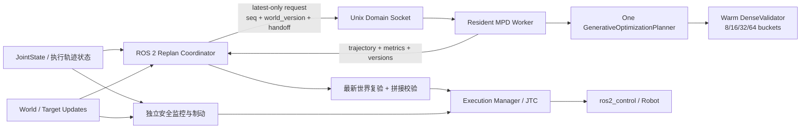

# MPD–ROS 2 实时重规划：可行性评估与实施计划

> 日期：2026-08-13  
> 适用仓库：`MotionPlanningDiffusion/mpd`、`physical_ai_runtime`  
> 依据：当前仓库代码、已有单次推理链路和仓库内 2026-07/08 性能实验；本文不把尚未实现的能力写成已有能力。

本计划是对[统一研究路线与可执行技术方案](从初始%20MPD%20到实时%20Space-Time%20CDSG，再到%20World-Model%20Planning：统一研究路线与可执行技术方案.md)的工程落地评审，并以[原始 MPD 论文](../Motion_Planning_Diffusion_Learning_and_Adapting_Robot_Motion_Planning_With_Diffusion_Models.pdf)作为算法假设边界。

## 1. 执行摘要

当前最合理的下一步，不是直接实现完整的 Space-Time CDSG，也不是让 ROS 节点重复调用 `infer_once.py`，而是先把现有 MPD 改造成一个**常驻、串行、可热身的 GPU 规划服务**，再由 ROS 2 侧实现**异步、只保留最新请求、带版本号和未来交接点的重规划协调器**。

这个方向具有较高可行性，原因是现有代码已经具备以下基础：

- 单次 MPD 推理、轨迹导出和 ROS 2 FollowJointTrajectory 执行链路已经打通；
- `GenerativeOptimizationPlanner`、模型、CostGuide、B-spline 缓存和 DenseValidator 工作区都可以在进程内长期复用；
- 仓库实测显示，同一进程中 DenseValidator 首次调用约 `208.8 ms`，后续约 `5.5–6.4 ms`，常驻进程能直接消除每次请求重复支付的首次使用成本；
- 现有全局规划后端接口已有 `warmup()`、`update_world()`、`plan()` 概念，适合接入常驻 MPD。

但当前系统不能准确称为“硬实时动态避障”或“Space-Time 规划器”：

- 热态 MPD 推理仍约为 `0.37–0.42 s`，近期合理目标是 **1–2 Hz 的软实时重规划**，不是 10–30 Hz 控制回路；
- 当前场景由固定 `scene_id` 决定，碰撞场是静态的，没有障碍物预测或时间维；
- 当前 diffusion 每次都从高斯噪声开始，尚未实现旧轨迹重新加噪、截断 DDIM 等“算法级热启动”；
- 当前 ROS 脚本规划期间要求起点不漂移，且未实现有所有权的动作抢占和连续轨迹拼接；
- 128 个离散采样点的 DenseCheck 不是连续碰撞证明。

因此建议把目标拆成三层：

1. **工程热启动**：进程、模型、环境、CostGuide、DenseValidator 和 GPU 缓冲区只初始化一次；这是第一优先级。
2. **滚动重规划**：在静态场景中以 1–2 Hz 生成新轨迹，并在未来交接点安全接管；这是近期可交付能力。
3. **算法热启动与动态场景**：旧轨迹 warm seed、固定容量动态障碍物、预测包络、Space-Time CDSG；这是后续研究层。

## 2. 可行性与合理性结论

| 能力 | 当前可行性 | 结论 | 主要条件 |
|---|---:|---|---|
| 模型与规划器常驻、一次启动 | 9/10 | 立即实施 | 把 `infer_once.py` 的初始化与单次请求拆开 |
| DenseValidator 全桶预热 | 9/10 | 立即实施 | 显式跑过 8/16/32/64 桶的 FK/SDF 路径并同步 CUDA |
| 静态场景 1–2 Hz 滚动重规划 | 8/10 | 近期可交付 | 单工作线程、最新请求覆盖、未来交接、过期丢弃 |
| 真机运动中无缝交接 | 5/10 | 需先在仿真验收 | 当前模型训练分布偏向首末静止；动作抢占链路也需补齐 |
| 在线更新少量 box/sphere 障碍物 | 6/10 | 中期可行 | 固定容量 GPU tensor，避免每帧重建 SDF 和 Python 对象 |
| 算法级 diffusion warm start | 5/10 | 中期研究 | 增加 `initial_x/start_timestep`、旧计划重参数化与冷启动兜底 |
| Space-Time CDSG | 当前 3/10，完成基础后约 7/10 | 合理但不应越级 | 动态世界、时间参数化、预测与不确定性必须先落地 |
| World-Model Planning | 当前 2/10 | 适合作为远期路线 | 先证明实时闭环、数据闭环和安全接口，再引入学习世界模型 |

总路线“MPD → 实时重规划 → Space-Time CDSG → World Model”在研究顺序上是合理的。需要修正的是里程碑口径：**常驻 MPD 解决的是软实时规划服务；Space-Time 和 World Model 是新算法能力，不能由循环调用现有静态规划器自然得到。**

## 3. 代码现状与证据

### 3.1 单次推理链路

[`scripts/runtime/infer_once.py`](../scripts/runtime/infer_once.py) 当前在每次调用中完成：

1. 读取并校验 request/config/checkpoint；
2. 构建 planning task 和 dataset；
3. 加载 `GenerativeOptimizationPlanner` 和模型权重；
4. 执行 `plan_trajectory()`；
5. 做最终 128 点轨迹校验；
6. 写 JSON 和 NPZ。

这个脚本适合离线回归和故障复现，但不适合作为循环重规划的请求入口。若每一轮都通过 `subprocess.run(conda run ... infer_once.py)` 启动，模型加载、CUDA context、内核首次编译/分配、缓存建立和 DenseValidator 首次 FK/SDF 都会重复发生。

### 3.2 规划器已经具备常驻基础

[`mpd/inference/inference.py`](../mpd/inference/inference.py) 中的 `GenerativeOptimizationPlanner` 在构造时已经：

- 加载 checkpoint；
- 创建 CostGuide；
- 创建 DenseTrajectoryValidator；
- 为 ranked dense validation 预分配固定桶工作区；
- 调用模型和 CostGuide 的 `warmup()`。

这说明不需要重写整个 MPD。核心改造是把这个对象放入长生命周期的 worker 中，并把请求相关状态更新与初始化解耦。

需要注意：`plan_trajectory()` 会修改 planning task、boundary conditions、context 和内部 profiler/cache 状态。因此一个 planner 实例应当由**单一 GPU 工作线程串行访问**，不能直接让多个 ROS callback 并发调用。

### 3.3 DenseCheck 的“热身缺口”已有实测

当前 planner 的 `warmup()` 只覆盖 model 和 CostGuide，没有真正执行 DenseTrajectoryValidator 的 FK/SDF 验证路径。现有结果文档：

- [`GRID_MAP_SDF_GPU_INDEX_BENCHMARK_20260809.md`](GRID_MAP_SDF_GPU_INDEX_BENCHMARK_20260809.md)：同一进程首个 context 的 dense 阶段约 `208.8 ms`，后续约 `5.5 ms` 和 `6.4 ms`；热态总推理约 `0.37–0.42 s`。
- [`DENSE_VALIDATION_FIXED_BUCKET_RESULTS_20260809.md`](DENSE_VALIDATION_FIXED_BUCKET_RESULTS_20260809.md)：固定桶本身不能消除冷进程的首次 FK/SDF 成本，明确指向常驻 planner、固定缓冲区与 scene version invalidation。

结论是：**DenseCheck 不应关闭，而应在服务 READY 之前预热。** 只把 DenseCheck 从计时段移到启动阶段，却仍然每次启动新进程，没有实际价值。

### 3.4 当前 diffusion 不是轨迹 warm start

[`mpd/models/diffusion_models/diffusion_model_base.py`](../mpd/models/diffusion_models/diffusion_model_base.py) 的 DDIM 采样仍以 `torch.randn(shape_x)` 初始化。虽然已有 `q_sample()`，但推理 API 没有 `initial_x`、`start_timestep` 或旧轨迹 seed。

因此必须区分：

- **工程热启动**：常驻进程和 GPU 状态，现阶段即可完成；
- **算法热启动**：将旧轨迹重采样为固定控制点，按选定噪声等级重新加噪，再用较少 DDIM 步数修复；需要修改模型推理接口并重新验证成功率。

### 3.5 ROS 侧目前仍是一锤子调用

[`send_mpd_trajectory.py`](../../../physical_ai_runtime/src/apps/franka_motion_demos/scripts/send_mpd_trajectory.py) 当前通过 `subprocess.run()` 启动 Conda 中的 `infer_once.py`。它已经把阻塞调用放入单线程池，ROS executor 不会完全被冻结；但它仍然是一次规划、一次执行、结束进程的流程。

当前脚本还有三个与滚动规划冲突的条件：

- 规划请求使用最新位置，但速度和加速度边界写为零；
- 推理完成后若起点漂移超阈值就拒绝，无法运动中接管；
- 未维护可取消、可确认结果、与 plan generation 绑定的 action goal 生命周期。

`physical_ai_runtime` 中现有 `GlobalTrajectoryBackend` 的 `warmup/update_world/plan` 接口可以作为正式适配层；现有 Execution Manager 的 `joint_trajectory_goal` 路径还需要增强 goal handle、结果监控和可控抢占，才能用于生产式重规划。

### 3.6 与原始 MPD 假设的边界

原始 MPD 方案使用固定轨迹时长，并以首末位置固定、首末速度和加速度为零的 rest-to-rest 边界训练与评估。当前仓库的 B-spline 预处理已经可以解析地施加非零 `dq/ddq` 边界，但这只说明轨迹表示能够表达运动中边界，不等于 checkpoint 已经学习了相同分布。

因此，常驻 planner 不改变原始算法假设；“机器人运动中从旧轨迹切到新轨迹”必须被视为新增能力，并用非零边界测试集、仿真跟踪和必要的微调单独验收。固定 10 s 时长也意味着真正的时间优化和 Space-Time 速度调整仍未实现。

## 4. 推荐总体架构

ROS 2 与 MPD Conda/PyTorch 环境继续保持进程隔离。只在系统启动时启动一次 MPD worker，ROS 节点通过 Unix Domain Socket 请求规划。这样既保留环境隔离，也避免每轮 `conda run`。



关键边界：

- PyTorch、CUDA、IPC 和重规划协调都在**非实时线程/进程**；
- `ros2_control` update loop 只负责确定性的轨迹跟踪，不调用 MPD；
- GPU 规划器是软实时服务，必须用 deadline、版本号和安全层约束它，而不是假装它是硬实时控制器。

## 5. 常驻 MPD Worker 设计

### 5.1 建议文件拆分

在 `MotionPlanningDiffusion/mpd` 中新增：

```text
scripts/runtime/
├── runtime_engine.py       # MpdRuntimeEngine：一次初始化，多次 plan
├── infer_server.py         # 常驻 worker、UDS、状态机、健康检查
├── ipc_protocol.py         # request/response v2、长度帧和版本校验
└── infer_once.py           # 保留为薄包装，复用 runtime_engine
```

并修改：

```text
mpd/inference/inference.py
mpd/inference/dense_trajectory_validator.py
mpd/models/diffusion_models/diffusion_model_base.py   # 第二阶段才需要 warm seed
```

`infer_once.py` 必须继续可用，以便把常驻服务输出和单次输出做回归对比；不要复制出两套推理逻辑。

### 5.2 Worker 生命周期

状态机：

```text
STARTING → LOADING → WARMING → READY ⇄ PLANNING
                         ↓          ↓
                       FAULT ←──── FAULT
                         ↓
                      STOPPING
```

启动步骤：

1. 校验配置、模型、checkpoint、scene 和设备；
2. 加载 planning task、dataset、模型与 checkpoint；
3. 构造唯一的 `GenerativeOptimizationPlanner`；
4. 执行现有 model/CostGuide warmup；
5. 对 DenseValidator 的 8/16/32/64 四种 bucket 逐一执行真实 FK/SDF 验证；
6. `torch.cuda.synchronize()`，确保异步内核全部完成；
7. 运行一个固定、已知可行的自检请求，丢弃输出；
8. 记录 config/checkpoint/scene hash、GPU、显存、热身耗时；
9. 原子发布 READY，之后才允许 ROS 侧提交计划。

Dense warmup 不能使用 `stop_on_first_valid` 让流程提前返回，否则后面的 bucket 仍会在第一次真实请求中变冷。建议给 `DenseTrajectoryValidator` 增加明确的 `warmup(control_points_template)` 方法，在所有已配置形状上执行同样的张量路径。

### 5.3 请求调度

- planner 只允许一个 worker thread 使用；
- 队列容量为 1，采用 latest-only/coalescing；
- 正在执行的 request 先完成，期间到来的多次 world/goal 更新只保留最新快照；
- 第一阶段不强行中断 CUDA kernel，而是在结果返回时按版本和 deadline 丢弃；
- 第二阶段可在 DDIM step/guide step 边界检查 cancel event，实现协作式取消；
- 不要通过杀 worker 来取消普通请求，杀进程只用于故障恢复，因为会丢失所有热状态。

### 5.4 IPC 选择与权限

MVP 建议使用 Unix Domain Socket：

- 长度前缀 + UTF-8 JSON 消息；
- 大数组继续用原子写入的 NPZ 文件传递，或在后续改成共享内存；
- socket 权限设为 `0600`；
- 每条响应都回传请求 ID、输入版本、输出 hash 和 timing；
- `conda run` 仅在 launch 阶段发生一次，或者直接调用目标 Conda 环境中的 Python。

UDS 足够完成第一阶段，并比立刻定义 ROS service/action + 跨环境 Python 依赖更小。待契约稳定后，可以把相同 worker 封装成 ROS 2 service/action，但 planner 仍保持单工作线程。

### 5.5 请求/响应契约 v2

建议 request 至少包含：

```json
{
  "schema_version": 2,
  "request_seq": 1042,
  "stamp_ns": 1786579200000000000,
  "frame_id": "panda_link0",
  "scene_id": "EnvWarehouseExtraObjectsV00",
  "scene_hash": "...",
  "world_version": 57,
  "prediction_version": 0,
  "start": {
    "q": [0, 0, 0, 0, 0, 0, 0],
    "dq": [0, 0, 0, 0, 0, 0, 0],
    "ddq": [0, 0, 0, 0, 0, 0, 0]
  },
  "goal": {"q": [0, 0, 0, 0, 0, 0, 0]},
  "handoff_time_ns": 1786579200600000000,
  "deadline_ns": 1786579200550000000,
  "mode": "cold_full",
  "seed_plan_id": null
}
```

response 至少包含：

```json
{
  "request_seq": 1042,
  "plan_id": "...",
  "world_version": 57,
  "prediction_version": 0,
  "status": "OK",
  "trajectory_path": "...npz",
  "config_hash": "...",
  "checkpoint_hash": "...",
  "scene_hash": "...",
  "timing_ms": {
    "queue": 0.4,
    "inference": 391.2,
    "dense": 6.1,
    "total": 402.8
  },
  "validation": {
    "dense_samples": 128,
    "min_clearance": 0.03,
    "valid": true
  }
}
```

所有字段都应有上限检查。worker 不接受任意路径、任意模型或任意 Python 配置作为普通请求参数，防止实时路径意外触发重新加载。

## 6. ROS 2 滚动重规划协调器

### 6.1 不在原 demo 脚本上无限扩展

可以先新增 `franka_motion_demos/scripts/replan_mpd_trajectory.py` 做 `plan_only` 和 fake hardware 原型，但正式实现建议放到：

```text
physical_ai_runtime/src/motion_planning/motion_planners/mpd_planner_adapter/
├── mpd_planner_adapter/backend.py
├── mpd_planner_adapter/worker_client.py
├── mpd_planner_adapter/replan_coordinator.py
├── mpd_planner_adapter/contracts.py
├── config/mpd_replanner.yaml
├── launch/mpd_replanner.launch.py
└── test/
```

`backend.py` 实现现有 `GlobalTrajectoryBackend` 语义：

- `warmup()`：启动/连接 worker，等待 READY；
- `update_world(world)`：产生单调递增 `world_version`；
- `plan(request)`：异步发送，但底层 GPU worker 串行；
- `close()`：优雅退出 worker。

MPD 当前生成约 10 s 的整段轨迹，第一阶段应将它定位为“滚动全局规划器”，不要命名为高频 MPC。

### 6.2 重规划触发条件

任何一项满足时生成新请求，但在 debounce/coalescing 后只保留最新请求：

- 目标变化超过阈值；
- `world_version` 增加；
- 当前计划剩余时间低于补充阈值；
- 跟踪误差超过阈值；
- 周期性刷新（首期建议 1 Hz，完成 P99 测量后再提高）；
- 当前轨迹在最新世界快照上复验失败。

不应在每个 JointState callback 中直接触发推理。触发器只更新“最新意图”，调度器按 GPU 是否空闲和 deadline 决定何时提交。

### 6.3 未来交接点

令：

```text
L_budget = P99(inference + dense + IPC + commit) + safety_margin
t_h      = now + L_budget
t_deadline = t_h - commit_margin
```

首期可从 `L_budget = 0.6–0.8 s` 起步，必须在本机测得 P99 后替换，不能长期写死。

协调器从当前**已提交轨迹**预测 `t_h` 时刻的 `(q_h, dq_h, ddq_h)`，以此作为新规划边界，而不是使用请求发出时的 JointState。这样推理期间机器人仍可沿旧计划运动。

但是当前 checkpoint 主要基于首末速度、加速度为零的分布训练。虽然 B-spline 代码现在可以施加非零边界，运动中接管仍属于未验证能力。推荐分两级上线：

1. MVP 仅在低速/停止点交接，或先用 bridge 段减速；
2. 仿真中通过非零 `dq/ddq` 成功率和动态连续性门槛后，再允许任意运动中交接；必要时补充非零边界训练数据并微调模型。

### 6.4 安全的轨迹拼接与抢占

不要假设给 JTC 发送一个未来 `header.stamp` 的新 goal 后，旧 goal 会自动可靠执行到该时刻。不同控制器的抢占语义可能导致旧 goal 立即被替换。

推荐做法是：

1. 当前计划以绝对时间保存；
2. 新计划在 `t_h` 处起始；
3. 结果在 deadline 前返回后，构造一个新的完整 JTC goal：
   - 从“现在”开始重放旧计划尚未执行的安全前缀；
   - 在 `t_h` 处与新后缀连接；
4. 检查位置、速度、加速度连续性，重新检查限制和碰撞；
5. 发送新完整 goal，确认接受后更新 `active_plan_id`；
6. 保留 goal handle，监控 accepted/result/cancel，并把结果关联到 generation ID。

以下任一情况直接丢弃结果，不提交机器人：

- `request_seq` 不是当前允许提交的 generation；
- `world_version` 或 `prediction_version` 已经过期；
- 已超过 `deadline_ns`；
- 当前执行状态与预测交接状态偏差超阈值；
- 最新世界复验失败；
- 拼接后的轨迹不满足连续性或动态限制。

如果最新障碍物使旧计划的已提交前缀变得不安全，等待新计划来不及解决问题。必须由独立安全监控触发减速/停止。这也是实时规划和安全控制必须分层的原因。

## 7. 动态场景与 Space-Time 的正确进入方式

### 7.1 先做固定容量动态 primitive

当前 `scene_id` 对应静态碰撞环境，`update_objects_extra()` 可能重建 SDF，不适合每个感知帧调用。首个动态世界版本建议只支持有界数量的 box/sphere/capsule：

```text
centers[MAX_OBJECTS, 3]
sizes_or_radii[MAX_OBJECTS, ...]
active_mask[MAX_OBJECTS]
world_version
```

这些 tensor 在 GPU 上一次分配，更新时使用 `copy_()`；碰撞代价使用固定形状的解析距离函数。好处是：

- 避免重建 Python object 和 SDF grid；
- 保持张量 shape 不变；
- 便于做稳定性能测量；
- 为未来 CUDA Graph 或固定 stencil CDSG 留出条件。

静态 warehouse 继续使用常驻 SDF；动态少量物体走解析距离。mesh/point cloud 暂不放入实时 MVP。

### 7.2 再增加时间维和预测包络

Space-Time 输入不应只是“每轮更新一次静态障碍物位置”。需要明确：

- 每个障碍物的预测轨迹 `x_o(t)`；
- 时间戳、坐标系、有效区间；
- 预测不确定性或占用膨胀 `r(t)`；
- 机器人轨迹的真实时间参数化；
- 过期预测的处理规则。

在没有完整 Space-Time 代价之前，可以用预测时间窗内的 swept volume 做保守静态包络，但文档和实验必须称其为“保守快照近似”，不能声称是时间相关避障。

### 7.3 CDSG 的实施约束

主路线中固定 stencil、late guidance 和 uncertainty envelope 的方向是合理的；但本仓库已有 temporal pruning、link broad phase、span certificate 等实验说明：动态稀疏选择、扫描和 Python dispatch 很容易抵消理论省下的计算。

因此 CDSG 每一步都必须用端到端 wall-clock 判断，不只报告激活点数或 FLOPs。建议门槛：

- 与当前 B3 production baseline 在相同场景、相同成功率、相同最终 DenseCheck 下比较；
- 至少报告 50/95/99 分位，不只报告均值；
- 若速度没有稳定提升且代码复杂度明显增加，不进入默认路径；
- 固定 shape、固定 capacity、张量化操作优先于数据依赖的 Python 分支。

## 8. 算法级 warm start 方案

这应放在常驻冷启动基线稳定之后。

### 8.1 Seed 构造

1. 从 active plan 截取 `t_h` 之后的后缀；
2. 将剩余时间重新参数化到本次固定 horizon；
3. 拟合为与模型一致数量和阶次的 B-spline control points；
4. 用新的 `(q_h,dq_h,ddq_h)` 和目标边界重设固定控制点；
5. 提取模型所需 inner control points，并使用训练时相同 normalization；
6. 调用 `q_sample(x_seed, t_start, noise)` 重新加噪；
7. 从 `t_start` 做截断 DDIM + guidance；
8. 最终仍走完整的约束与 DenseCheck。

### 8.2 冷热双路径

不要在第一版强行把 warm 和 cold 样本塞进同一个不同步 batch，因为截断 warm seed 和完整 Gaussian seed 的 timestep 不一致，会让实现和性能都复杂化。

建议顺序：

- `cold_full`：现有 100 candidates、15 DDIM steps，作为基线和兜底；
- `warm_truncated`：旧计划 seed + 更高质量局部修复；
- 每 N 次或检测到目标/世界大变化时强制 `cold_full`；
- warm 请求无可行解、clearance 过低或与 seed 偏离异常时立即回退 cold；
- 稳定后再研究固定 shape 的 warm/cold bank 和 per-sample mask。

worker 可以保留上一轮 elite candidates 在 GPU 上，减少 host/device 搬运；但 elite bank 必须与 `scene_hash/world_version/start/goal` 绑定，版本变化后不得无条件复用。

## 9. 分阶段实施计划与验收门槛

### Phase 0：冻结基线与可观测性（2–3 天）

交付：

- 固定 3–5 个 scene/request/seed；
- 保存单次推理成功率、轨迹 hash、clearance、位置/速度/加速度限制；
- 使用 CUDA event 或显式 synchronize 测量 load、model、guide、dense、IPC；
- 记录 GPU 型号、driver、PyTorch、checkpoint/config/scene hash。

验收：

- 基线可重复运行；
- timing 口径明确，不把异步 CUDA 时间错误归到后续阶段；
- 失败能区分无解、过期、约束失败和服务错误。

### Phase 1：常驻 worker 与完整预热（4–7 天）

实施状态（2026-08-13）：**已完成并通过真实 CUDA 验证。**

- 新增 `runtime_engine.py`、`infer_server.py`、`infer_client.py` 和长度帧 JSON IPC；
- 原 `infer_once.py` 未修改，继续作为单次回归入口；
- planner 构造阶段实际执行 8/16/32/64 四种 DenseValidator bucket，并在 READY 前同步 CUDA；
- worker 使用单 planner 非阻塞锁、单调 `request_seq`、deadline 和受控输出根目录；
- 修复仓库第一方 robot wrapper 与固定 TorchKin submodule 间缺失 pose-cache factory 的接口不一致，原有 cached-pose Jacobian 数值等价测试通过；
- `tests/` 全量结果：`109 passed`；新增常驻协议相关定向结果：`20 passed`；
- 同一 CUDA worker 连续两次真实请求的 `engine_instance_id` 一致；服务端耗时约 `364 ms / 308 ms`；
- 首个用户请求 DenseCheck 为 `6.40 ms`，第二次为 `4.64 ms`，首次约 200 ms 的 FK/SDF 冷启动已移至 READY 前。

交付：

- `MpdRuntimeEngine`；
- `infer_server.py` + UDS 协议；
- DenseValidator 显式全桶 warmup；
- READY/health/shutdown；
- `infer_once.py` 复用 engine。

验收：

- 同一 worker 连续 100 次请求，模型/checkpoint/task 只加载一次；
- 第 1 个用户请求不再承担约 200 ms 的 dense 首次路径；
- 稳态 dense P95 目标 `< 10 ms`，若硬件差异导致未达标则以基线回归解释；
- 常驻与 `infer_once` 在固定 seed 下输出和有效性一致；
- 无逐请求显存增长，100 次后显存进入稳定平台；
- worker 崩溃时 ROS 侧 fail closed，不重放旧响应。

### Phase 2：静态场景滚动重规划（1–2 周）

实施状态（2026-08-13）：**已完成并通过 30 分钟 Franka fake-hardware 验证。**

- 在 `physical_ai_runtime/src/motion_planning/motion_planners/` 新增独立
  `mpd_planner_adapter`，没有修改既有 `manipulation_motion_planning` 核心逻辑和
  两份单次推理脚本；ROS 侧使用 Pixi/ROS 2 Jazzy，CUDA 仍隔离在 MPD Conda worker；
- `MpdGlobalTrajectoryBackend` 实现现有 `GlobalTrajectoryBackend` 契约，完成
  FR3 state/pose/joint target 到 resident worker schema 的转换、NPZ 有限值/shape/
  joint order/time 检查，以及 `request_seq/world_version/deadline` 响应校验；
- `LatestOnlyPlanner` 只有一个运行请求和一个可替换 pending slot，完成队列也固定
  为 2；ROS callback 不执行 UDS、磁盘读取或 CUDA 推理，旧 generation 在发布前丢弃；
- ROS 节点以绝对 Unix 纳秒生成跨重启单调 request sequence，支持 1 Hz 周期触发、
  joint/pose target、`world_version` 失效、stop、future-handoff 状态插值、JSON 诊断；
- Phase 2 强制 `plan_only=true`，输出带 future handoff `header.stamp` 的完整
  `JointTrajectory`；控制器 goal ownership、拼接和执行在 Phase 3 才启用；
- 新增普通 launch 和延迟启动 JTC 的 Franka fake-hardware launch；后者规避 Franka
  bringup 先发布 vendor hardware、随后替换 GenericSystem 时的 controller spawner 竞争；
- `colcon test`：`6 passed`；package XML schema、launch 参数解析、compile/flake8
  基础检查通过；worker/ROS 节点重启后仍复用同一 engine instance；
- 30 分钟 fake-hardware 结果：`submitted=1723`、`accepted=1720`、
  `superseded=2`、结束采样时 `pending=1`，`deadline_miss/invalid/worker_error=0`；
  512 点滑动窗口 P50/P95/P99 为约 `331/351/364 ms`；
- 同一 worker 总处理 1806 个请求，GPU 进程显存从中点到终点均为 `1276 MiB`；
  `/joint_states` 约 200 Hz，推理期间 ROS 图、参数服务、world-version 和 stop callback
  均保持响应；快速连续目标更新产生的 2 个旧 generation 均被丢弃；
- 最终故障注入确认 `world_version=9` 后只接受相同版本结果，stop 后
  `has_target=false`、`pending_count=0`，节点 SIGINT 干净退出。

交付：

- `GlobalTrajectoryBackend` 的 MPD adapter；
- async client、队列容量 1、latest-only；
- request generation/world version/deadline；
- future handoff 预测和过期结果丢弃；
- plan-only 与 fake hardware launch。

验收：

- ROS executor 在推理时仍可处理 JointState、world update 和 stop；
- 连续运行 30 分钟，无死锁和无界队列；
- 目标连续改变时，实际提交的是最新有效 generation；
- 达到本机实测 1–2 Hz 软实时计划更新，报告 P50/P95/P99 和 deadline miss rate；
- 不向控制器提交已经过期或世界版本错误的轨迹。

### Phase 3：可控抢占、拼接与真机前验证（1–2 周）

实施状态（2026-08-13）：**工程落地完成，unit/plan-only/fake-hardware 通过；仿真与
限速真机按安全门槛保留为后续人工测试。**

- 在同一新增 ROS 包中实现 `JtcHandoffManager`，分别保存 pending/active plan ID
  与 accepted goal handle；所有 goal response、result、cancel 回调均闭包关联 plan ID，
  新 goal rejection/send error 不会覆盖仍在执行的旧 handle，过期 accepted response 会取消；
- 执行路径默认关闭，仅 `plan_only:=false` 时启用；提交前构造从当前 commit time 到
  future handoff 的旧安全前缀，再追加新计划后缀，不依赖 future header stamp 的隐含抢占语义；
- 拼接前检查当前 JointState 对 active plan 的 start drift、handoff 速度、位置和速度断差，
  并用拼接两侧速度差分检查加速度断差；任一超阈值只丢新计划，旧 goal 继续执行；
- 首版强制低速/停止点门控，默认阈值为 handoff speed `0.20 rad/s`、q jump
  `0.03 rad`、dq jump `0.20 rad/s`、ddq jump `2.0 rad/s²`、start drift `0.10 rad`；
- `/mpd_replanner/safe_stop` 会同时使 generation 失效、清 target/pending 并取消 owned goal；
  另有独立进程 `/mpd_jtc_safe_stop`，即使 replanner/MPD worker 不运行，也能直接向
  JTC dispatch cancel-all；它同时发布 transient-local `/mpd/emergency_stop` 锁存，
  防止 replanner 下一周期重新提交，重启的 replanner 也会收到 stop；
- 标准单包 `colcon build` 为 `0.85 s`；`colcon test` 最终为 `17 passed`，
  覆盖 q/dq/ddq 拼接、start drift、低速门、
  pending-slot、worker contract，以及 goal accepted/succeeded/rejected/aborted/cancel、
  stale response 和 cancel-all wildcard；静态检查、manifest schema 和两个 launch 解析通过；
- Franka fake-hardware 实测完成多个 goal 的 accepted→terminal 关联，JTC 返回
  `error_code=0`/`Goal successfully reached!`；活动轨迹期间不满足低速或 start-drift
  的新计划全部被拒绝，没有替换旧 goal；
- owned safe-stop 实测得到 `CANCELED`，active/pending plan ID 清空；独立 safe-stop
  实测 cancel 后 `has_target=false`、`pending_count=0`，间隔 2 秒两次诊断的
  submitted/accepted 计数不再增长；replanner 完全关闭时独立 stop 仍能成功 dispatch；
- 当前 effort JTC + `mock_components/GenericSystem` 不模拟 Franka 真实动力学跟踪，
  因而 fake hardware 只能验证 ROS/action/门控状态机，不能替代动力学仿真；真实跟踪误差、
  protective stop 和制动距离必须在仿真及限速真机阶段继续验证，外部 E-stop 不由本程序替代。

交付：

- Execution Manager 或 handoff manager 持有 JTC goal handle；
- accepted/result/cancel 状态与 `plan_id` 关联；
- 旧前缀 + 新后缀拼接与重新验证；
- 独立 stop/braking 接口；
- 低速/停止点交接模式。

验收顺序：

1. unit test；
2. plan_only；
3. fake hardware；
4. 仿真；
5. 限速真机。

真机前硬门槛：

- 拼接处 `q/dq/ddq` 不发生超阈值跳变；
- goal rejection/cancel/abort 均能进入安全状态；
- start prediction 误差过大时结果被拒绝；
- e-stop/protective stop 独立于 planner 可用；
- 首轮真机仅允许停止点或极低速交接。

### Phase 4：固定容量动态场景（2–4 周）

交付：

- 静态 SDF + 动态解析 primitive 混合碰撞场；
- world snapshot/version/frame/stamp 契约；
- 最新世界提交前复验；
- 障碍物更新压力测试。

验收：

- world update 不触发模型、planning task 或静态 SDF 重载；
- 固定容量内更新不产生明显的频繁内存分配；
- 旧 world version 的计划 100% 被丢弃或重验；
- 障碍突然侵入已提交前缀时，安全层能停止，而不是等待 MPD。

### Phase 5：diffusion warm start（3–6 周研究）

交付：

- seed 重参数化、归一化和边界重设；
- `initial_x/start_timestep`；
- warm/cold 策略和回退；
- 非零速度/加速度边界测试集，必要时微调 checkpoint。

验收必须同时满足：

- P95 延迟显著下降；
- 成功率和最小 clearance 不劣于 cold baseline 的预设容差；
- 大目标变化、scene change 和 seed 失效时能自动 cold fallback；
- 非零边界轨迹在仿真中稳定通过连续性和跟踪测试。

### Phase 6：Space-Time CDSG（6–12+ 周研究）

交付顺序：

1. 显式时间参数化和障碍预测接口；
2. uncertainty envelope；
3. 固定 stencil Space-Time cost；
4. late guidance；
5. CDSG 候选选择；
6. 独立 dense/swept validation；
7. 与 B3 baseline 的消融。

Go 条件：动态任务成功率、安全裕度或 P95 时延至少有一项形成实质提升，且其他关键指标没有不可接受退化。否则保持为实验分支。

### Phase 7：World-Model Planning（远期）

只有在前面已经形成可靠的数据和闭环契约后再进入：

- 记录 state/action/world snapshot/prediction/plan/result/near-miss；
- 先做世界模型预测评估，不直接闭环控制；
- 以 calibration、OOD 检测和 uncertainty 为上线条件；
- 初期只让 world model 提供 obstacle prediction 或 proposal，不绕过几何碰撞校验和安全层。

## 10. 测试矩阵

| 层级 | 测试内容 | 必测故障 |
|---|---|---|
| 单元 | IPC schema、版本比较、队列覆盖、B-spline 拼接、seed 转换 | 非法维度、NaN、乱序 response |
| MPD engine | 常驻 100/1000 次、显存稳定、fixed seed 回归 | checkpoint 错、CUDA OOM、dense invalid |
| ROS 集成 | executor 响应、deadline、latest-only、goal lifecycle | worker crash、socket 断开、goal reject/abort |
| 动态世界 | 更新频率、scene version、提交前复验 | stale world、frame 错、预测过期 |
| 执行 | fake hardware/仿真拼接、限速跟踪 | start drift、missed handoff、cancel 超时 |
| 安全 | committed-prefix 监控、减速/停止 | 突发障碍、planner 卡死、JointState 失联 |

性能报告至少包含：

- cold startup、warmup、首个用户请求和稳态请求；
- end-to-end、queue、model、guide、dense、IPC、commit；
- P50/P95/P99/max；
- deadline miss、stale discard、cold fallback、no-solution 比例；
- success、min clearance、路径长度、jerk/跟踪误差；
- CPU/GPU 占用和显存高水位。

## 11. 主要风险与缓解

### 风险 1：把常驻服务误认为算法已经实时化

常驻服务能去掉初始化和 dense 首次开销，但 guide 仍占主要时延。对外口径使用“约 1–2 Hz 软实时滚动重规划”，直到 P99 证明更高频率。

### 风险 2：运动中边界偏离训练分布

先做低速/停止点交接；建立非零边界数据集；若成功率明显下降，补数据微调，不仅依赖 B-spline 解析边界修正。

### 风险 3：动作抢占造成轨迹跳变

不依赖未来 stamp 的隐含语义；新 goal 包含旧安全前缀和新后缀；保留 goal handle 并校验 JTC 实际行为。

### 风险 4：离散 DenseCheck 漏碰撞

128 点/10 s 相邻点约 78.7 ms，不等同连续安全。真机前至少对最终 top-1 做更高分辨率或 swept/continuous 检查，并保留在线安全监控。

### 风险 5：动态场景更新破坏缓存正确性

所有 scene/world/prediction cache 都绑定单调版本；固定容量动态 tensor 原地更新；结果提交前用最新版本复验。

### 风险 6：所谓稀疏优化反而变慢

以端到端 P95/P99 和成功率为准；任何 CDSG/剪枝优化必须对比当前 B3 baseline；负收益方案不进入默认路径。

## 12. 建议的首个两周 Sprint

### 第 1 周

- [ ] 固定基线 requests、seeds 和 timing 口径；
- [ ] 抽出 `MpdRuntimeEngine`，让 `infer_once.py` 复用；
- [ ] 为 DenseValidator 增加全桶 warmup；
- [ ] 完成 UDS request/response v2 和 worker 状态机；
- [ ] 连续 100 次测试，确认无重复加载和显存增长；
- [ ] 输出 cold/first-user/warm P50/P95/P99。

### 第 2 周

- [ ] 实现 ROS worker client 和 `GlobalTrajectoryBackend` adapter；
- [ ] 实现 queue=1、latest-only、request_seq/world_version/deadline；
- [ ] 在 plan_only 中持续 1 Hz 重规划；
- [ ] 在 fake hardware 中实现 future handoff 预测；
- [ ] 先做停止点/低速交接，不直接上任意速度真机；
- [ ] 注入 worker crash、stale response、deadline miss 和 start drift 故障。

两周结束时的决策点：

- 若稳态 P99 与成功率支持 1–2 Hz，则进入 Phase 3 的执行交接；
- 若 guide 仍使 deadline miss 过高，先优化候选数/DDIM/guide 配置并做成功率消融；
- 若非零边界失败率高，则将“运动中无缝交接”转为数据与微调子项目；
- 在常驻静态闭环没有稳定之前，不启动 Space-Time CDSG 主线开发。

## 13. 最终建议

近期应立项为：

> **Resident MPD Soft-Realtime Replanning v1：静态场景、一次加载、完整预热、1–2 Hz、latest-only、未来交接、过期丢弃、独立安全停止。**

它既是现有代码上最小且高收益的工程改造，也是 Space-Time CDSG 和 World-Model Planning 必须依赖的系统地基。完成这一层后，算法 warm start、动态 primitive 和 Space-Time cost 都能在同一常驻服务、相同版本契约和相同端到端基准上独立验证，不会把系统开销、执行抢占问题和算法效果混在一起。
