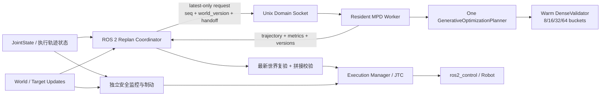

# MPD–ROS 2 实时重规划：可行性评估与实施计划

> 更新日期：2026-08-22
>
> 适用仓库：`MotionPlanningDiffusion/mpd`、`physical_ai_runtime`
>
> 依据：当前两个仓库的实际代码与提交、本机 CUDA/ROS 2 fake-hardware/IsaacLab 回放数据、[`gpt1.txt`](gpt1.txt) 的后续研究约束；本文不把尚未实现的能力写成已有能力。

本计划是对[统一研究路线与可执行技术方案](从初始%20MPD%20到实时%20Space-Time%20CDSG，再到%20World-Model%20Planning：统一研究路线与可执行技术方案.md)的工程落地评审，并以[原始 MPD 论文](../Motion_Planning_Diffusion_Learning_and_Adapting_Robot_Motion_Planning_With_Diffusion_Models.pdf)作为算法假设边界。

## 1. 执行摘要

文档原定的工程地基已经完成：Phase 1–4 已经把单次 MPD 改造为常驻 GPU 规划服务，建立了 ROS 2 latest-only 重规划、JTC goal 所有权、动态世界版本、CV-KF 预测、固定 timing 动态碰撞代价、top-K valid 轨迹、quintic bridge、新旧轨迹共同窗口比较、最新世界复验、目标驻留保护与安全制动。Phase 3 和 Phase 4 保持独立入口，现有静态与固定 timing 动态基线不应被后续研究性改动覆盖。

当前最合理的下一步是：

> **先不改 checkpoint、不重新训练 diffusion model，在现有空间 B-spline (q(s;P)) 之外新增低维 timing spline (t(s;c))，将动态碰撞、速度、加速度和时长代价写成 (C(P,c))，在推理 guidance 中同时计算 ∂C/∂P 和 ∂C/∂c。**

这是一个 **inference-only Space-Time guidance baseline**，不是已经训练好的 joint Space-Time diffusion：

- 预训练 denoiser 仍只生成和去噪空间控制点 (P)；
- timing 参数 (c) 由线性 10 s 基线和少量固定 temporal mode 初始化，在每次 guidance 内独立更新；
- 同一个可微碰撞图同时把梯度传到 (P) 和 (c)，分别回答“空间怎么绕”和“什么时候到”；
- 保留当前 top-K、quintic handoff、hysteresis、guard、world-version 和最终 DenseCheck 作为安全外壳；
- 只有该 baseline 证明 timing spline 相对固定 10 s 和 scalar duration 确实有收益，才进入 temporal corridor/CDSG、算法 warm start 和时间维数据训练。

当前仍然不能把系统称为硬实时或完整 Space-Time 规划器：

- Phase 4 虽然按绝对时间查询未来障碍物，机械臂轨迹仍固定为 10 s 线性 phase-time；
- 当前动态障碍 orientation 在预测 horizon 内保持不变，复杂 mesh/local voxel SDF 和视觉 world model 尚未实现；
- 最终验证仍为离散采样，尚未形成 swept/continuous collision proof；
- 依然是软实时规划服务，安全仍依赖独立 guard、制动和控制器层。

## 2. 可行性与合理性结论

| 能力 | 当前可行性 | 结论 | 主要条件 |
|---|---:|---|---|
| 常驻 worker、DenseCheck 全桶预热 | 10/10 | **已完成** | Phase 1 入口和回归测试继续保留 |
| 静态 latest-only 滚动重规划 | 9/10 | **已完成** | 真机性能边界仍需限速验证 |
| JTC 抢占、连续拼接、独立 stop | 8/10 | **工程完成** | fake hardware 不替代真实动力学与 protective stop 验证 |
| 固定容量动态 primitive + CV-KF | 8/10 | **已完成 Phase 4 baseline** | 已有版本、预测、膨胀、驻留 guard 和制动 |
| top-K + quintic bridge + 新旧轨迹复合选择 | 8/10 | **已完成** | 仍要在更广场景调整权重和检查绕路倾向 |
| 不重训的 timing spline + 联合 ∂/∂P,∂/∂c | 7/10 | **下一步主线** | 需先补齐可微时间参数化、候选特定障碍时间表和时变 q/dq/ddq |
| phase-time corridor / temporal diversity / Space-Time CDSG | 6/10 | timing baseline 通过后实施 | 不先展开 per-spatial Top-K，优先固定 population 内 mode allocation |
| (P,c) 算法 warm start | 6/10 | 放在 timing 表示稳定后 | 避免先对固定 10 s 轨迹实现一次、后续重写 |
| timing-aware 数据与 joint diffusion 训练 | 5/10 | 中长期研究 | 先用 inference-only 消融确认值得改数据与 checkpoint |
| World-Model Planning | 3/10 | 远期 | 先建立预测评估、calibration/OOD 和数据闭环 |

调整后的主路线为：

```text
Phase 0–4（已完成的工程/固定 timing 基线）
    → Phase 5：inference-only timing spline + joint space-time gradient
    → Phase 6：temporal corridor / diversity / Space-Time CDSG
    → Phase 7：(P,c) warm start 与端到端时延收敛
    → Phase 8：timing-aware 数据生成与 joint diffusion 训练
    → Phase 9：World-Model Planning
```

这个顺序把“时间表示是否真的有用”与“是否值得重训模型”分开；同时使 warm start 面向最终的 (P,c) 状态，而不是过时的固定 10 s (P) 状态。

## 3. 代码现状与证据

### 3.1 单次推理链路

[`scripts/runtime/infer_once.py`](../scripts/runtime/infer_once.py) 当前在每次调用中完成：

1. 读取并校验 request/config/checkpoint；
2. 构建 planning task 和 dataset；
3. 加载 `GenerativeOptimizationPlanner` 和模型权重；
4. 执行 `plan_trajectory()`；
5. 做最终 128 点轨迹校验；
6. 写 JSON 和 NPZ。

这个脚本适合离线回归和故障复现，但不适合作为循环重规划的请求入口。若每一轮都通过 `subprocess.run(conda run ... infer_once.py)` 启动，模型加载、CUDA context、内核首次编译/分配、缓存建立和 DenseValidator 首次 FK/SDF 都会重复发生。

### 3.2 常驻规划器已经落地

[`mpd/inference/inference.py`](../mpd/inference/inference.py) 中的 `GenerativeOptimizationPlanner` 在构造时已经：

- 加载 checkpoint；
- 创建 CostGuide；
- 创建 DenseTrajectoryValidator；
- 为 ranked dense validation 预分配固定桶工作区；
- 调用模型和 CostGuide 的 `warmup()`。

[`scripts/runtime/runtime_engine.py`](../scripts/runtime/runtime_engine.py) 已经把该对象放入长生命周期 worker，
[`infer_server.py`](../scripts/runtime/infer_server.py) 与
[`infer_dynamic_server.py`](../scripts/runtime/infer_dynamic_server.py) 分别提供静态和动态 UDS 入口。
请求相关的起终点、world snapshot、deadline 和输出与一次性初始化已经解耦。

需要注意：`plan_trajectory()` 会修改 planning task、boundary conditions、context 和内部 profiler/cache 状态。因此一个 planner 实例应当由**单一 GPU 工作线程串行访问**，不能直接让多个 ROS callback 并发调用。

### 3.3 DenseCheck 的热身缺口已经关闭

原 planner 的 `warmup()` 只覆盖 model 和 CostGuide，没有真正执行 DenseTrajectoryValidator 的 FK/SDF
验证路径。Phase 1 已在 READY 前真实执行固定容量 bucket 的 FK/SDF 路径并同步 CUDA。历史依据为：

- [`GRID_MAP_SDF_GPU_INDEX_BENCHMARK_20260809.md`](GRID_MAP_SDF_GPU_INDEX_BENCHMARK_20260809.md)：同一进程首个 context 的 dense 阶段约 `208.8 ms`，后续约 `5.5 ms` 和 `6.4 ms`；热态总推理约 `0.37–0.42 s`。
- [`DENSE_VALIDATION_FIXED_BUCKET_RESULTS_20260809.md`](DENSE_VALIDATION_FIXED_BUCKET_RESULTS_20260809.md)：固定桶本身不能消除冷进程的首次 FK/SDF 成本，明确指向常驻 planner、固定缓冲区与 scene version invalidation。

当前结论仍是：**DenseCheck 不关闭，冷路径在服务 READY 前预热，最终验证不因 guidance 优化而剪枝。**

### 3.4 当前 diffusion 不是轨迹 warm start

[`mpd/models/diffusion_models/diffusion_model_base.py`](../mpd/models/diffusion_models/diffusion_model_base.py) 的 DDIM 采样仍以 `torch.randn(shape_x)` 初始化。虽然已有 `q_sample()`，但推理 API 没有 `initial_x`、`start_timestep` 或旧轨迹 seed。

因此必须区分：

- **工程热启动**：常驻进程和 GPU 状态，Phase 1 已完成；
- **算法热启动**：将旧轨迹重采样为控制点，按选定噪声等级重新加噪，再用较少 DDIM 步数修复；
  当前尚未实现，并已重排到 timing 表示稳定后的 Phase 7。

### 3.5 原单次入口保留，滚动重规划使用新增 adapter

[`send_mpd_trajectory.py`](../../../physical_ai_runtime/src/apps/franka_motion_demos/scripts/send_mpd_trajectory.py)
继续保留为单次规划/执行 demo，没有被改造成复杂状态机。滚动重规划已由两个新增 ROS 包承担：

- `mpd_planner_adapter`：Phase 2/3 静态 latest-only、JTC goal ownership 与安全停止；
- `mpd_dynamic_planner_adapter`：Phase 4 动态世界、guard、top-K 候选选择、quintic bridge、
  goal hold 与 replay recording。

原 demo 的以下限制因此不会污染新入口：

- 规划请求使用最新位置，但速度和加速度边界写为零；
- 推理完成后若起点漂移超阈值就拒绝，无法运动中接管；
- 未维护可取消、可确认结果、与 plan generation 绑定的 action goal 生命周期。

新增 adapter 已实现异步 backend、固定 latest-only 队列、generation/world version/deadline、goal handle
生命周期和可控抢占。Phase 5 应扩展这些 adapter 的“显式非均匀时间数组”契约，不应回头修改原 demo。

### 3.6 与原始 MPD 假设的边界

原始 MPD 方案使用固定轨迹时长，并以首末位置固定、首末速度和加速度为零的 rest-to-rest 边界训练与评估。当前仓库的 B-spline 预处理已经可以解析地施加非零 `dq/ddq` 边界，但这只说明轨迹表示能够表达运动中边界，不等于 checkpoint 已经学习了相同分布。

因此，常驻 planner 不改变原始算法假设。Phase 4 的 quintic bridge 已在工程上实现运动中切换，
但其真实跟踪仍需非零边界测试集和动力学/真机验收。固定 10 s 时长也意味着真正的时间优化和
Space-Time 速度分配仍未实现，这正是 Phase 5 的目标。

## 4. 推荐总体架构

ROS 2 与 MPD Conda/PyTorch 环境继续保持进程隔离。只在系统启动时启动一次 MPD worker，ROS 节点通过 Unix Domain Socket 请求规划。这样既保留环境隔离，也避免每轮 `conda run`。



关键边界：

- PyTorch、CUDA、IPC 和重规划协调都在**非实时线程/进程**；
- `ros2_control` update loop 只负责确定性的轨迹跟踪，不调用 MPD；
- GPU 规划器是软实时服务，必须用 deadline、版本号和安全层约束它，而不是假装它是硬实时控制器。

## 5. 常驻 MPD Worker：当前实现与 Phase 5 扩展点

### 5.1 当前文件与职责

```text
scripts/runtime/
├── runtime_engine.py          # 静态 MpdRuntimeEngine：一次初始化，多次 plan
├── dynamic_runtime_engine.py  # Phase 4 动态 world、top-K 与动态终检
├── infer_server.py            # 静态常驻 UDS 服务
├── infer_dynamic_server.py    # 动态常驻 UDS 服务
├── infer_client.py            # 静态诊断/关闭客户端
└── infer_dynamic_client.py    # 动态诊断客户端

mpd/inference/
├── cost_guides.py
├── dynamic_collision.py
└── dense_trajectory_validator.py
```

`infer_once.py` 和 `send_mpd_trajectory.py` 继续保留为原始单次入口。常驻 worker 使用一个 planner、
单 GPU 执行路径和固定容量工作区；模型、checkpoint、静态场、CUDA context 和 DenseCheck bucket
只在启动/READY 前加载或预热。

### 5.2 生命周期与请求调度

```text
STARTING → LOADING → WARMING → READY ⇄ PLANNING
                         ↓          ↓
                       FAULT ←──── FAULT
                         ↓
                      STOPPING
```

- planner 仅由一个工作线程串行访问；
- ROS 侧维持一个运行请求和一个可覆盖 pending slot，实现 latest-only；
- 普通更新不通过杀进程取消 CUDA，结果返回时按 generation、world version、deadline 和最新世界复验决定是否提交；
- worker 进程持续存在，包括机械臂到达目标并驻留期间，因此后续危险不会重新承担模型/DenseCheck 冷启动；
- crash/socket failure 走 fail-closed，独立 guard/stop 不依赖 planner 正常返回。

### 5.3 当前 IPC/artifact 契约

长度帧 JSON 承载 request/response 元数据，轨迹与 collision sphere 等大数组使用 NPZ artifact。当前契约至少绑定：

- `request_seq/plan_id/world_version/deadline`；
- frame、scene/config/checkpoint 标识；
- start `q/dq/ddq`、goal、绝对计划启动时刻；
- top-K valid trajectories、validation 和分阶段 timing；
- 动态 object snapshot、prediction/inflation 参数；
- schema v2 未压缩 NPZ、`float32` spheres 与去重后的 best trajectory。

普通请求不得指定任意 checkpoint、Python 配置或不受控输出路径，以免实时路径触发重新加载或越权写入。

### 5.4 Phase 5 的最小侵入改动

下一阶段应沿现有分层扩展，不改 Phase 3/4 默认入口：

1. 在 `mpd/parametric_trajectory/` 新增 timing spline 类；
2. `dynamic_collision.py` 从共享 fixed timing 接口扩展为显式 `trajectory_times[B,H]`；
3. `cost_guides.py` 增加 `(P,c)` 成本/梯度入口，旧 `P`-only 路径由配置保持；
4. `dynamic_runtime_engine.py` 输出每条 candidate 的真实时间数组；
5. 增加新的实验 config/socket/launch，待消融通过后才考虑替换动态默认配置；
6. 最终 validator 继续独立于 guidance pruning，并按 candidate-specific 时间全量执行。

## 6. ROS 2 滚动重规划协调器：当前实现

### 6.1 静态与动态入口分离

`physical_ai_runtime` 当前新增了两个独立包：

```text
mpd_planner_adapter/
├── backend.py / client.py / coordinator.py
├── execution.py / handoff.py / safe_stop_node.py
├── config/replan.yaml
└── launch/replan.launch.py

mpd_dynamic_planner_adapter/
├── backend.py / replan_node.py / dynamic_world.py
├── collision_guard.py / candidate_selector.py
├── quintic_bridge.py / braking.py / replay_recorder.py
├── config/replan_dynamic.yaml
└── launch/replan_dynamic.launch.py
```

静态 Phase 3 和动态 Phase 4 的 launch/config 可独立运行、回归和回退；原 demo 不承担滚动状态机。

### 6.2 当前触发和调度语义

目标、世界版本、周期 timer、当前/驻留轨迹未来安全状态会更新“最新意图”，但不会在每个
JointState/world callback 直接启动一个无界请求。GPU 忙时只保留最新 pending generation。

世界以高于 planner 的频率更新时，不立即取消当前 CUDA request；请求完成后使用最新 snapshot 复验。
这避免 10 Hz 世界更新使约 1–3 Hz 的规划永远被 supersede，同时保证旧版本结果不能未经检查提交。

### 6.3 实际 handoff 与新旧轨迹选择

当前算法不再要求寻找低于固定速度阈值的天然 handoff。对每条 runtime top-K candidate：

1. 在旧活动轨迹的绝对时间轴上选择可用 handoff 状态 `(q_h,dq_h,ddq_h)`；
2. 从该状态到 MPD 新轨迹首状态建立满足 joint limit 的 quintic bridge；
3. 合成“旧安全前缀 + bridge + 新后缀”，检查位置/速度/加速度连续性；
4. 在共同时间窗口比较旧轨迹和复合候选，并评价窗口后的 tail length、smoothness、goal progress；
5. 应用 switching hysteresis 和 minimum commit interval；
6. 用最新 world 对最终候选全段复验，通过后才替换 JTC goal。

因此新计划产生不等于必然切换：旧轨迹若更安全、更短或已接近 goal，可以继续执行。MPD 新轨迹
频繁落在另一同伦分支时，复合 bridge/tail 成本会惩罚绕路，但其权重仍需跨场景标定。

### 6.4 Goal ownership、驻留与安全停止

- active/pending plan 和 accepted/result/cancel callback 都绑定 plan ID，旧回调不能覆盖新 goal；
- JTC 新 goal 包含从当前时刻起的完整可执行轨迹，不依赖 future `header.stamp` 的隐含抢占语义；
- 旧轨迹、bridge、新后缀和 goal hold 均使用绝对时间做动态 guard；
- 到达目标后不停止 planner/node，保持驻留轨迹；只要未来安全就不动，预测不安全才 replan；
- planner 无解、world 过期、复验失败或没有安全候选时，由 braking/独立 stop 进入安全状态；
- fake hardware 只验证消息、action 和状态机；真实制动距离、跟踪误差、protective stop 仍需动力学仿真和真机验证。

## 7. 动态场景与 Space-Time 的正确进入方式

### 7.1 已完成的固定容量动态 primitive

当前 `scene_id` 对应的静态全局 SDF 常驻，不在感知帧调用可能重建 SDF 的
`update_objects_extra()`。动态世界支持有界数量的 box/sphere/capsule：

```text
centers[MAX_OBJECTS, 3]
sizes_or_radii[MAX_OBJECTS, ...]
active_mask[MAX_OBJECTS]
world_version
```

这些 tensor 在 GPU 上按容量桶组织，碰撞代价使用按 shape 分组的解析距离函数。其收益是：

- 避免重建 Python object 和 SDF grid；
- 保持张量 shape 不变；
- 便于做稳定性能测量；
- 为未来 CUDA Graph、candidate-specific 时间表和固定 stencil CDSG 留出条件。

静态环境继续使用常驻 SDF；动态少量已知物体走 local analytic SDF。任意 mesh/point cloud local SDF
仍未进入实时路径，不应把 primitive baseline 描述成通用动态场重建。

### 7.2 已有预测时间，尚缺可优化机器人时间

Phase 4 已明确：

- 每个障碍物的预测轨迹 `x_o(t)`；
- 时间戳、坐标系、有效区间；
- 预测不确定性或占用膨胀 `r(t)`；
- 过期预测的处理规则。

当前障碍物预测和 collision query 是时间相关的，但机器人仍使用共享的固定 10 s/128 点时间表。
因此缺口不是“有没有未来障碍位置”，而是机器人能否通过 `t(s;c)` 主动选择等待、加速或减速。
Phase 5 将共享 `[H]` 时间表升级为 candidate-specific `[B,H]`，这才是本仓库从 fixed-timing
dynamic planning 进入可优化 Space-Time planning 的关键一步。

### 7.3 Phase 6 的 Path-Conditioned Phase-Time Feasible Set

对第 `b` 条空间候选 `P_b` 定义：

```text
q_b(s)   = q(s; P_b)
h_b(s,t) = d(G(q_b(s)), O(t)) - margin
T_b(s)   = {t | h_b(s,t) >= 0}
         = union_m [a_bm(s), b_bm(s)]
```

`T_b(s)` 通常是多个不连通时间区间，而且会随空间候选变化。因此 Phase 6 不能给整个 batch
硬套同一个 `[a,b]`，也不能默认只检查危险区域中心 phase。若机器人有体积并在
`s∈[s_in,s_out]` 穿过冲突区，应逐 phase 检查 `t(s_k)` 所属安全区间；简单 crossing event
才可以退化为单个 `t(s*)`。

这一方向与 SIPP、Safe Interval Motion Planning、ST-RRT* 和 Temporal Safe Corridors 有直接关系，
研究表述应使用 **Path-Conditioned Phase-Time Feasible Set**，创新点放在其与 diffusion candidate、
timing spline 和后续 shared CDSG 的组合，而不是声称首次提出时间安全窗口。

### 7.4 Direct Dynamic SDF 与 corridor cost 的分工

两者应同时存在：

```text
C = λ_dyn C_dynamic_sdf + λ_cor C_corridor
  + λ_static C_static + λ_v C_velocity + λ_a C_acceleration
  + λ_s C_smooth + λ_T C_duration
```

- direct dynamic SDF 在每个 `(s,t(s))` 提供细粒度 clearance，并同时产生空间和时间梯度；
- corridor cost 在 late stage 把 candidate 保留在已分配的 temporal mode 内，避免跨不连续 safe interval 抖动；
- 首版 corridor extraction 对 `P` stop-gradient，空间侧继续依赖 direct dynamic-SDF gradient；
- corridor 只做 assignment/refinement，不为每条空间候选复制 Top-K temporal sequences；
- mode assignment 应在 predicted-clean 足够稳定后进行，并保持固定 population 总量。

### 7.5 CDSG 的实施约束

主路线中固定 stencil、late guidance 和 uncertainty envelope 的方向是合理的；但本仓库已有
temporal pruning、link broad phase、span certificate 等实验说明：动态稀疏选择、扫描和 Python
dispatch 很容易抵消理论省下的计算。

Phase 6 不再用 joint velocity limit 构造宽到几乎无效的“trust region”，而应离线统计各 diffusion
timestep 的 remaining predicted-clean drift，得到 `P/c` 的 **Posterior Refinement Envelope**。
在该 envelope 上为 link/obstacle/phase query 计算保守 clearance lower bound。只有整个 batch 都能
证明安全的 query 才从 shared stencil 移除；不要生成 per-candidate 不规则 stencil。

因此 CDSG 每一步都必须用端到端 wall-clock 判断，不只报告激活点数或 FLOPs。建议门槛：

- 与当前 B3 production baseline 在相同场景、相同成功率、相同最终 DenseCheck 下比较；
- 至少报告 50/95/99 分位，不只报告均值；
- 若速度没有稳定提升且代码复杂度明显增加，不进入默认路径；
- 固定 shape、固定 capacity、张量化操作优先于数据依赖的 Python 分支。

## 8. 下一步：不重训练的 Timing Spline 联合空间—时间 Guidance

### 8.1 目标、边界与选择理由

下一阶段先回答一个比“是否重训 joint diffusion”更基础的问题：**仅在推理中给现有空间轨迹增加可优化时间参数，能否让 MPD 在动态穿越、等待和加减速任务中稳定优于固定 10 s？**

首版边界明确如下：

- 不改已有 checkpoint，不改变训练数据 schema，不要求重新训练；
- denoiser 仍只生成空间 B-spline 控制点 `P`；
- 新增低维 timing spline 控制量 `c`，它不是 diffusion 输出，而是 guidance 内的可微优化变量；
- 动态碰撞、关节速度、关节加速度、总时长等代价统一写成 `C(P,c)`；
- 每个 guidance step 从同一计算图获得 `∂C/∂P` 和 `∂C/∂c`，空间控制点沿现有 guidance 路径更新，时间控制点使用独立步长与投影/正则更新；
- 当前 Phase 3/4 固定 timing 入口、top-K、quintic bridge、新旧轨迹选择、安全 guard、最新世界复验和最终 full DenseCheck 全部保留。

这样能先隔离验证“时间自由度”的实际价值，也避免同时修改训练、采样、动态场和执行层后无法归因。

### 8.2 Timing spline 参数化

当前 [`phase_time.py`](../mpd/parametric_trajectory/phase_time.py) 使用 `r=ds/dt`。为避免与现有符号混淆，新模块建议直接把待优化量定义为正的时间密度：

```text
q(s; P) = B_q(s) P,                    s ∈ [0, 1]
z(s; c) = B_t(s) c
u(s; c) = dt/ds = u_min + softplus(z(s; c))
t(s; c) = t_plan_start + ∫[0,s] u(ξ; c)dξ
T(c)    = ∫[0,1] u(ξ; c)dξ
```

由链式法则：

```text
dq/dt   = q_s / u
d²q/dt² = q_ss / u² - q_s u_s / u³
```

非零运动边界也会与 timing 耦合。若起点要求为 `(q̇_0,q̈_0)`，则空间 spline 的 phase
导数必须满足：

```text
q_s(0)  = u(0) q̇_0
q_ss(0) = u(0)² q̈_0 + u_s(0) q̇_0
```

终点同理。首版建议固定 timing spline 两端的 `u` 和 `u_s`，只优化内部 timing control points，
从而保持现有非零边界控制点构造稳定；若后续允许端点 timing 变化，则
`preprocess_control_points()` 必须把上述边界构造纳入 `(P,c)` 的可微计算图，不能先按固定 10 s
生成空间控制点、之后再单独改时间。

实现建议：

- timing spline 与空间 spline 使用相同归一化 phase 网格，但采用独立的固定 knot vector；
- 首版使用 6–8 个 timing control points，保持低维；
- 用 GPU 上的固定形状求积权重或 `cumsum` 计算 `t(s)`，不在 candidate/guide 循环中运行 Python 积分；
- `u_min` 防止时间映射退化，另设 `T_min/T_max`、端点和 timing smoothness 约束；
- 线性 phase-time 必须能表示为一个确定的 `c_linear`，并在关闭 timing 优化时数值回归当前固定 10 s 行为；
- 首版不要复用只支持 `PhaseTimeLinear` 的导数捷径，而应显式测试上述 `q̇/q̈` 公式。

### 8.3 固定 population 内的 temporal 初始化

保持当前 candidate population（例如 100）不变，不能为每条空间轨迹再展开多个时间候选而把 batch 成倍放大。首版在同一 batch 内分配少量确定性 temporal mode：

1. 线性 10 s 基线，占最大比例；
2. 较短/较长总时长 mode，用于对比 scalar-duration baseline；
3. 在已知穿越区域前减速、通过后恢复的 mode；
4. 少量平滑扰动 mode，受 `T_min/T_max` 和 `u_min` 约束。

所有 mode 最终都允许被 `∂C/∂c` 更新。先用固定 mode allocation 保持 shape 稳定；只有实验证明 temporal diversity 不足，才引入 late predicted-clean corridor assignment，避免出现 `每个空间 Top-K × 多个时间 Top-K` 的组合爆炸。

### 8.4 Candidate-specific 动态场查询

当前 Phase 4 对所有候选共享固定的 `trajectory_times[128]` 和障碍时间表。timing spline 后，每个候选具有自己的 `t[b,h]`，因此动态场必须改为：

```text
phase samples                 [H]
candidate time                [B, H]
robot collision spheres       [B, H, S, 3]
dynamic centers               [B, H, M, 3]
inflation                     [B, H, M]
orientation / shape params    [B, H, M, ...] 或可广播等价形式
```

首版沿用已完成的 CV-KF 与 horizon 内恒定 orientation：

```text
p_o(t) = p_o0 + v_o · (t - t_world_stamp)
```

线性膨胀和 covariance inflation 也必须按每个候选的实际查询时间计算。sphere/box/capsule local SDF 继续张量化并按 shape 分组；最终对所有活动障碍物做最小值规约。由于 `t[b,h]` 已不同，现有“同一 request 共享 centers[H,M,3]”的缓存只能缓存世界初值、速度、orientation 和 shape 参数，不能错误复用候选特定的未来中心。

### 8.5 同时求空间与时间偏导

一次 guidance 计算使用同一 `C(P,c)`：

```text
P ──> q(s), q_s, q_ss ──────────────┐
                                    ├─> dynamic/local SDF ─> C_dynamic
c ──> u(s), t(s), u_s ─> x_o(t) ───┘
                └──────> qdot/qddot ──> C_limits + C_smooth
                └──────> T(c) ─────────> C_duration + C_timing_reg
```

各成本的依赖关系：

| 成本 | 对 `P` 求导 | 对 `c` 求导 | 作用 |
|---|---:|---:|---|
| 静态环境/self collision | 是 | 通常否 | 决定空间可行性 |
| 动态 local-SDF collision | 是 | 是 | 同时决定“往哪绕”和“何时到” |
| goal/boundary/path geometry | 是 | 视定义而定 | 保持任务目标和路径质量 |
| joint velocity/acceleration | 是 | 是 | 防止通过压缩时间投机 |
| timing smoothness、`T_min/T_max` | 否 | 是 | 防止停滞、抖动和无限拖延 |
| duration/arrival preference | 否 | 是 | 在安全前提下避免无谓等待 |

工程上必须为两类变量设置独立的归一化、gradient clipping 和 step size。`P` 的量纲是 rad，`c/u/t` 的量纲最终落在秒；直接拼接后使用同一梯度尺度很容易让某一侧完全主导。建议保留现有空间 guidance 更新，只给 timing 参数增加独立优化器状态，第一版优先采用可解释的 projected gradient/Adam-like update，不改变 DDIM 的噪声日程。

### 8.6 约束、终检与下游提交

timing 优化不能只依靠软成本。每个 candidate 输出前至少硬验证：

- `t[:,i+1] > t[:,i]`，且 `u >= u_min`；
- `T_min <= T <= T_max`；
- 由 spline 解析值计算的 `q/dq/ddq` 有限且满足 joint limit；
- 动态 DenseCheck 使用该 candidate 自己的绝对时间，不再使用共享 10 s 时间表；
- 最终 DenseCheck 对完整候选、完整时间点和完整动态障碍物执行，不使用 guidance pruning；
- runtime 返回 `q/dq/ddq/time` 和 top-K valid，首点仍显式校验；
- ROS adapter 继续在提交前按最新 world version 复验，并对候选分别建立 quintic bridge、比较旧轨迹和复合新轨迹；
- 找不到安全候选时沿用安全制动，目标驻留时沿用“安全则不动、不安全才重规划/制动”。

绝对时间原点也必须统一：request 中的 `t_plan_start` 应是预测 handoff 的绝对时间。若 adapter 为某个
候选加入持续 `ΔT_bridge` 的 bridge，则 MPD 新后缀实际查询时间整体平移到
`t_plan_start + ΔT_bridge`。首版允许 guidance 先使用 nominal handoff 时间，但最终复合轨迹必须按
bridge 后的真实时间全量复验；若该时间平移频繁导致候选被拒，应增加 bridge-aware late refinement，
不能通过减小安全余量掩盖。

由于新轨迹总时长不再固定，NPZ/IPC schema 必须把时间数组视为一等数据，旧读者遇到新 schema 要明确拒绝或走兼容转换，不能自行假设 10 s。

### 8.7 正确性测试与消融顺序

先做可证明的小测试，再跑完整 MPD：

1. **时间数学单测**：单调性、`T(c)`、linear 10 s 回归；用 finite difference 检查 `q̇/q̈`；
2. **autograd 单测**：分别比较 `∂C/∂P`、`∂C/∂c` 与 central finite difference；
3. **移动门 toy scene**：固定空间路径时，时间梯度应把到达时刻推离碰撞窗；允许空间变化后，联合梯度能在绕行和等待之间选择；
4. **静态回归**：关闭 timing update 时与当前固定 timing 结果一致；开启后不得用无谓拉长时长掩盖空间失败；
5. **四组消融**：固定 10 s、仅 scalar duration、timing-spline time-only、joint `(P,c)`；随后再增加 corridor/CDSG；
6. **动态 ToDrawer/交叉障碍**：比较 success、min clearance、总时长、路径长度、速度/加速度/jerk、guide/DenseCheck/P95、handoff/bridge/brake 比例；
7. **最终 replay**：同时显示障碍预测、候选实际时间、被拒轨迹、bridge、活动轨迹和制动事件。

进入 Phase 6 的 Go 条件：joint `(P,c)` 在 moving-gate/交叉障碍上相对固定 10 s 形成可重复的成功率或效率提升，静态场景成功率、动态 clearance、速度/加速度约束和端到端 P95 没有不可接受退化。若 time-only 已经有效而 joint 更新不稳定，先保留 time-only baseline，不直接进入重训练。

### 8.8 首版明确不做的内容

- 不把 timing control points 临时伪装成 diffusion channel；
- 不修改已有 checkpoint tensor shape；
- 不实现任意 orientation 预测或 learned world model；
- 不将 guidance pruning 的收益优先于正确性；候选特定时间版本先关闭相关优化，逐项恢复并做等价测试；
- 不把离散动态 DenseCheck 描述为连续时间安全证明；
- 不在 timing baseline 未通过前生成大规模新数据或训练 joint `(P,c)` diffusion。

## 9. 分阶段实施计划与验收门槛

### Phase 0：冻结基线与可观测性（2–3 天）

实施状态：**已完成并持续作为后续消融基线维护。** Phase 5 开始前需要补冻结一组
fixed-timing dynamic artifacts，防止后续 schema/时间表示变化后失去可比对象。

交付：

- 固定 3–5 个 scene/request/seed；
- 保存单次推理成功率、轨迹 hash、clearance、位置/速度/加速度限制；
- 使用 CUDA event 或显式 synchronize 测量 load、model、guide、dense、IPC；
- 记录 GPU 型号、driver、PyTorch、checkpoint/config/scene hash。

验收：

- 基线可重复运行；
- timing 口径明确，不把异步 CUDA 时间错误归到后续阶段；
- 失败能区分无解、过期、约束失败和服务错误。

### Phase 1：常驻 worker 与完整预热（4–7 天）

实施状态（2026-08-13）：**已完成并通过真实 CUDA 验证。**

- 新增 `runtime_engine.py`、`infer_server.py`、`infer_client.py` 和长度帧 JSON IPC；
- 原 `infer_once.py` 未修改，继续作为单次回归入口；
- planner 构造阶段实际执行 8/16/32/64 四种 DenseValidator bucket，并在 READY 前同步 CUDA；
- worker 使用单 planner 非阻塞锁、单调 `request_seq`、deadline 和受控输出根目录；
- 修复仓库第一方 robot wrapper 与固定 TorchKin submodule 间缺失 pose-cache factory 的接口不一致，原有 cached-pose Jacobian 数值等价测试通过；
- `tests/` 全量结果：`109 passed`；新增常驻协议相关定向结果：`20 passed`；
- 同一 CUDA worker 连续两次真实请求的 `engine_instance_id` 一致；服务端耗时约 `364 ms / 308 ms`；
- 首个用户请求 DenseCheck 为 `6.40 ms`，第二次为 `4.64 ms`，首次约 200 ms 的 FK/SDF 冷启动已移至 READY 前。

交付：

- `MpdRuntimeEngine`；
- `infer_server.py` + UDS 协议；
- DenseValidator 显式全桶 warmup；
- READY/health/shutdown；
- `infer_once.py` 复用 engine。

验收：

- 同一 worker 连续 100 次请求，模型/checkpoint/task 只加载一次；
- 第 1 个用户请求不再承担约 200 ms 的 dense 首次路径；
- 稳态 dense P95 目标 `< 10 ms`，若硬件差异导致未达标则以基线回归解释；
- 常驻与 `infer_once` 在固定 seed 下输出和有效性一致；
- 无逐请求显存增长，100 次后显存进入稳定平台；
- worker 崩溃时 ROS 侧 fail closed，不重放旧响应。

### Phase 2：静态场景滚动重规划（1–2 周）

实施状态（2026-08-13）：**已完成并通过 30 分钟 Franka fake-hardware 验证。**

- 在 `physical_ai_runtime/src/motion_planning/motion_planners/` 新增独立
  `mpd_planner_adapter`，没有修改既有 `manipulation_motion_planning` 核心逻辑和
  两份单次推理脚本；ROS 侧使用 Pixi/ROS 2 Jazzy，CUDA 仍隔离在 MPD Conda worker；
- `MpdGlobalTrajectoryBackend` 实现现有 `GlobalTrajectoryBackend` 契约，完成
  FR3 state/pose/joint target 到 resident worker schema 的转换、NPZ 有限值/shape/
  joint order/time 检查，以及 `request_seq/world_version/deadline` 响应校验；
- `LatestOnlyPlanner` 只有一个运行请求和一个可替换 pending slot，完成队列也固定
  为 2；ROS callback 不执行 UDS、磁盘读取或 CUDA 推理，旧 generation 在发布前丢弃；
- ROS 节点以绝对 Unix 纳秒生成跨重启单调 request sequence，支持 1 Hz 周期触发、
  joint/pose target、`world_version` 失效、stop、future-handoff 状态插值、JSON 诊断；
- Phase 2 强制 `plan_only=true`，输出带 future handoff `header.stamp` 的完整
  `JointTrajectory`；控制器 goal ownership、拼接和执行在 Phase 3 才启用；
- 新增普通 launch 和延迟启动 JTC 的 Franka fake-hardware launch；后者规避 Franka
  bringup 先发布 vendor hardware、随后替换 GenericSystem 时的 controller spawner 竞争；
- `colcon test`：`6 passed`；package XML schema、launch 参数解析、compile/flake8
  基础检查通过；worker/ROS 节点重启后仍复用同一 engine instance；
- 30 分钟 fake-hardware 结果：`submitted=1723`、`accepted=1720`、
  `superseded=2`、结束采样时 `pending=1`，`deadline_miss/invalid/worker_error=0`；
  512 点滑动窗口 P50/P95/P99 为约 `331/351/364 ms`；
- 同一 worker 总处理 1806 个请求，GPU 进程显存从中点到终点均为 `1276 MiB`；
  `/joint_states` 约 200 Hz，推理期间 ROS 图、参数服务、world-version 和 stop callback
  均保持响应；快速连续目标更新产生的 2 个旧 generation 均被丢弃；
- 最终故障注入确认 `world_version=9` 后只接受相同版本结果，stop 后
  `has_target=false`、`pending_count=0`，节点 SIGINT 干净退出。

交付：

- `GlobalTrajectoryBackend` 的 MPD adapter；
- async client、队列容量 1、latest-only；
- request generation/world version/deadline；
- future handoff 预测和过期结果丢弃；
- plan-only 与 fake hardware launch。

验收：

- ROS executor 在推理时仍可处理 JointState、world update 和 stop；
- 连续运行 30 分钟，无死锁和无界队列；
- 目标连续改变时，实际提交的是最新有效 generation；
- 达到本机实测 1–2 Hz 软实时计划更新，报告 P50/P95/P99 和 deadline miss rate；
- 不向控制器提交已经过期或世界版本错误的轨迹。

### Phase 3：可控抢占、拼接与真机前验证（1–2 周）

实施状态（2026-08-13）：**工程落地完成，unit/plan-only/fake-hardware 通过；仿真与
限速真机按安全门槛保留为后续人工测试。**

本节记录 Phase 3 当时的低速门控基线；动态入口随后已由 Phase 4 的 top-K + quintic bridge
替代该限制，但 Phase 3 静态入口仍保持原行为，便于安全回退和回归。

- 在同一新增 ROS 包中实现 `JtcHandoffManager`，分别保存 pending/active plan ID
  与 accepted goal handle；所有 goal response、result、cancel 回调均闭包关联 plan ID，
  新 goal rejection/send error 不会覆盖仍在执行的旧 handle，过期 accepted response 会取消；
- 执行路径默认关闭，仅 `plan_only:=false` 时启用；提交前构造从当前 commit time 到
  future handoff 的旧安全前缀，再追加新计划后缀，不依赖 future header stamp 的隐含抢占语义；
- 拼接前检查当前 JointState 对 active plan 的 start drift、handoff 速度、位置和速度断差，
  并用拼接两侧速度差分检查加速度断差；任一超阈值只丢新计划，旧 goal 继续执行；
- 首版强制低速/停止点门控，默认阈值为 handoff speed `0.20 rad/s`、q jump
  `0.03 rad`、dq jump `0.20 rad/s`、ddq jump `2.0 rad/s²`、start drift `0.10 rad`；
- `/mpd_replanner/safe_stop` 会同时使 generation 失效、清 target/pending 并取消 owned goal；
  另有独立进程 `/mpd_jtc_safe_stop`，即使 replanner/MPD worker 不运行，也能直接向
  JTC dispatch cancel-all；它同时发布 transient-local `/mpd/emergency_stop` 锁存，
  防止 replanner 下一周期重新提交，重启的 replanner 也会收到 stop；
- 标准单包 `colcon build` 为 `0.85 s`；`colcon test` 最终为 `17 passed`，
  覆盖 q/dq/ddq 拼接、start drift、低速门、
  pending-slot、worker contract，以及 goal accepted/succeeded/rejected/aborted/cancel、
  stale response 和 cancel-all wildcard；静态检查、manifest schema 和两个 launch 解析通过；
- Franka fake-hardware 实测完成多个 goal 的 accepted→terminal 关联，JTC 返回
  `error_code=0`/`Goal successfully reached!`；活动轨迹期间不满足低速或 start-drift
  的新计划全部被拒绝，没有替换旧 goal；
- owned safe-stop 实测得到 `CANCELED`，active/pending plan ID 清空；独立 safe-stop
  实测 cancel 后 `has_target=false`、`pending_count=0`，间隔 2 秒两次诊断的
  submitted/accepted 计数不再增长；replanner 完全关闭时独立 stop 仍能成功 dispatch；
- 当前 effort JTC + `mock_components/GenericSystem` 不模拟 Franka 真实动力学跟踪，
  因而 fake hardware 只能验证 ROS/action/门控状态机，不能替代动力学仿真；真实跟踪误差、
  protective stop 和制动距离必须在仿真及限速真机阶段继续验证，外部 E-stop 不由本程序替代。

交付：

- Execution Manager 或 handoff manager 持有 JTC goal handle；
- accepted/result/cancel 状态与 `plan_id` 关联；
- 旧前缀 + 新后缀拼接与重新验证；
- 独立 stop/braking 接口；
- 低速/停止点交接模式。

验收顺序：

1. unit test；
2. plan_only；
3. fake hardware；
4. 仿真；
5. 限速真机。

真机前硬门槛：

- 拼接处 `q/dq/ddq` 不发生超阈值跳变；
- goal rejection/cancel/abort 均能进入安全状态；
- start prediction 误差过大时结果被拒绝；
- e-stop/protective stop 独立于 planner 可用；
- 首轮真机仅允许停止点或极低速交接。

### Phase 4：固定 timing 动态场景与连续提交（已完成）

实施状态（2026-08-22）：**Phase 4 的工程闭环及后续 handoff/性能优化已经落地，
unit、真实 CUDA、ROS 2 fake hardware 和 IsaacLab 离线回放通过；真实动力学、
感知误差与限速真机仍未验收。**

已完成能力：

- 保留 Phase 3 的 `infer_server.py`、静态 socket 和 `replan.launch.py`；动态入口独立使用
  `infer_dynamic_server.py`、动态 socket 与 `replan_dynamic.launch.py`，便于回归和回退；
- worker 启动时只构建一次静态全局 SDF，动态层使用已知物体的
  sphere/box/capsule local analytic SDF；固定容量 tensor 不随感知帧重建；
- ROS 世界层使用 3D constant-velocity Kalman Filter，orientation 在预测窗内保持不变，
  支持线性 horizon inflation 或 covariance inflation；
- 固定 timing collision guide 按轨迹绝对启动时刻查询未来障碍；旧轨迹在线 guard、
  新轨迹终检和提交前复验均使用绝对持续时间对齐；
- runtime 显式验证 MPD 首点 `q/dq/ddq`，返回经过完整验证的 top-K valid trajectories；
- adapter 不再依赖低速 handoff 门槛，默认对候选建立满足关节速度/加速度约束的 quintic bridge，
  bridge 时长随状态差和限制自适应，并使用旧轨迹 `ddq_handoff`；
- 旧轨迹与每条 `bridge + new suffix` 在共同时间窗口比较安全、路径和运动学成本，
  并将共同窗口之后的剩余长度、平滑度和 goal progress 纳入 tail cost；
- switching hysteresis 与最小提交间隔抑制来回切换；“旧轨迹即将耗尽便绕过 hysteresis”默认关闭，
  临近 goal 且旧轨迹安全时不再无意义重规划；
- 到达目标后进程、GPU planner、世界预测和 guard 均保持常驻；安全时保持机械臂不动，
  预测到目标驻留将碰撞时才重新规划，找不到安全候选则制动；
- 每个候选在提交前使用最新 world snapshot/version 再验证；无安全 handoff/候选时 fail closed；
- IsaacLab pipeline 可自动导出静态场景、运行 fake hardware + 动态障碍、记录 manifest、
  校验连续性并离线渲染机械臂、障碍预测包络、旧/新/拒绝轨迹、handoff 与制动事件。

已经落地的动态性能优化：

- 按 active 数量选择容量桶，并按 sphere/box/capsule、linear/covariance inflation 分组，
  只执行实际存在的公式；
- 缓存同一 request 的固定时间表、预测中心、膨胀、rotation 和 shape 参数；
- 融合 local-SDF 求值与最小值规约；恢复动态感知的 guidance pruning，但保留每个候选和
  每个时间点的正确映射；
- 轨迹 artifact 使用未压缩 NPZ schema v2、`float32` collision spheres，并对 best trajectory 去重；
- **最终 DenseCheck 仍对完整候选执行，不使用 guidance pruning 或 early-exit。**

本机现有证据：

- 优化消融中动态 guide 从历史 baseline 约 `0.660 s` 降到约 `0.200 s`，
  MPD `request_total` 从约 `0.746 s` 降到约 `0.271 s`，worker/backend 完整响应约
  `0.360/0.367 s`；数值来自 `/tmp/mpd-optimization-ablation-2/summary.json`，
  只能代表该机器和该配置，不应写成跨硬件保证；
- `/tmp/mpd-todrawer-optimized-v2-final` 记录约 `19.28 s`、15 个 plan、192 个 world snapshot、
  5 次 handoff、0 次 brake、2 个动态物体；已执行轨迹的时间组成约为最新 MPD 后缀
  `56.54%`、旧轨迹续接 `37.42%`、quintic bridge `6.04%`，未出现 command gap；
- 测试期间出现过 `NoValidTrajectory`，但旧轨迹/guard/后续请求继续工作，说明“单轮无解”
  不会自动等同于立即停止；这仍不构成真实动态安全认证。

已知边界：当前 local SDF 是解析 primitive，不是任意 voxel/mesh local SDF；固定 10 s/128 点
仍限制了等待、抢时和速度分配；离散 guard/DenseCheck 不是 swept/continuous collision proof；
fake hardware 和 replay 不模拟 Franka 真实跟踪误差、制动距离或 protective stop。因此 Phase 4
是后续研究的可靠 baseline，不是可直接无条件上真机的最终系统。

### Phase 5：Inference-only Timing Spline 与联合梯度（下一步，2–4 周）

目标：在不改训练和 checkpoint 的前提下，把固定 10 s phase-time 替换为候选可优化的
`t(s;c)`，并在一次 guidance 中同时计算空间 `∂C/∂P` 和时间 `∂C/∂c`。详细设计见第 8 节。

建议按以下顺序落地，每一步保留独立开关：

1. **5A：时间表示与数学验证**
   - 新增 timing spline 类、固定 knot/求积矩阵、`u_min/T_min/T_max`；
   - 实现 `t/u/u_s/q/dq/ddq` 的批量计算；
   - 完成 finite-difference、autograd 和固定 10 s 回归测试。
2. **5B：候选特定的动态查询**
   - 协议和 trajectory artifact 携带显式时间数组；
   - 动态中心/膨胀由 `[H,M]` 共享表改为按 `t[B,H]` 查询；
   - 暂时关闭依赖共享时间表的 pruning/cache，建立全量正确性基线。
3. **5C：联合 guidance**
   - 同一 dynamic-SDF cost graph 对 `P,c` 求导；
   - 分离空间/时间的归一化、步长、clipping 和 regularization；
   - 固定 population 内加入 linear/scalar/slow-zone temporal modes。
4. **5D：完整闭环与消融**
   - 恢复逐项等价验证过的 shape grouping、融合规约和 pruning；
   - runtime top-K、ROS quintic bridge、共同窗口选择、最新 world 复验全部支持变时长轨迹；
   - 在 moving-gate、ToDrawer 两障碍交叉和静态环境跑固定 10 s/scalar/time-only/joint 四组消融。

Phase 5 验收门槛：

- 关闭 timing 优化时，固定 seed 的时间、轨迹有效性和成本与 Phase 4 基线在容差内一致；
- `∂C/∂P` 和 `∂C/∂c` 均通过 central finite-difference，移动门测试的时间梯度方向正确；
- 全部输出时间严格单调，`q/dq/ddq`、总时长和动态 clearance 通过硬验证；
- joint `(P,c)` 在至少一个必须“等待或抢时”的动态场景中稳定优于固定 10 s，且不是靠无限拉长时长；
- 最终 full candidate-specific DenseCheck 与最新世界复验均未被剪枝；
- 静态成功率和端到端 P95 不出现无解释的大幅退化；如 P95 上升，提供张量 shape 和 profiler 归因。

### Phase 6：Temporal Corridor、候选多样性与 Space-Time CDSG（4–8 周研究）

在 Phase 5 证明 timing 有价值后，再提高质量和效率：

1. 从 predicted-clean trajectory 提取晚期时空冲突区；
2. 为固定 population 分配少量 corridor/mode，而不是扩大成组合式 Top-K；
3. 加入 dynamic-SDF + corridor 的时间梯度，对比 dynamic-SDF-only；
4. 离线统计各 denoising step 的 `(P,c)` predicted-clean drift，形成 0.99/0.999 分位 refinement envelope；
5. 基于保守 lower bound 构建 batch-shared 固定 stencil 的 Space-Time cost 与 late guidance；
6. 逐项尝试 CDSG 候选选择/剪枝，并以完整 DenseCheck 为独立终检；
7. 对相同 population、相同最终 validator 报告 stencil density、成功率、clearance 和 P50/P95/P99。

Go 条件：相对 Phase 5 joint baseline，动态成功率、安全裕度或 P95 至少一项形成可重复实质提升，
且其他关键指标没有不可接受退化；否则 corridor/CDSG 保持为实验开关。

### Phase 7：面向 `(P,c)` 的算法 Warm Start（3–6 周研究）

表示稳定后再实现 warm start，避免围绕固定 10 s 重写：

1. 从 active plan 的未来安全后缀拟合空间 seed `P_seed` 和 timing seed `c_seed`；
2. 用实际预测的 `(q_h,dq_h,ddq_h)` 重设边界并复验 seed；
3. 空间 seed 使用 `q_sample(x_seed,t_start,noise)` 和截断 DDIM；timing seed 在相同 horizon 内优化；
4. `cold_full` 继续作为大场景变化、seed 失效和周期性全局探索的兜底；
5. elite bank 绑定 `scene_hash/world_version/start/goal/timing_schema`，版本变化后不能无条件复用。

验收必须同时满足 P95 延迟下降、成功率/clearance 不劣化、cold fallback 可靠，以及运动中
非零 `dq/ddq` 边界在动力学仿真中通过连续性和跟踪测试。

### Phase 8：Timing-aware 数据生成与 Joint Diffusion 训练（6–12+ 周研究）

只有 inference-only 消融证明 timing 自由度确有价值后才投入数据和训练：

- 以现有静态 RRT/示教空间路径为几何 seed，在可控动态物体轨迹下离线优化多个 timing solution；
- 保存空间 spline、timing spline、绝对世界时间、障碍预测、可行/失败标签、cost breakdown，
  而不是只给无时间 spline 人为附一个固定时长；
- 通过 moving gate、交叉交通、追越/让行、驻留侵入等任务提供真正依赖时间选择的数据；
- 按静态 scene、动态 motion pattern 和 seed 分组拆分 train/val/test，防止同轨迹时间平移泄漏；
- 先训练 timing proposal 或 conditional timing head，再评估是否值得训练完整 joint `(P,c)` diffusion；
- joint 模型仍需与 Phase 5 inference-only、scalar duration 和空间 MPD 做等预算消融。

### Phase 9：World-Model Planning（远期）

只有前面已经形成可靠时空数据和闭环契约后再进入：

- 记录 state/action/world snapshot/prediction/plan/result/near-miss；
- 先离线评估多模态障碍预测、calibration、长 horizon 漂移和 OOD，不直接闭环控制；
- 初期只让 world model 提供 obstacle prediction、mode probability 或 proposal；
- 几何 local/global SDF、最新世界复验、独立 guard 和安全停止始终保留，不允许 learned model 绕过。

## 10. 测试矩阵

| 层级 | 测试内容 | 必测故障 |
|---|---|---|
| 时间数学 | timing spline 单调性、求积、`q̇/q̈`、linear 10 s 回归 | `u→0`、非单调时间、极端 duration、NaN |
| 梯度 | `∂C/∂P`、`∂C/∂c` 的 autograd/central-difference 对比 | 梯度符号错、量纲失衡、clipping 后无更新 |
| 动态场 | candidate-specific `t[B,H]`、CV 位置、膨胀、local SDF | 超出 prediction horizon、world stamp 过期、候选串时 |
| 单元 | IPC/schema、版本比较、队列覆盖、quintic bridge、top-K | 非法维度、NaN、乱序 response、旧 reader 误读变时长 |
| MPD engine | 常驻 100/1000 次、显存稳定、fixed seed/timing 回归 | checkpoint 错、CUDA OOM、full DenseCheck invalid |
| ROS 集成 | executor 响应、deadline、latest-only、goal lifecycle | worker crash、socket 断开、goal reject/abort |
| 动态世界 | 更新频率、scene version、提交前复验 | stale world、frame 错、预测过期 |
| 候选选择 | 旧轨迹、bridge+new、共同窗口和 tail cost | 新路绕远、频繁切换、临近 goal 抽搐 |
| 执行 | fake hardware/IsaacLab/动力学仿真拼接、限速跟踪 | start drift、missed handoff、cancel 超时 |
| 安全 | committed-prefix/goal-hold guard、最新世界、减速/停止 | 突发障碍、planner 卡死、JointState 失联 |
| 数据/训练（Phase 8） | scene/motion 分组、时间标签和可复现性 | 时间平移泄漏、单一 duration、失败样本缺失 |

性能报告至少包含：

- cold startup、warmup、首个用户请求和稳态请求；
- end-to-end、queue、model、guide、dense、IPC、commit；
- P50/P95/P99/max；
- deadline miss、stale discard、cold fallback、no-solution 比例；
- success、min clearance、路径长度、总时长、速度/加速度/jerk/跟踪误差；
- timing mode 使用率、`T` 分布、time-only/joint 成功率和时间梯度范数；
- 旧轨迹续接、quintic bridge、MPD 新后缀、目标驻留和制动的时间占比；
- CPU/GPU 占用和显存高水位。

## 11. 主要风险与缓解

### 风险 1：把常驻服务误认为算法已经实时化

常驻服务能去掉初始化和 dense 首次开销，但 guide 仍占主要时延。对外口径使用“在已测配置下约
1–3 Hz 的软实时滚动重规划”，具体 launch 频率必须服从该场景 P99 和安全余量，不能称为硬实时。

### 风险 2：运动中边界偏离训练分布

当前 quintic bridge 可以在非零速度处连续交接，但 pretrained MPD 首段仍可能偏离运动中边界分布。
保留首点 `q/dq/ddq` 硬校验、bridge limit 检查和 start-drift 拒绝；在动力学仿真建立非零边界测试集，
若失败率明显上升，再把相应数据微调放入 Phase 8，而不是仅依赖解析边界修正。

### 风险 3：动作抢占造成轨迹跳变

不依赖未来 stamp 的隐含语义；新 goal 包含旧安全前缀和新后缀；保留 goal handle 并校验 JTC 实际行为。

### 风险 4：离散 DenseCheck 漏碰撞

128 点/10 s 相邻点约 78.7 ms，不等同连续安全。真机前至少对最终 top-1 做更高分辨率或 swept/continuous 检查，并保留在线安全监控。

### 风险 5：动态场景更新破坏缓存正确性

所有 scene/world/prediction cache 都绑定单调版本；固定容量动态 tensor 原地更新；结果提交前用最新版本复验。

### 风险 6：所谓稀疏优化反而变慢

以端到端 P95/P99 和成功率为准；任何 CDSG/剪枝优化必须对比当前 B3 baseline；负收益方案不进入默认路径。

### 风险 7：Timing 参数化或链式法则实现错误

`dt/ds` 与 `ds/dt` 很容易混用，错误可能仍生成“看起来能动”的轨迹。新模块统一使用 `u=dt/ds`，
不复用含义相反的变量名；解析式、autograd 和 central finite difference 三方交叉验证后才接入 planner。

### 风险 8：时间优化通过拖延或离散采样投机

如果只有动态碰撞成本，优化器可能无限等待、把高速段藏在采样点之间，或跑出 prediction horizon。
使用 `u_min/T_min/T_max`、duration 与 smoothness penalty、速度/加速度硬检查，以及比 guidance
更高分辨率的 candidate-specific 最终验证；超出可靠预测 horizon 的部分按保守占用或直接拒绝。

### 风险 9：空间与时间梯度尺度不匹配

`P`、`c` 的物理量纲和曲率不同，统一 step size 可能导致空间不动或 timing 抖动。分别记录梯度范数，
采用独立 normalization、clipping、step size 和消融；不得只报告总 cost 下降。

### 风险 10：Temporal mode collapse 或 population 爆炸

全为线性初始化可能收敛到同一时间策略；每条空间样本展开多时序又会拖慢系统。保持固定 population，
以 batch-level mode allocation 提供有限多样性；只有 Phase 5 证据不足时才增加 late corridor assignment。

### 风险 11：候选特定时间破坏已有缓存/剪枝正确性

Phase 4 的障碍时间表缓存建立在所有候选共享固定时间的前提上。Phase 5 先关闭这些优化建立 full baseline，
之后逐项恢复并用逐元素距离、梯度、valid mask 和最终 top-K 等价测试验证，不能仅比较总耗时。

## 12. 下一阶段执行清单（Phase 5）

### Milestone 1：时间表示与独立数学测试

- [ ] 冻结 Phase 4 的静态、动态 fixed-timing 请求、seed、输出与 profiler 基线；
- [ ] 在 `mpd/parametric_trajectory/` 新增独立 timing spline 实现，不改变
  `PhaseTimeLinear` 的现有语义；
- [ ] 预计算固定 knot、basis、derivative 和 quadrature tensor；
- [ ] 输出 `u(s)`、`t(s)`、`T`、`q/dq/ddq`，补齐 batch/candidate 维；
- [ ] 固定首版 `u/u_s` 端点并验证非零 `dq/ddq` 边界；为未来可微边界耦合预留接口；
- [ ] 增加 linear 10 s、严格单调、duration bound、finite-difference 单测；
- [ ] 明确 `u_min`、timing CP 数、`T_min/T_max` 的配置位置和单位。

完成标准：纯数学测试不依赖 ROS/CUDA 场景，线性 timing 与旧实现数值一致，所有极端输入 fail fast。

### Milestone 2：Candidate-specific 动态查询与 artifact schema

- [ ] 扩展 [`dynamic_collision.py`](../mpd/inference/dynamic_collision.py)，接受显式 `trajectory_times[B,H]`；
- [ ] CV center、linear/covariance inflation 对候选时间保持可微；
- [ ] static/global SDF 与 dynamic/local SDF 仍做同一最小距离规约；
- [ ] runtime request/response、NPZ 和 replay manifest 携带真实时间数组与 timing schema version；
- [ ] final DenseCheck 使用每条候选自己的时间，禁止共享时间表和最终剪枝；
- [ ] 用同一 `P`、不同 `c` 构造会碰撞/不会碰撞的 moving-gate 单测。

完成标准：固定空间路径仅改变 timing 即可改变动态碰撞判定，且 CPU/reference 与 GPU 结果一致。

### Milestone 3：联合 `(P,c)` Guidance

- [ ] 在 [`cost_guides.py`](../mpd/inference/cost_guides.py) 中建立统一 `C(P,c)` 接口；
- [ ] 保留 pretrained DDIM 对 `P` 的原更新，增加 `c` 的独立 optimizer state；
- [ ] 实现 dynamic SDF、velocity、acceleration、duration、timing smoothness 成本及 breakdown；
- [ ] 分别记录每步 `||∂C/∂P||`、`||∂C/∂c||`、clip 比例和 timing mode；
- [ ] 以固定 population 分配 linear/scalar/slow-zone modes，不扩大候选总数；
- [ ] 对 `P` 冻结的 time-only 和 `(P,c)` joint 两条路径使用独立开关。

完成标准：moving-gate 中时间梯度方向与有限差分一致；联合优化不会通过违反速度/加速度或无限延时降低碰撞成本。

### Milestone 4：ROS/IsaacLab 闭环和消融决策

- [ ] adapter 读取非均匀时间点，quintic bridge 和共同窗口成本统一使用绝对时间；
- [ ] 对每条 candidate 按 `ΔT_bridge` 平移 MPD 后缀时间并做最新世界复验；统计 nominal 与实际时间差导致的拒绝；
- [ ] old-vs-new、hysteresis、min commit interval、goal-hold guard 和 latest-world revalidation 回归；
- [ ] 运行固定 10 s、scalar duration、time-only spline、joint `(P,c)` 四组等预算测试；
- [ ] 对静态 ToDrawer、单 moving gate、两个垂直穿越障碍分别保存 manifest 和视频；
- [ ] 报告成功率、clearance、duration、path length、v/a/jerk、P50/P95/P99 与阶段时间占比；
- [ ] 再逐项打开 Phase 4 的 shape grouping、融合规约、cache/pruning，验证结果等价后保留。

Phase 5 决策点：

- joint 优于 fixed/scalar 且性能可接受：进入 Phase 6 corridor/CDSG；
- time-only 有效、joint 空间更新不稳：保留 time-only，先解决梯度尺度与 cost conflict；
- timing 仅通过显著拖长 `T` 获益：收紧任务 deadline/duration cost，不能据此启动 joint training；
- inference-only 没有形成稳定收益：暂停 Phase 8 数据/训练，保留 Phase 4 作为 production baseline；
- 任一安全回归失败：默认入口继续使用 Phase 4，新功能仅在实验 launch/config 开启。

## 13. 最终建议

当前已完成的可复用基线是：

> **Resident Dynamic MPD v1：一次加载、固定 timing、CV-KF 动态 primitive、top-K + quintic handoff、旧/新轨迹选择、最新世界复验、目标驻留 guard 与独立安全停止。**

下一项应单独立项为：

> **Inference-only Space-Time MPD v0：预训练空间 diffusion + 可微 timing spline + 联合 `(P,c)` guidance + candidate-specific 动态终检。**

优先级不是继续增加 world-model 复杂度，也不是立刻重训 checkpoint，而是先用固定 population、同一动态
SDF 和同一安全外壳证明“同时优化何处经过与何时经过”确实解决固定 10 s 无法解决的任务。通过后再按
Phase 6 corridor/CDSG → Phase 7 `(P,c)` warm start → Phase 8 timing-aware 数据与 joint training →
Phase 9 world model 的顺序推进。这样每一步都有独立 baseline、消融和回退入口，不会把训练收益、
时间参数化错误、动态预测误差和 ROS 执行问题混在一起。
