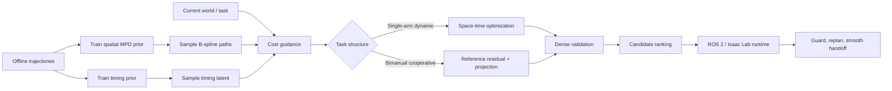
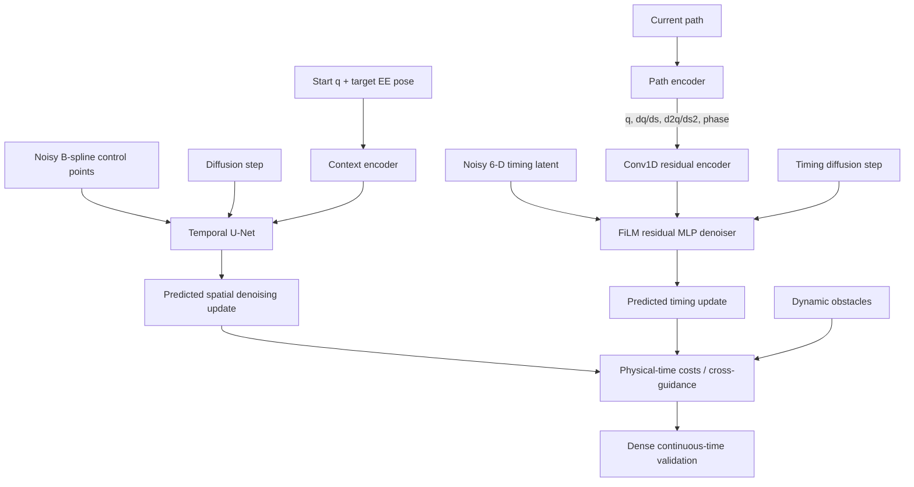
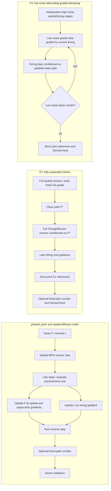
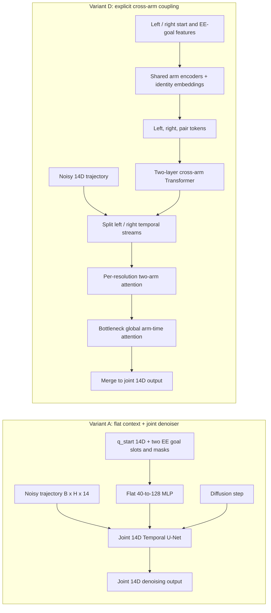
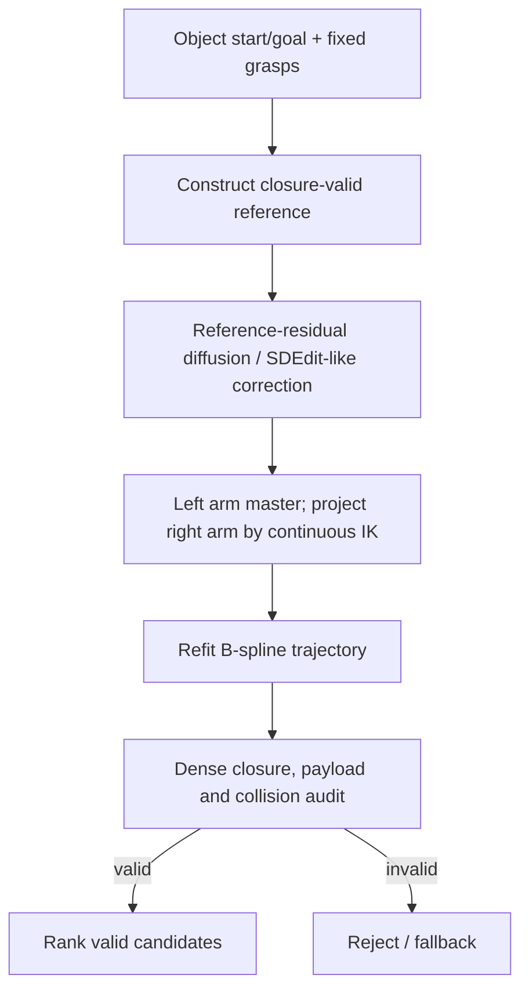
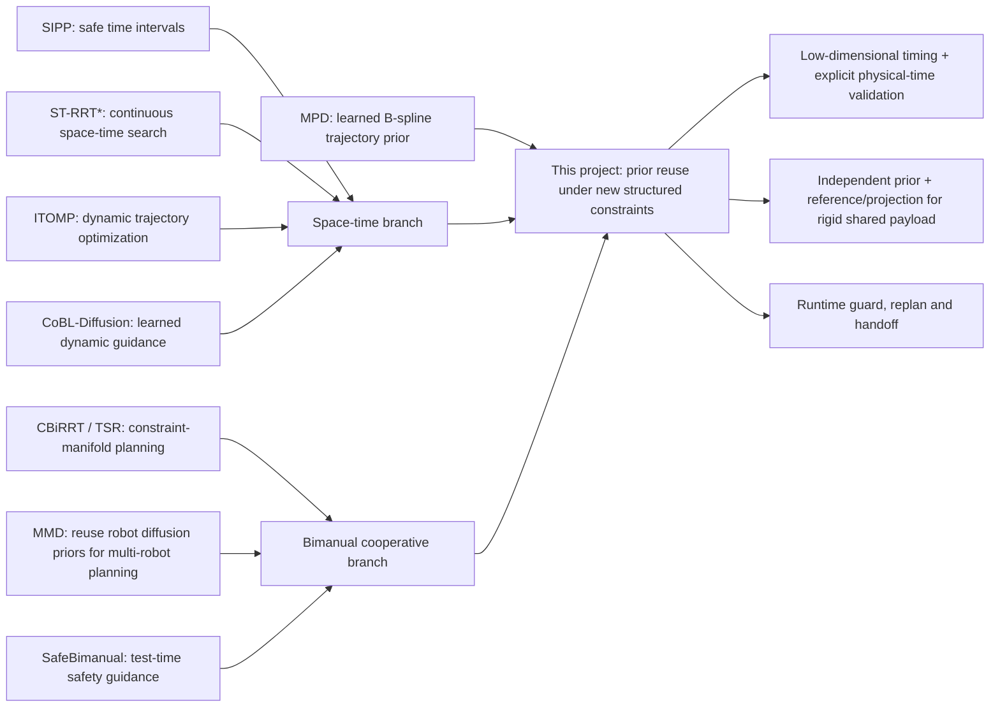
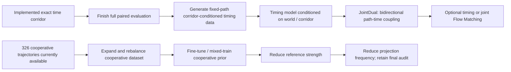

# MPD 项目正式汇报初稿

> 审计日期：2026-09-28  
> 用途：与导师正式汇报项目完成情况，并据此制作 PPT。  
> 证据口径：只把代码、配置、数据或完整日志支持的内容列为“已完成”；只完成实现但尚未形成正式实验的内容单列为“开发中”；设计文档中的方案不写成既有结果。

## 1. 建议的项目定位

### 汇报标题

**Extending Motion Planning Diffusion to Structured Space–Time and Bimanual Constraints**  
中文可用：**面向时空与双臂结构约束的扩散运动规划扩展**

### 一句话主线

本项目研究的是：**在尽量保留预训练运动扩散先验的前提下，如何在推理阶段引入新的结构化约束，并把方法推进到可验证、可运行的机械臂规划系统。**

这里的两类结构化约束是：

1. 单臂动态场景中的**空间—物理时间耦合**：同一条几何路径，经过障碍区域的时刻不同，碰撞结果也不同；
2. 双臂刚性协作中的**跨机械臂闭链耦合**：两条单臂轨迹必须在整个运动过程中同时满足共同负载、相对抓取位姿与碰撞约束。

这条叙事比“做了若干独立功能”更适合作为正式汇报主线。单臂动态规划和双臂协作不是两个无关项目，而是同一个问题的两种实例：**原有 learned prior 不包含新约束时，如何通过表示、引导、投影、验证和运行时机制完成适配。**

### 不应使用的主张

- 不把 corridor 写成已经带来成功率提升：实现与计算优化已经完成，当前正在跑完整测试；有限结果中加与不加 corridor 的有效候选数和任务结果变化不大。
- 不把 F1/F2/F3 称为 JointDual：它们仍是空间扩散模型与 timing diffusion 的因子化组合。
- 不说已经完成 Flow Matching：仓库里没有对应训练器、网络和正式实验。
- 不说当前 cooperative planner 学会了闭链协作分布：现有正式 benchmark 使用 independent prior，并依赖 reference-residual 与 projection。
- 不把当前结果扩展成动力学、力控或柔顺操作结论：目前验证主要是几何与运动学层面。
- 不把 Isaac Lab、fake-hardware 或 replay 结果表述为真实硬件实验。

## 2. 当前仓库状态审计

| 模块 | 当前状态 | 可在主汇报中如何表述 | 主要证据 |
|---|---|---|---|
| 原始 MPD 复现与扩展 | 已完成 | 以 B-spline 控制点为低维轨迹变量，结合扩散先验、可微代价引导与最终验证 | 原 MPD 代码路径及 [MPD 论文](https://arxiv.org/abs/2412.19948) |
| 引导梯度加速 | 已完成并有正式 ablation | 用 active-set / link-sparse pruning 降低无效碰撞梯度计算；在 7 个场景中保持判定一致 | `GRADIENT_PRUNING_B0_B7_MULTI_SCENE_RESULTS_20260807.md` |
| 单臂显式时序 | 已完成并有系统 benchmark | 将空间路径与物理时序分离；支持显式时序优化及动态障碍代价 | `space_time_guidance.py`、120-environment benchmark |
| Learned timing（F1/F2/F3） | 已完成并有系统 benchmark | 6 维 timing latent 的 diffusion prior；三种空间—时序组合采样方式 | `mpd/timing_training/`、factorized benchmark |
| Time corridor | **已实现，完整评估中** | 已完成 safe interval、可达分支、corridor cost、fixed-path refinement、`batch_exact` 与 K-best/DP 可选项；当前有限测试未显示稳定的覆盖或成功率增益 | `time_corridor.py`、`TIMECORRIDOR_SPEED_FIRST_IMPLEMENTATION_REPORT.md`、`FACTORIZED_CORRIDOR_BRANCH_STUDY.md` |
| 14-DoF 独立双臂 MPD | 已完成并有 benchmark | 构建 19.94 万条 independent 双臂轨迹，比较 A–D 四类跨臂建模结构 | 数据 summary、region benchmark、网络变体说明 |
| 双臂刚性协作推理 | 已完成并有 ablation/benchmark | 使用闭链 reference、reference-residual 扩散修正、非对称投影与 dense audit，将 independent prior 适配到 cooperative task | cooperative ablation 与 9-checkpoint benchmark |
| Cooperative 数据 | 已有小规模数据，尚未形成正式 learned cooperative prior | 已生成 100 contexts、326 trajectories；未找到用该 Warehouse cooperative 数据训练并验证的 checkpoint | cooperative `generation_summary.json` |
| ROS 2 / Isaac Lab 运行时 | 主要软件链路已实现 | resident worker、world update、候选选择、碰撞 guard、重规划与平滑 handoff；作为系统工程完成项展示 | `physical_ai_runtime` 中三个 planner adapter；不宣称真机验证 |
| JointDual | 设计阶段 | 作为 future work；需要双向空间—时间交互的联合网络、训练目标和采样器 | `SINGLE_ARM_SPACETIME_TIMECORRIDOR_JOINTDUAL_FLOWMATCHING_DESIGN.md` |
| Flow Matching | 设计阶段 | 放在 JointDual 之后作为替代生成动力学的研究方向 | 同上 |

补充说明：当前推荐的显式配置是 `batch_exact`、chunk 64；最终安全性仍由原 DenseCheck、handoff、guard 和 brake 决定。已有测试支持实现与数值链路，但全量多场景统计仍在运行，因此只报告“已实现、初步影响不明显”。

## 3. 建议的 PPT 结构（15 页正文）

| 页 | 标题 | 核心内容 | 推荐图 |
|---:|---|---|---|
| 1 | Title & one-sentence question | 保留 learned motion prior，适配新结构约束 | 单臂动态 + 双臂协作并列任务图 |
| 2 | Motivation | 静态几何 prior 不等于动态可执行；独立双臂 prior 不等于闭链协作 | “prior → constraint gap”示意图 |
| 3 | Baseline: MPD | B-spline 轨迹、diffusion prior、cost guidance、dense validation | 基础 MPD 模型结构 |
| 4 | Problem formulation | 统一目标 + 两类约束：时空耦合、跨臂闭链耦合 | 两个数学问题并列 |
| 5 | Related work and gap | MPD / 动态规划 / cooperative planning 三条线及交叉缺口 | 第 6 节关系图 |
| 6 | System overview | 数据、训练、推理引导、投影、验证、ROS 2 runtime | 第 5.1 节总流程图 |
| 7 | Efficient guided inference | gradient pruning 的动机、方法与结果 | active set 示意 + B0/B3 柱状图 |
| 8 | Space–time method | `c`/`tau_r` 表示；phase5_joint、F1、F3 | 第 5.2–5.3 节模型与推理图 |
| 9 | Space–time results | 120 场景、3 repeats、paired subset；准确率—时长—耗时权衡 | 第 7.2 节表或 Pareto 图 |
| 10 | Time corridor | cost、safe-interval 分支、固定路径 refinement；初步结果变化不大 | 第 4.5 与 5.6 节公式/示意图 |
| 11 | Bimanual independent prior | 14-DoF 数据与 A–D 架构；重点比较 A 与 D | 第 5.4 节模型图 |
| 12 | Cooperative adaptation | reference-residual、right-arm IK projection、dense closure/payload audit | 第 5.5 节流程图 |
| 13 | Cooperative results | 组件必要性 ablation + 9-checkpoint 结果 | 两张紧凑表 |
| 14 | Runtime integration & limitations | resident server、动态世界、handoff、fallback；尚无真机证据 | runtime 方框图 + limitations |
| 15 | Future work & takeaways | corridor → conditioned timing → JointDual；cooperative data → learned cooperative prior | 第 9 节路线图 |

若汇报时间只有 12–15 分钟，可把第 7 页并入结果页，把第 10 页简化为 future-work 开头，并把 runtime 放附录。

## 4. Motivation 与问题表述

### 4.1 建议的 motivation 叙事

1. **MPD 的优势**：学习到的轨迹先验能够快速提出平滑、任务相关的候选，并通过代价引导适应测试时约束。
2. **现有边界**：原始先验主要描述空间轨迹；实际部署还需要处理物理时间、动态障碍、双臂互相影响及刚性负载闭链。
3. **简单扩维的困难**：把所有变量直接拼成一个大向量会增加数据与训练成本，而且新约束未必存在于原始训练分布。
4. **本项目假设**：保留已有空间运动知识，把新增结构编码成低维 timing latent、推理期代价、显式投影和严格验证，可以更经济地扩展规划能力。
5. **研究问题**：这种“prior reuse + structured correction”的方式能走多远？在哪些约束下足够，在哪些约束下必须把新结构重新写入训练数据与模型？

最后一句自然引出结果：单臂时空规划已经表现出有效但存在 success–duration trade-off；双臂协作中，reference 与 projection 缺一不可，说明纯推理期适配存在明确上限。

### 4.2 本项目可以解决、以及预期解决的问题

这里不建议使用“其他论文都不能解决”的绝对表述。更准确的贡献定位是：**已有方法通常分别解决 learned trajectory generation、dynamic-obstacle planning、constraint-manifold planning 或双臂安全中的一部分，但没有直接覆盖本项目所需的组合：复用已有机械臂运动先验，同时加入显式物理时间或刚性闭链约束，并经过候选级验证与运行时重规划。**

| 问题 | 现有方法留下的缺口 | 本项目当前能够解决什么 | 预期进一步解决什么 |
|---|---|---|---|
| 静态空间 prior 无法判断“何时经过” | 原始 MPD 主要生成几何路径；仅沿路径做固定速度执行，无法利用等待、加速或减速避开运动障碍 | 保留空间 MPD，通过低维 timing latent 和 physical-time cost，为每个候选联合决定路径与执行时序 | 用 corridor-conditioned timing 和 JointDual 学习 early/late passing 等多模态，并在 timing 无解时反向修改空间路径 |
| 传统时空搜索不利用任务运动先验 | SIPP / ST-RRT* 能处理动态可达性，但不直接利用预训练机械臂轨迹分布；连续高维机械臂搜索仍可能昂贵 | 由 learned prior 提供少量高质量空间候选，再优化物理时序；已实现 time corridor 约束固定路径的到达时刻 | 继续验证 corridor 在真正多时间模态任务中的覆盖收益，并把 corridor condition 输入 timing model |
| 纯局部轨迹优化依赖初值 | ITOMP、GPU trajectory optimization 等方法很强，但结果可能受 seed、局部极小值和候选覆盖影响 | 扩散 prior 提供多样候选，cost guidance、批量验证与 ranking 负责测试时约束 | 形成固定候选预算下，与 sampling / optimization baseline 的完整成功率—延迟对照 |
| Independent 双臂轨迹不满足刚性协作 | 一般多机器人协调主要处理互相碰撞；两臂共同搬运还要求全过程保持相对抓取位姿并验证 payload | 在固定抓取假设下，以 closure-valid reference、residual correction、closed-chain projection 和 dense audit 适配 independent prior | 将 cooperative 数据写入生成 prior，提高直接产生 closure-consistent 候选的比例，减少强 reference 与高频 projection 依赖 |
| 离线可行轨迹不等于可部署规划 | 许多论文以离线 success 为终点，未覆盖动态 world age、deadline、handoff 和执行中 guard | 已实现 resident inference、候选验证、world update、replan、平滑 handoff 与 braking 软件链路 | 补充 warm-latency、replan-to-handoff 和真实硬件鲁棒性实验 |

因此，本项目的核心价值不是提出一个可以替代所有规划器的单一模型，而是给出一条**从已有 learned prior 到新约束任务的渐进式适配路径**：先用低维结构变量、引导和投影获得可用系统，再根据消融暴露出的瓶颈，把 timing corridor 或 cooperative structure 纳入数据与模型。

可在 Motivation 页用一句话概括：

> Existing planners can address parts of dynamic or constrained motion planning, but they do not directly provide a reusable learned manipulator prior that can be extended to both physical-time reasoning and rigid bimanual closure. This project studies that missing adaptation layer.

### 4.3 统一问题

用 B-spline 控制点 $P$ 表示几何路径：

\[
q(s)=B(s)P,\qquad s\in[0,1].
\]

预训练扩散模型给出条件轨迹先验 $p_\theta(P\mid c)$。推理时求解可写成：

\[
\min_{P,z}\;-\log p_\theta(P\mid c)+\lambda J(P,z;\mathcal W)
\quad\text{s.t.}\quad g(P,z;\mathcal W)\le 0,\;h(P,z)=0,
\]

其中 $z$ 是新增的低维结构变量，$\mathcal W$ 是规划时的世界状态；单臂动态任务中 $z$ 表示时序，双臂任务中 $h=0$ 表示闭链约束。

### 4.4 单臂 space–time formulation

保持几何路径 $q(s)$，另用单调 timing law 把路径相位映射到物理时间。

#### `c` 表示：直接参数化正 timing density

完整 timing spline 使用 8 个控制点：

\[
g(s;c)=B_t(s)c,\qquad
u(s;c)=\frac{dt}{ds}=u_{\min}+\operatorname{softplus}(g(s;c)),
\]

\[
t(s;c)=\int_0^s u(\xi;c)d\xi.
\]

端点约束为 $c_1=c_0$、$c_6=c_7$，使 $u_s(0)=u_s(1)=0$。TimingDiffusion 实际学习的六维向量是

\[
z_c=[c_0,c_2,c_3,c_4,c_5,c_7],
\]

解码后恢复为 $[c_0,c_0,c_2,c_3,c_4,c_5,c_7,c_7]$。`phase5_joint` 则直接维护完整 $c$，并在优化时冻结首尾各两个控制点。

#### `tau_r` 表示：分离总时长和相对 timing shape

令五维 $r$ 经过 gauge-fixed spline 得到归一化正密度

\[
\pi(s;r)=\epsilon+(1-\epsilon)
\frac{\exp(B_t(s)\tilde r)}{\int_0^1\exp(B_t(\xi)\tilde r)d\xi},
\quad
\tilde r=[0,0,r_1,r_2,r_3,r_4,r_5,r_5].
\]

根据路径和该 shape 计算满足采样速度/加速度限制的下界 $T_{\min}(P,r)$：

\[
T_v=\max_{s,j}\frac{|q_{s,j}|}{\pi\,\dot q_j^{\max}},\qquad
T_a=\sqrt{\max_{s,j}
\frac{|q_{ss,j}/\pi^2-q_{s,j}\pi_s/\pi^3|}{\ddot q_j^{\max}}},
\]

\[
T_{\min}=\max(T_{floor},\kappa T_v,\kappa T_a).
\]

六维 latent 为 $z_{\tau r}=[\tau,r_1,\ldots,r_5]$，其中

\[
y=\sigma(\tau),\qquad
T=T_{\min}+y(T_{\max}-T_{\min}),
\]

\[
u(s)=T\pi(s;r),\qquad t(s)=T\int_0^s\pi(\xi;r)d\xi.
\]

因此 `tau_r` 把“总时长选择”和“沿路径在哪里减速”分开；`c` 更直接，但整体尺度与局部 shape 耦合在同一组控制点中。

#### 联合物理代价

两种表示最终都解码成相同的 $t(s)$，并使用：

\[
J_{ST}=w_{dyn}J_{dynamic}(q(s),t(s))
+w_vJ_{velocity}+w_aJ_{acceleration}
+w_TT+w_sJ_{timing\ smoothness}.
\]

核心不是只找 collision-free path，而是同时选择**从哪里走**和**何时经过那里**。当前 timing network 只以 path 为条件，没有直接看到 dynamic world 或 corridor，因此相同路径在不同障碍时序下可能得到相同 timing prior；这是后续 corridor-conditioned timing 的主要动机。

#### Timing model 的训练数据从哪里来

训练数据从 Warehouse HDF5 的静态可行 `sol_path` 开始：先拟合空间 B-spline $P[29,7]$，再用 TOPP-RA 和 Panda 运动限制生成可行 retiming；将其拟合为 runtime `c[8]`，并生成 `fast_anchor`、1.5/2.0/2.5 倍全局减速、`local_slowdown` 和 `near_wait` 变体。每条记录重新检查 joint position、velocity、acceleration 和 14 s horizon。

`tau_r` 数据再从这些 $c$ 曲线拟合五维 shape $r$，计算 $T_{\min}(P,r)$，并对 eligible shape 展开

\[
y\in\{0.01,0.05,0.15,0.35,0.60\},\qquad \tau=\operatorname{logit}(y).
\]

同一 base path、反向路径和所有 timing variants 放在同一 train/validation/test split，避免路径泄漏。当前数据提供的是**运动学可行的多 timing teacher**，没有把当前 dynamic world 或 corridor 作为模型条件，这也解释了 learned timing 在动态测试中的局限。

### 4.5 Time corridor cost 与本项目实现

对固定空间路径 $P$，在采样 phase $s_i$ 上选择一个可达安全时间区间 $[l_i,u_i]$。若当前 timing 的到达时刻为 $t_i=t(s_i)$，corridor penalty 为

\[
J_{corr}=\frac{1}{M}\sum_{i=1}^{M}
\left[\operatorname{ReLU}(l_i-t_i)^2+
\operatorname{ReLU}(t_i-u_i)^2\right],
\]

并优化 $J_{total}=J_{ST}+\lambda_{corr}J_{corr}$。

本项目中的实现流程是：

1. 固定 $P$，默认取 32 个 phase points，并以 0.2 s 网格查询动态世界中所有 collision spheres 的 signed distance；
2. 结合碰撞 margin 得到每个 phase 的 safe intervals，并由关节速度限制给出相邻 phase 的最小时间步数；
3. 用动态规划连接可达 intervals，默认搜索贴近当前 timing、偏早和偏晚三种分支；K-best 与 DP 初始化作为可选实验项；
4. 对 `phase5_joint` 的物理 $c$ 或 F1 checkpoint 的标准化六维 latent 做 fixed-path Adam refinement；默认 $\lambda_{corr}=0.1$、20 steps、learning rate 0.04；
5. 按原精确物理代价选择结果，最后仍执行原 DenseCheck，不把离散 corridor 可达当作连续安全证明。

实现、`batch_exact` 加速与相关测试已经完成，当前全量评估仍在运行。有限样本中 corridor on/off 的有效候选和任务结果变化不大；K-best 虽增加分支数，也暂未救回额外候选。因此当前结论是“提供显式时间窗口结构，但尚未观察到稳定收益”，不是 corridor 无效的最终结论。

### 4.6 双臂 cooperative formulation

双臂状态为 $q=[q_L,q_R]\in\mathbb R^{14}$。固定抓取下，共同物体要求左右末端之间的相对变换在整条轨迹上保持一致：

\[
h(q_L(s),q_R(s))=
\operatorname{Log}\!\left(
T_L(q_L(s))^{-1}T_R(q_R(s))T_{LR}^{*-1}
\right)=0.
\]

同时满足关节限制、自碰撞、环境碰撞和 payload 碰撞。当前做法不是训练一个真正的 closed-chain prior，而是：

- 先构造 closure-valid reference；
- independent bimanual diffusion prior 在 reference 附近生成 residual；
- 以左臂为 master，对右臂做连续 IK projection；
- 对投影轨迹重新拟合，并进行 dense closure / payload / collision audit。

投影是数值修正，不应表述为连续流形上的理论保证。

## 5. 建议放入 PPT 的图

以下 Mermaid 图可直接作为绘图草稿，正式 PPT 建议重新绘制成统一配色的矢量图。

### 5.1 项目总流程图

图中 `Train timing prior` 只适用于 factorized timing 方法；cooperative 正式结果仍使用 independent spatial prior。

### 5.2 单臂模型结构图

需要在图旁明确写：空间 MPD 默认 context 不含 scene geometry；动态世界主要通过 inference-time cost 进入。timing denoiser 目前也没有 corridor/world condition。

### 5.3 单臂 `phase5_joint`、F1 与 F3 推理流程图

准确口径：`phase5_joint` 没有 TimingDiffusion，它在 spatial diffusion 的 guide 内优化 $c$；F1/F3 才加载独立的 path-conditioned timing checkpoint。F3 是 alternating guided denoising，不称为严格 Gibbs sampler。

### 5.4 双臂 Variant A 与 D 模型结构图

两者使用相同的 14-DoF 轨迹、扩散过程和 loss。A 的 context 与轨迹都较早扁平融合，约 4.57M parameters；D 保留左右臂与 pair token，并在多个时间分辨率显式交换信息，约 6.86M parameters。D 不是参数量匹配消融，因此结果页仍应同时报告延迟和模型规模。

### 5.5 Cooperative 推理算法流程图

此图应该紧接 cooperative ablation，因为结果直接说明 `RR` 与 `PR` 两个模块都不是可选装饰。

### 5.6 Time-corridor 图应画什么

画一个二维 $s$–$t$ 平面：横轴 path phase，纵轴 physical time。

- 障碍物造成的 forbidden regions 用红色表示；
- 每个 phase 的 safe intervals 用白色纵向区间表示；
- interval 之间的可达连接构成分支图；
- 当前 timing curve 是从左下到右上的单调曲线；
- corridor cost 把曲线拉回选中的可达分支；图旁可放第 4.5 节的 hinge-squared interval penalty。

右上角标注：**Implemented; full evaluation running. Preliminary tests show little change in valid-candidate coverage or task outcome.**

## 6. Related work：主幻灯片放哪些论文

### 6.1 主图的组织方式

### 6.2 建议正文保留的论文

| 方向 | 论文 | 与本工作的关系 | 放置位置 |
|---|---|---|---|
| 基础方法 | [Motion Planning Diffusion](https://arxiv.org/abs/2412.19948) | 低维 B-spline 轨迹扩散先验与推理期 cost guidance；本项目的直接基础 | Baseline 页 |
| 时间区间 | [SIPP](https://www.cs.cmu.edu/~maxim/files/sipp_icra11.pdf) | safe interval 的经典离散抽象；启发 time corridor，但本项目作用于连续机械臂路径的 phase–time 表示 | Related work / corridor 页 |
| 连续时空搜索 | [ST-RRT*](https://arxiv.org/abs/2203.02176) | 在连续 state-time 中处理动态障碍与未知到达时间；是非学习式动态规划基线代表 | Related work 页 |
| 动态轨迹优化 | [ITOMP](https://aaai.org/papers/00207-13513-itomp-incremental-trajectory-optimization-for-real-time-replanning-in-dynamic-environments/) | 动态环境中的增量优化与执行耦合；对比本项目“learned proposal + guidance/runtime” | Related work 页 |
| 学习式动态规划 | [CoBL-Diffusion](https://arxiv.org/abs/2406.05309) | 用 barrier/Lyapunov guidance 处理动态多智能体约束；相关但任务不是高维机械臂操作 | Related work 页，注明任务差异 |
| 约束流形规划 | [CBiRRT / Task Space Regions](https://publications.ri.cmu.edu/task-space-regions-a-framework-for-pose-constrained-manipulation-planning) | 经典 pose-constrained / manifold planning；解释 projection/reference 的来源与差异 | Cooperative 页 |
| 多机器人 prior 复用 | [MMD](https://arxiv.org/abs/2410.03072) | 用单机器人 diffusion priors 协调多机器人碰撞；不直接处理刚性 shared-object equality | Cooperative related work |
| 双臂测试时安全适配 | [SafeBimanual](https://arxiv.org/abs/2508.18268) | 对预训练双臂 diffusion policy 施加测试时安全代价；与“保留 prior、推理期修正”最接近 | Cooperative related work |

### 6.3 为什么现有相关工作不能直接替代本项目

| 方法类别 | 已解决的问题 | 对本项目任务仍不足的地方 | 本项目补充的部分 |
|---|---|---|---|
| MPD | 学习 B-spline 轨迹 prior，并在推理期加入 differentiable cost | 原始设定没有独立的物理时间决策，也没有 rigid bimanual closure | timing latent、physical-time costs、双臂 reference/projection 和 runtime validation |
| SIPP / ST-RRT* | safe intervals 或连续 state-time search，能够绕开动态障碍 | 不提供由操作任务数据学习的机械臂运动 prior；SIPP 的经典保证基于其离散图设定，不能直接移植为本项目连续高维系统的保证 | 用 learned spatial proposals 缩小搜索范围，并用 continuous phase-time corridor 表达固定路径的安全时序 |
| ITOMP / cuRobo 类优化器 | 高效局部轨迹优化、碰撞和运动约束处理 | 依赖初始解或多 seed，且没有直接回答如何复用已有 diffusion prior 增加任务相关候选覆盖 | generative candidates + guided correction + dense candidate selection；但仍需补直接 baseline 对照 |
| CoBL-Diffusion 等 learned dynamic planning | 将动态安全条件加入 diffusion guidance | 主要实验问题和状态维度与高自由度机械臂操作不同，也没有采用“可复用空间 prior + 独立低维 timing model”的设计 | 针对机械臂 B-spline path 与物理时序的因子化建模和验证 |
| CBiRRT / TSR | 在约束流形上搜索 pose-constrained manipulation path | 不学习任务轨迹分布，每次规划仍主要依靠采样、投影和连接 | 使用 learned bimanual prior 提供候选；同时保留 reference/projection 处理强等式约束 |
| MMD | 复用单机器人 diffusion priors，解决多机器人之间的碰撞协调 | collision coordination 不等同于两臂刚性抓持同一负载；没有直接施加全过程 shared-object equality | 显式 closure constraint、payload collision 与闭链 dense audit |
| SafeBimanual / APEX | 双臂生成或测试时安全适配 | 与本项目的固定双抓取、刚性 shared payload、全过程闭链和 independent-prior reuse 设定不同 | 针对该闭链设定验证 reference-residual 与 projection 的必要性，并规划用 cooperative 数据减少依赖 |

这张表的结论应是“**problem setting 与能力组合仍有缺口**”，而不是声称其他方法在各自设定中无效。当前项目也仍有缺陷：corridor 完整效果评估尚未结束、缺少直接 classical baseline、cooperative 方法依赖 reference/projection、且尚未完成真实硬件验证。

### 6.4 建议只放附录或 future-work 页的论文

- [cuRobo](https://arxiv.org/abs/2310.17274) / [cuRoboV2](https://arxiv.org/abs/2603.05493)：作为 GPU 优化与高自由度规划参考；除非补做直接 benchmark，否则不要在正文造成“已比较”的印象。
- [APEX](https://arxiv.org/abs/2404.02284)：双臂 latent diffusion，可用于补充 learned dual-arm planning 背景；其问题设置与本项目的 rigid shared payload 不完全相同。
- [G2DP](https://arxiv.org/abs/2606.26017)：可微时空 cost volume 对 corridor 表示有启发，但任务是自动驾驶，适合 future-work 页。
- [FlowMP](https://arxiv.org/abs/2503.06135) 与 [SafeFlow](https://arxiv.org/abs/2504.08661)：只在 Flow Matching future-work 中引用，不应写成当前方法组成。

相关工作页的重点应是“问题轴与方法轴”，不是论文数量。正文 7 篇左右已经足够。

## 7. 可以正式展示的实验结果

### 7.1 引导梯度加速：完整多场景 ablation

实验覆盖 7 个场景、8 个变体、3 次 timing repeats，共 168/168 次 CUDA runs。相对未裁剪基线 B0，推荐展示 B3（link-sparse）：

| 指标 | B0 | B3 | B3 相对结果 |
|---|---:|---:|---:|
| Guidance time | 0.4646 s | 0.2794 s | 1.668× speedup |
| Inference speedup | — | — | 1.561× |
| Total speedup（含 dense validation） | — | — | 1.341× |
| Valid / collision decisions | 7 个场景基线 | 与 B0 一致 | 无变化 |

表述边界：该实验支持“在这些场景中减少引导计算且不改变最终判定”，不支持对所有任务的普遍无损保证。重复实验使用相同 seed，适合做性能稳定性统计，不是独立规划成功率估计。

### 7.2 单臂动态：120 个冻结环境的系统 benchmark

配置为 120 个固定环境（12 categories × 10），每种模式 3 repeats，日志共发现 1257 runs。为了公平比较，正文采用 136 个配置完整的 paired groups：

| 方法 | Goal reached | 成功轨迹执行时长 | Path length | Mean inference |
|---|---:|---:|---:|---:|
| phase4 | 130/136 | 12.131 s | 4.976 | 0.255 s |
| phase4_aligned | 133/136 | 10.952 s | 4.693 | 0.454 s |
| joint | 132/136 | **10.681 s** | 5.201 | 0.372 s |
| F1-c | 94/136 | 5.703 s | 4.348 | — |
| F2-c | 92/136 | **5.576 s** | 4.364 | — |
| F3-c | 92/136 | 5.810 s | 4.342 | — |
| F1-τr | 113/136 | 9.165 s | 4.309 | — |
| F2-τr | **114/136** | 9.220 s | **4.285** | — |
| F3-τr | 110/136 | **9.119 s** | 4.296 | 0.759 s |

建议讲法：

- 显式 candidate-specific timing / joint optimization 保持了接近 baseline 的 goal reach，同时缩短成功轨迹的执行时间；
- learned timing 不是全面优于优化基线：`c` 表示产生更短时间但明显降低 goal reach；`tau_r` 较稳健，但仍存在成功率—速度权衡并增加推理成本；
- 这正好支持下一步引入 world/corridor conditioning，而不是只展示最好数字。

该表是 corridor 之前的统一 baseline；corridor 当前测试应另页展示，避免和不同协议的数据直接混合。

### 7.3 Time corridor：已完成实现，效果评估中

目前可报告两点：第一，`batch_exact` 已消除原串行实现的主要计算瓶颈；同一冻结请求的中位完整计算由约 19.875 s 降至 1.636 s，67 个有效候选保持不变。第二，当前有限 F1 冻结请求中，扩大到 K-best 分支没有增加最终有效候选，备选分支救回数为 0；小规模在线结果也没有显示 corridor on/off 的稳定任务差异。

因此 PPT 只给出一句结果：**corridor 已经实现并可在可接受时间内运行，但当前场景中 direct dynamic cost 与原 timing refinement 已经解决了大部分可修正情况，额外 corridor 结构尚未带来明显收益。** 这一解释仍是假设，需要等待正在运行的全量 paired test；不能从少量样本得出 corridor 普遍无效。

### 7.4 独立双臂：region benchmark

21 个 planning-evaluable requests；每个请求最多 4 batches × 32 candidates。推荐只展示代表性的 D checkpoint，避免把整张 checkpoint 表塞进正文：

| Model | Overall | In-distribution | Structured OOD | Strict random OOD | Mixed / shared workspace | Mean wall time |
|---|---:|---:|---:|---:|---:|---:|
| D-305k | 18/21 | 6/6 | 3/4 | 4/5 | 4/5 | 17.29 s |
| D-600k | **19/21** | 6/6 | 4/4 | 4/5 | 4/5 | **15.77 s** |
| D-665k | **19/21** | 6/6 | 4/4 | 4/5 | 4/5 | 17.71 s |

限制：任务集较小，wall time 含启动开销；有一个 endpoint sampling shortfall 未进入 planning-evaluable denominator。因此应称为 task-suite result，而不是广义 OOD 泛化证明。

### 7.5 Cooperative 组件 ablation

| 生成方式 | Projection | Easy | Medium | Hard |
|---|---|---:|---:|---:|
| Direct project | Off | 0/30 | 0/60 | 0/30 |
| Direct project | On | 0/30 | 0/60 | 0/30 |
| Reference residual | Off | 0/30 | 0/60 | 0/30 |
| Reference residual | On | **28/30** | **52/60** | **22/30** |

结论应写成：

> Ablation showed that neither reference-residual correction nor closed-chain projection alone produced valid cooperative trajectories; successful planning required both mechanisms in the evaluated tasks.

中文讲法：在所评估任务中，reference-residual correction 与 closed-chain projection 缺一不可；单靠 reference 附近的生成或单靠投影都没有得到有效协作轨迹。

### 7.6 Cooperative 9-checkpoint benchmark

正式 v2 benchmark 已完成 1080/1080 runs，所有模式均启用 reference-residual + projection。正文展示代表性最好模型：

| Model | End-to-end success | Planning success* | Mean wall time | Mean valid candidates |
|---|---:|---:|---:|---:|
| A-660k | 98/120 = **81.7%** | 90.7% | **19.08 s** | 4.85 |
| A-835k | 98/120 = **81.7%** | 89.1% | 19.60 s | 5.07 |
| D-600k | 98/120 = **81.7%** | 89.1% | 20.28 s | 5.81 |
| D-665k | 95/120 = 79.2% | 86.4% | 20.44 s | **6.12** |

\* Planning success 排除了部分 reference construction / runtime fault；因此正文把 end-to-end success 作为主指标，planning success 只用于诊断。

合理结论是：多个 independent-prior checkpoint 在 reference+projection 框架下达到约 80% 的 end-to-end success，但不同网络变体并未表现出决定性差距，系统瓶颈不只是 prior architecture，也包括 reference 构造、闭链投影和候选有效率。

### 7.7 不建议放入主结果页的内容

- 不把 corridor 的单个冻结请求或少量在线轮次当作最终效果 benchmark；它们目前只支持实现、速度和初步趋势判断；
- 单个 GPU SDF microbenchmark：可放性能附录，不能替代 planner-level 结果；
- Panda 与 Marvin 的单次生成速度对比：更像容量测试，不是核心研究结论；
- 单个成功视频或 hand-picked trajectory：可作演示，但不能替代统计结果；
- 只有 unit test 通过的模块：测试证明实现一致性，不证明方法有效性。

## 8. 目前仍缺的关键实验

按正式汇报的重要性排序：

1. **Corridor 全量效果实验**：实现和后端速度测试已经完成；仍需完成 no-corridor vs `batch_exact` 的同环境/seed/candidate-budget 配对矩阵，报告 goal reach、dynamic collision、deadline、inference latency 和窗口分支统计。K-best 只保留为诊断项，当前没有覆盖收益。
2. **Space–time 核心消融**：spatial only、timing optimization only、timing prior only、prior + optimization、corridor-conditioned timing；否则目前难以量化各部分独立贡献。
3. **与非学习式方法的直接比较**：至少选一个适配当前任务的 ST-RRT* 或 trajectory-optimization baseline；如果实现成本过高，需要在汇报中明确“相关方法比较尚未完成”。
4. **统计不确定性**：当前表格宜补 bootstrap confidence interval 或跨 seed 的 success interval；尤其是 21-request bimanual region benchmark。
5. **Cooperative learned-prior 对照**：independent prior vs cooperative-data fine-tuning / mixed-data training，在相同 reference、projection、候选数下比较；再逐步减弱或移除 reference/projection。
6. **Cooperative 难度分解**：分别记录 reference failure、diffusion candidate failure、projection failure、closure violation、payload/environment collision 和 runtime timeout，避免只报总成功率。
7. **实时性与部署**：给出 resident worker 下的 warm latency、world-update age、replan-to-handoff latency、guard intervention；若无真机，则明确 Isaac Lab / fake-hardware 范围。
8. **动力学与鲁棒性**：当前主要是运动学验证；若要声称可部署，后续需要速度/加速度/力矩约束、模型误差和障碍预测误差实验。

如果时间只够补一组实验，优先完成第 1 项；它决定 corridor 在汇报中应作为“有效方法贡献”还是“已完成但当前增益有限的诊断性扩展”。

## 9. Future work 路线图

### 9.1 Space–time：完成 corridor 评估，再做 conditioned timing 与 JointDual

近期工程与实验顺序：

1. 冻结当前已完成的 `batch_exact` 实现、profiling schema 和 paired benchmark protocol；
2. 跑完 corridor on/off 全量矩阵，确认“变化不大”是场景缺少多时间模态、latent 表达不足，还是 corridor cost 与 direct dynamic cost 重复；
3. 保留 exact backend 作为 correctness oracle；K-best 目前只作为诊断，不在无覆盖收益时默认开启；
4. 用 corridor 生成 D1 fixed-path dynamic timing 数据，把 world/corridor condition 输入 timing denoiser；
5. 在此基础上实现 JointDual，让 path denoising 与 timing denoising 双向交换信息，而不只是 timing 依赖 path；
6. 最后再评估 Flow Matching 是否能用更少 integration steps 保持可行率。

需要特别说明：fixed-path phase-time corridor 与计算优化已经完成，完整效果验证仍在进行；`corridor-conditioned timing`、JointDual、Flow Matching 仍是 future work。

### 9.2 Cooperative：让协作结构进入数据与先验

当前已有一版 Warehouse cooperative 数据：100 个 contexts、326 条轨迹，其中 65 个 context 达到每任务 4 条解的目标；相比 independent 数据的 199,424 条轨迹，规模和覆盖明显不足，且 35 个 contexts 未达到配额。

建议路线：

1. 扩充 cooperative 数据，平衡 object pose、grasp transform、narrow passage、shared workspace 和失败边界样本；
2. 用 mixed curriculum 保留 independent reachability 能力，同时学习闭链协作分布；
3. 首先在现有 reference+projection 框架下比较 independent prior 与 cooperative prior；
4. 再做 reference noise / dropout，使模型逐步降低对精确 reference 的依赖；
5. 将 projection 从“每个候选必须依赖”改为轻量 correction 或最终 safety repair；
6. dense closure、payload collision 与最终 continuous audit 仍应保留，即使生成 prior 已经改善。

目标不应表述为“完全取消一切约束处理”，而应是：**减少强 reference 和高频 projection 的依赖，提高直接生成有效协作候选的比例，同时保留安全验证。**

## 10. 容易遗漏、但值得讲的已完成工作

1. **验证体系**：动态碰撞、闭链误差、payload 碰撞和 dense audit 是方法可信度的一部分，不只是辅助代码。
2. **数据工程**：14-DoF independent 数据生成、reverse augmentation、GPU RRT、分 shard 生成与恢复机制，是模型结果能够形成的前提。
3. **候选级而非单轨迹级规划**：方法依靠批量候选、验证和 ranking；汇报图中应体现，而不能只画一条 diffusion trajectory。
4. **运行时集成**：规划器输出还经过 stale-world 管理、guard、replan、quintic/constrained handoff 和 braking，说明工作目标不只是离线生成。
5. **负结果与边界**：learned timing 不总是优于优化；cooperative 中任何单独组件都失败；corridor 已完成实现但初步增益不明显。这些不是削弱工作，反而构成下一阶段问题定义。

## 11. 最后一页可直接使用的 takeaways

1. **Efficient guidance**：link-sparse gradient pruning 在 7 个场景中保持最终判定一致，并将 guidance 加速 1.668×、总流程加速 1.341×。
2. **Explicit time matters**：在动态场景中加入候选相关的物理时间决策，能够缩短成功轨迹执行时间；learned timing 仍存在成功率—效率权衡。
3. **Structured correction enables reuse**：independent bimanual prior 经 reference-residual 与 closed-chain projection 后可用于刚性协作，但 ablation 表明两者缺一不可。
4. **The remaining gap is learned structure**：time corridor 已实现但仍需完成全量效果验证；JointDual 与 cooperative-data training 的目标，是把当前依赖外部修正的结构逐步写入模型本身。

## 12. 讲述口径与素材清单

### 12.1 建议统一术语

- `spatial path`：几何路径 $q(s)$，不要直接称为 timed trajectory；
- `timing law / physical-time parameterization`：$t(s)$ 或其 6 维 latent；
- `factorized timing diffusion`：F1/F2/F3 的总称；
- `JointDual`：只指未来双向交互的联合模型；
- `reference-residual correction`：避免说成 reference-free generation；
- `closed-chain projection`：说明为 numerical asymmetric projection；
- `end-to-end success`：包含 reference/runtime fault；优先于条件化 planning success。

### 12.2 做 PPT 前建议导出的素材

- 1 个单臂动态成功案例：同一路径的 early/late timing 对比；
- 1 个 phase–time corridor 草图或可视化，标注 “implemented, evaluation running”；
- 1 个 independent 双臂 mixed/shared-workspace 案例；
- 1 个 cooperative easy 与 1 个 hard 成功案例，叠加闭链误差曲线；
- gradient pruning 的 B0/B3 时间分解图；
- factorized benchmark 的 success–execution-duration 散点图；
- cooperative ablation 与 9-checkpoint benchmark 的简化柱状图；
- runtime 的 planning → validation → handoff → guard 时间线。

### 12.3 仓库内主要证据位置

- `docs/gpt-analyse.txt`
- `docs/GRADIENT_PRUNING_B0_B7_MULTI_SCENE_RESULTS_20260807.md`
- `docs/TIMECORRIDOR_SPEED_FIRST_IMPLEMENTATION_PLAN.md`
- `docs/TIMECORRIDOR_SPEED_FIRST_IMPLEMENTATION_REPORT.md`
- `docs/FACTORIZED_CORRIDOR_BRANCH_STUDY.md`
- `docs/FACTORIZED_TIMING_OPTIMIZATION_REPORT.md`
- `docs/SINGLE_ARM_SPACETIME_TIMECORRIDOR_JOINTDUAL_FLOWMATCHING_DESIGN.md`
- `scripts/isaaclab/logs/todrawer-factorized-c-tau-r-120x3x9-v2/report/report.md`
- `scripts/inference/logs/marvin-region-model-benchmark-4x32/summary.json`
- `logs/benchmarks/cooperative_priors_v1/summary.md`
- `logs/benchmarks/cooperative_models_reference_projection_v2/summary.md`
- `data_public/data_trajectories/EnvWarehouse-RobotMarvinBimanual-independent-v3-gpu-combined-reversed/generation_summary.json`
- `data_public/data_trajectories/EnvWarehouse-RobotMarvinBimanual-cooperative-v1/generation_summary.json`
- `scripts/train/MARVIN_BIMANUAL_NETWORK_VARIANTS.md`
- `mpd/timing_training/model.py`
- `mpd/inference/time_corridor.py`
