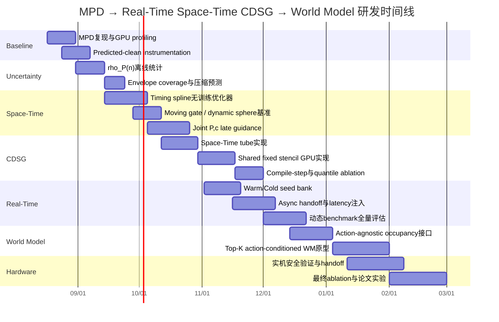

# 从初始 MPD 到实时 Space-Time CDSG，再到 World-Model Planning：统一研究路线与可执行技术方案

## 执行摘要

本报告建议把研究路线收敛为一条连续演进、而不是模块堆叠的主线：

\[
\boxed{
\text{MPD}
\rightarrow
\text{Real-Time / Warm-Start MPD}
\rightarrow
\text{Space-Time MPD}
\rightarrow
\text{Space-Time CDSG}
\rightarrow
\text{World-Model-Aware Space-Time MPD}
}
\]

起点是现有 **Motion Planning Diffusion（MPD）**：在 B-spline 控制点空间学习多模态轨迹先验，并在反向 diffusion 的后期通过可微规划 cost 做 posterior guidance。MPD 已经使用 phase \(s\) 与真实时间 \(t\) 的解耦公式，并定义了 \(r(s)=ds/dt\)，但当前实现采用线性 phase-time scaling，即 \(r(s)=1/T\)，且论文明确说明没有优化 trajectory duration。MPD 还指出 B-spline 的局部支撑适合局部碰撞梯度，并在固定 phase sampling 下预计算 basis matrix。citeturn4view1turn4view2turn4view0

本报告建议的第一项扩展不是 World Model，也不是立即重训 joint diffusion，而是将时间从固定标量 \(T\) 升级为低维 timing spline：

\[
q(s)=B_q(s)P,
\]

\[
z(s)=B_T(s)c,
\]

\[
\boxed{
r(s)=\frac{ds}{dt}
=
r_{\min}+\operatorname{softplus}(z(s))
}
\]

以及

\[
\boxed{
t(s)=t_0+\int_0^s\frac{1}{r(\xi)}\,d\xi.
}
\]

于是 diffusion/planning state 最终可以统一表示为

\[
\boxed{
X=
\begin{bmatrix}
\operatorname{vec}(P)\\
c
\end{bmatrix}.
}
\]

其中 \(P\) 决定“**去哪里**”，\(c\) 决定“**什么时候到那里**”。动态障碍成本因此从 \(C(q,O)\) 升级为

\[
\boxed{
C_{\rm dyn}(P,c)
=
C\left(
q(s;P),
O(t(s;c))
\right).
}
\]

Safe Interval Path Planning（SIPP）已经证明，用连续安全时间区间替代逐 timestep 的完整 space-time 搜索可以大幅压缩时间维度；Huang 等 2024 年的工作又进一步把 safe interval、temporal corridor 与 B-spline 动态轨迹优化结合起来。因此，“时间窗口”或“temporal corridor”本身不是本工作的创新点。真正值得研究的差异，是让 **当前 diffusion predicted-clean B-spline 所诱导的 phase-time feasible set直接进入 posterior guidance，并同时对 \(P\) 与 \(c\) 求梯度**。citeturn11view1turn3view1

CDSG 在这条路线里的角色也需要重新定义。没有 Local Planner 后，不应人为指定一个宽松的 \(\rho\)，更不能用最大关节速度构造“可信空间”。最大速度/加速度描述的是物理可行域，而 CDSG 真正需要的是：

\[
\boxed{
\text{从当前 late diffusion step 到最终解，
predicted-clean trajectory 还会变化多少。}
}
\]

因此建议离线统计

\[
\rho_{P,i}(n)
=
Q_\alpha
\left(
\left\|
P_i^{\rm final}
-
\hat P_i^{0,(n)}
\right\|
\right),
\]

\[
\rho_{c,j}(n)
=
Q_\alpha
\left(
\left|
c_j^{\rm final}
-
\hat c_j^{0,(n)}
\right|
\right),
\]

把它称为 **diffusion refinement uncertainty envelope**。它不是天然的形式化 Trust Region；只有在运行时检测越界并 recompile、或强制投影时，才能获得严格的 fixed-stencil 有效域。RTI-DP 已经表明上一时刻预测可以作为新的 diffusion 初始猜测并从较少 denoising steps 开始，而 RDM 明确采用“旧轨迹 forward re-noise → 少量反向 denoise”进行局部重规划；这些结果为 warm MPD 和 diffusion-derived refinement scale 提供了直接依据。citeturn6view3turn6view4turn6view0turn6view1

CDSG 的核心应由“空间 stencil”升级为 **Space-Time CDSG**。由 \(\rho_P(n)\) 构造机器人 link 的 workspace tube，由 \(\rho_c(n)\) 构造 arrival-time interval

\[
[t^-(s),t^+(s)],
\]

最终得到每个 span/link 的 space-time trust tube

\[
\boxed{
\mathcal Z_{k,l}.
}
\]

然后与动态障碍的 world tube

\[
\mathcal O_j^{ST}
=
\{(x,t):x\in O_j(t)\}
\]

求交，只保留

\[
\boxed{
\mathcal S_{ST}
=
\{(k,l,j):
\mathcal Z_{k,l}\cap
\mathcal O_j^{ST}\neq\emptyset
\}.
}
\]

对整个 batch 取并集，得到 **shared fixed stencil**；后续几个 guided DDIM steps 都使用完全固定的 shape。MPD 原论文已经观察到高噪声阶段 cost gradient 效果有限，因此只在最后若干 denoising steps 启用 cost guidance，这为 late-stage CDSG compilation 提供了非常自然的接入点。citeturn4view3

实时 inference 则建议采用 **Warm/Cold 混合 seed bank**，而不是每次从纯高斯或只从旧轨迹二选一。RDM 证明旧计划加少量 forward noise 后短程 denoising 能实现高效局部修复，而严重失效时仍需要 Gaussian restart；2026 年动态运动规划实验也直接使用“perturbed previous trajectory + 3 denoising steps”作为 warm-start diffusion baseline，并展示快速 batched diffusion 在动态环境中的价值。citeturn6view1turn5view1

由于新的 MPD 计算过程中机器人仍在执行旧轨迹，推荐使用 **未来 handoff**：冻结当前计划中一定会在推理延迟内执行的 prefix，在未来

\[
t_h
=
t_{\rm now}
+
L_{\rm infer}^{p99}
+
L_{\rm validate}
+
L_{\rm switch}
+
L_{\rm margin}
\]

处定义 handoff state/tube，再让新 MPD 从该未来边界开始规划。RTC 的核心思想正是执行当前 chunk 的同时生成下一 chunk，并冻结由于推理延迟而必然执行的 prefix，因此提供了重要的实时异步设计依据。citeturn7view0

World Model 应放在最后一层。第一版只需解析/Kalman/轨迹预测得到 \(O(t)\)；第二版 World Model 输出未来 occupancy 或 object pose distribution；最终版再考虑 action-conditioned World Model：

\[
p_\psi
\left(
W_{t+\tau}
\mid
H_t,\Gamma_{P,c}
\right),
\]

其中

\[
\Gamma_{P,c}=\{q(t;P,c)\}
\]

是候选机器人未来轨迹。Robot-Factored World Models 的一个非常相关的新观点是：与其让 World Model 从 raw robot commands 自己学习机器人运动实现，不如先通过真实 controller/kinematics 得到 deployment-time 可用的 nominal robot trajectory，再将机器人几何显式渲染给 World Model，让模型主要学习环境如何响应机器人运动。这和 B-spline MPD 的接口高度契合。需要注意，该工作截至 2026 年 8 月仍是非常新的 arXiv 预印本。citeturn1search3turn9view1

**总体判断：**最有论文价值的核心，不是“MPD 多了一条时间 spline”，也不是“CDSG 做稀疏碰撞”，而是以下统一关系：

\[
\boxed{
\text{predicted-clean diffusion uncertainty}
\Rightarrow
\text{space-time reachable envelope}
\Rightarrow
\text{fixed dynamic-cost domain}
\Rightarrow
\text{joint }(P,c)\text{ posterior refinement}.
}
\]

在本次截至 **2026-08-13** 的检索范围内，已有工作分别覆盖了 B-spline MPD、safe interval/temporal corridor、warm diffusion replanning、实时异步 action generation、space-time sampling、B-spline dynamic-obstacle optimization 和 World Model planning；**尚未发现完全相同的“joint spatial/timing B-spline diffusion + diffusion-derived uncertainty envelope + shared fixed space-time CDSG stencil + later world-model interface”组合**。这一“未发现”应理解为本次检索结论，而不是绝对的首次性证明。citeturn0search0turn3view1turn8search0turn8search2turn6view1turn7view0turn1search3

**可以立即开始的实验任务：**

| 实验任务 | 预期输入 | 预期输出 | 核心指标 | 预计工时 |
|---|---|---|---|---:|
| MPD latency 与 predicted-clean instrumentation | 当前 MPD checkpoint、现有静态 benchmark | 每个 DDIM step 的 \(\hat P_0^{(n)}\)、FK/J/SDF/UNet 时间分解 | P50/P95 latency、每 step drift、cost 占比 | 6–10 人时 |
| Diffusion uncertainty envelope 统计 | 1–5 万次完整 MPD rollout | \(\rho_{P,i}(n)\) lookup table、batch dispersion | Q90/Q95/Q99 drift、coverage、预测 stencil 压缩上限 | 8–16 人时 |
| Timing spline 无训练原型 | 已有 \(P\)、解析 moving-gate/moving-sphere 动态 | \(c^*\)、\(r(s)\)、\(t(s)\) | 动态避障成功率、速度/加速度 violation、duration | 12–20 人时 |
| Space-Time CDSG prototype | \(\hat P_0,\hat c_0,\rho_P,\rho_c,O(t)\) | shared \(\mathcal S_{ST}\) | stencil compression、false-negative、compile overhead、总 guide latency | 16–24 人时 |
| Warm/Cold 异步 MPD + handoff | 当前 plan、elite bank、模拟 inference latency | 下一条未来 handoff plan | warm recovery rate、cold invocation rate、handoff error、P99 response | 16–28 人时 |

上述工时是**单人、已有 MPD 代码可运行且仿真环境已搭建**时的工程估计，并非文献数据。

## 问题定义、文献定位与总体架构

目标场景是一个高自由度机械臂在静态与动态障碍共存环境中的在线运动规划问题。与标准 MPD 的一次性静态规划不同，环境在执行期间持续更新，而 diffusion inference、几何 cost、未来障碍预测本身都有非零延迟。现有 MPD 的优势在于 B-spline 参数空间较低维、能表示多模态 trajectory prior，并可在测试时加入训练阶段未出现的可微约束；其主要实时瓶颈之一则是 cost/gradient computation，而非 denoiser 本身。MPD 公开实验中，最复杂 Panda 场景采用 15-step DDIM 和 4 个中间梯度步骤时总时间约 0.56 s，其中 diffusion sampling 本身约 0.057 s，作者明确指出 gradient computation 是昂贵部分；具体绝对时间高度依赖硬件和实现，因此本项目必须重新 profile，而不能直接使用论文数字作为目标。citeturn4view3

动态规划文献给出了三类非常重要的参照。SIPP 将每个 configuration 的连续无碰撞时间段压缩为 safe intervals，从而避免把每个时间点都加入搜索状态；Huang 等进一步形成 temporal corridors 并用 B-spline 后端优化；ST-RRT* 则直接在 space-time 中规划，能处理动态障碍、速度约束和未知到达时间，并在 7-DoF robot-arm 问题上进行了实验。它们说明“动态障碍需要显式时间推理”是成熟问题，研究差异必须落到 diffusion representation、joint posterior guidance 和计算结构上。citeturn11view1turn3view1turn8search0

固定几何路径后的时间参数化也有成熟基准。TOPP-RA 将 Time-Optimal Path Parameterization 写成沿离散 path position 的 reachable/controllable set 递推，通过小规模 LP 求可行/时间最优速度 profile；因此它非常适合作为“固定 \(P\)，只优化 timing”的经典 baseline，但它本身并不解决 joint spatial-path/topology generation。citeturn0search3

本报告建议的总体系统如下。图中所有“CDSG、uncertainty envelope、joint \(P,c\) diffusion”均是本报告建议的研究模块，不代表已有论文已有同名实现。

```mermaid
flowchart TD
    A[Perception / World State] --> B{是否已有可执行计划?}

    B -- 否 --> C[Cold MPD<br/>Gaussian seeds]
    B -- 是 --> D[当前计划继续执行<br/>冻结 committed prefix]

    D --> E[风险 / 环境变化评估]
    E --> F[Severity γ]
    F --> G[Seed Bank]
    G --> G1[当前轨迹未来 tail]
    G --> G2[历史 elite alternatives]
    G --> G3[Cold Gaussian fraction]

    G1 --> H[Warm re-noise]
    G2 --> H
    G3 --> I[Cold sampling]

    C --> J[Early DDIM exploration]
    H --> J
    I --> J

    J --> K[Predicted-clean X_hat0 = P_hat0,c_hat0]
    K --> L{Late compile step?}

    L -- 否 --> J
    L -- 是 --> M[读取 rho_P(n), rho_c(n)]
    M --> N[构造 Space-Time Trust Tubes Z_k,l]
    A --> O[Dynamic prediction O(t)]
    O --> N

    N --> P[Compile shared fixed stencil S_ST]
    P --> Q[Late joint Cost Guidance]
    Q --> Q1[grad_P C: 改空间]
    Q --> Q2[grad_c C: 改时间]
    Q1 --> R[Final candidate set]
    Q2 --> R

    R --> S[Dense final validation]
    S --> T{有效?}
    T -- 是 --> U[Future handoff / splice / commit]
    T -- 否 --> V[提高 γ / Cold fallback / Safe stop]

    U --> D

    W[Future World Model] -. 替换或增强 O(t) .-> O
```

文献证据建议分三档使用，以避免把“新近预印本”和“成熟基础结果”混为一谈：

| 优先级 | 文献 | 在本研究中的作用 |
|---|---|---|
| **P0：基础/核心原始来源** | MPD | B-spline diffusion、cost guidance、phase-time 公式、late guidance。citeturn3view0turn4view2turn4view3 |
| **P0** | SIPP | safe interval 的基础定义。citeturn11view1 |
| **P0** | TOPP-RA | 固定 path 的速度/时间参数化 baseline。citeturn0search3 |
| **P0/P1** | Huang et al. 2024 | safe interval + temporal corridor + B-spline dynamic planning。citeturn3view1 |
| **P0** | ST-RRT* | direct space-time motion-planning baseline。citeturn8search0 |
| **P0/P1** | Continuous B-spline TO | 机械臂 B-spline + continuous constraints + dynamic obstacles。citeturn8search2 |
| **P0** | RDM | previous-plan re-noise、warm vs scratch replanning。citeturn6view1turn11view0 |
| **P1：较新原始工作** | RTI-DP | previous prediction initialization、truncated denoising。citeturn6view3 |
| **P0** | RTC / NeurIPS 2025 | async inference、committed/frozen prefix。citeturn7view0 |
| **P1** | Robot-Factored WM 2026 | nominal trajectory-conditioned world-model interface。citeturn9view1 |
| **P1** | RoboOccWorld 2025 | indoor future 3D occupancy representation。citeturn3view6 |
| **P1** | DINO-WM | latent world dynamics + test-time action optimization。citeturn2search1 |

**未指定假设与开放参数。** 以下不是论文已有结论，而是建议的 prototype 起点；所有值都必须通过 ablation 替换，而不应写成算法常数。

| 参数 | 符号 | 建议默认值 | 说明 |
|---|---:|---:|---|
| 机器人 | — | Franka Panda 7-DoF | 与 MPD、多个 motion-planning benchmark 重叠，方便复现。MPD包含7-DoF manipulator实验。citeturn3view0 |
| Spatial B-spline degree | \(p_q\) | 5，先继承 MPD | 避免一开始改变 prior representation；MPD实验使用 5th-order spline。citeturn4view1 |
| Spatial CP 数 | \(N_P\) | 继承现有 checkpoint，例如约 24 | 不建议第一版 adaptive spatial knots |
| Timing spline degree | \(p_T\) | 3 | 低维、足以表示局部加减速 |
| Timing CP 数 | \(N_T\) | 6–8 | 第一版固定 basis，避免动态 shape |
| Dense phase samples | \(N_s\) | 128 | 与 MPD公开设置一致，便于比较。citeturn4view0 |
| DDIM steps | \(N_D\) | 15 | 先复现 MPD 设置。citeturn4view3 |
| Batch | \(B\) | 64 起步；再测 32/128 | 由 GPU 决定，不视为算法常数 |
| Late compile | \(n_c\) | 剩余 3–5 steps 时 | 必须 ablate |
| Envelope quantile | \(\alpha\) | 0.99 起步 | 对应统计 coverage，不等于形式化 safety |
| Dynamic horizon | \(T_H\) | 3–6 s | 需覆盖当前 motion horizon |
| Perception update | \(f_{\rm obs}\) | 10–30 Hz | 与传感器系统有关 |
| Low-level control | \(f_{\rm ctrl}\) | 100–1000 Hz | 不由 MPD 直接决定 |
| Handoff margin | \(L_m\) | 20–50 ms 起步 | 由实际 jitter 决定 |
| WM use | — | 第一版关闭 | 先验证算法，不混入 prediction error |
| Final validation | — | Dense 全轨迹 | 第一版强制保留 |

最重要的研究纪律是：**不要同时更改 spatial knots、timing knots、diffusion architecture、CDSG 和 WM。** MPD 已经说明 B-spline control-point 数在表达能力和计算之间存在权衡；同时其 basis 在固定 sampling 下可预计算，因此固定 representation 是最干净的第一阶段。citeturn4view1

## 数学表示与 Local-free 联合优化

空间轨迹保持 MPD 的 B-spline 表示：

\[
\boxed{
q(s;P)
=
\sum_{i=0}^{N_P-1}
N_{i,p_q}(s)P_i
=
B_q(s)P,
\qquad
s\in[0,1].
}
\]

其中 \(P_i\in\mathbb R^d\) 是第 \(i\) 个关节空间 control point，\(N_{i,p_q}\) 是 B-spline basis。MPD 本身就是在这些 B-spline coefficients 上学习 diffusion prior，而不是在 128 个 dense waypoints 上直接 diffusion；论文同时强调 B-spline 的 local support，使改变一个控制点只影响邻近 trajectory segments。citeturn4view1

时间部分建议不要直接预测 \(t(s)\)，而预测正的 phase speed：

\[
z(s;c)=B_T(s)c
=
\sum_{j=0}^{N_T-1}
R_j(s)c_j,
\]

\[
\boxed{
r(s;c)
=
\frac{ds}{dt}
=
r_{\min}
+
\operatorname{softplus}(z(s;c)).
}
\]

其中 \(c\in\mathbb R^{N_T}\) 为 timing coefficients。这样自动得到

\[
r(s)>0,
\]

从而保证 phase 单调向前。

真实到达时间是

\[
\boxed{
t(s;c)
=
t_{\rm exec,0}
+
\int_0^s
\frac{1}{r(\xi;c)}
\,d\xi.
}
\]

如果需要显式计入 perception/planning latency，则可令

\[
t_{\rm exec,0}
=
t_{\rm sense}+L_{\rm system}.
\]

MPD 已给出一般 phase-time derivative \(r(s)=ds/dt\) 以及对应的速度、加速度链式法则，只是在公开实现中最终取线性 phase-time scaling \(r=1/T\)。citeturn4view2

因此

\[
\boxed{
\dot q
=
q_s\,r,
}
\]

\[
\boxed{
\ddot q
=
q_{ss}r^2
+
q_s r_s r.
}
\]

其中

\[
q_s=B'_qP,
\qquad
q_{ss}=B''_qP.
\]

这意味着 timing spline 不是独立“时间标签”；它直接进入 velocity/acceleration feasibility。固定几何 path 的速度/加速度可行 timing 可以用 TOPP-RA 做 baseline 或初始化，但 joint \(P,c\) planning 仍需要更一般的联合优化。citeturn0search3turn4view2

最终联合状态为

\[
\boxed{
X
=
\begin{bmatrix}
\operatorname{vec}(P)\\
c
\end{bmatrix}.
}
\]

如果 joint diffusion 训练，则 spatial 和 timing block 必须分别 normalization：

\[
\widetilde P
=
\frac{P-\mu_P}{\sigma_P},
\qquad
\widetilde c
=
\frac{c-\mu_c}{\sigma_c}.
\]

Clean label 为

\[
\boxed{
X_0=
[
\operatorname{vec}(\widetilde P^*),
\widetilde c^*
].
}
\]

其中 \(P^*\) 可以来自原 MPD 训练 pipeline 的 expert path B-spline fit，\(c^*\) 则来自 offline timing/space-time optimizer。原 MPD训练本身就是把 expert trajectory 拟合成 B-spline coefficients 后做标准 diffusion noise prediction，因此将 clean state 扩展为 \([P,c]\) 在训练接口上是自然的，但这属于建议的新扩展。citeturn4view1

本报告仍建议分阶段实施训练：

| 阶段 | \(P\) | \(c\) | 是否重新训练 diffusion | 科学问题 |
|---|---|---|---|---|
| 初始 MPD | diffusion | 固定 \(T\) | 否 | 复现基线 |
| Timing optimizer | MPD 输出固定 | 数值优化 | 否 | 单靠 retiming 能解决多少动态问题 |
| Timing-only model | MPD 输出固定 | learned | 只训练 timing | timing 是否存在有价值的 learned prior |
| Joint Space-Time MPD | learned | learned | 是 | spatial/time mode 是否真正耦合 |
| WM-conditioned refinement | learned | learned | 可保持 prior frozen | learned future dynamics 是否带来收益 |

**Local-free joint optimization**意味着不存在独立 Local Planner；late diffusion 本身就是局部 refinement mechanism。建议总 cost：

\[
\boxed{
C(P,c)
=
\lambda_{\rm dyn}C_{\rm dyn}
+
\lambda_{\rm static}C_{\rm static}
+
\lambda_gC_{\rm goal}
+
\lambda_vC_v
+
\lambda_aC_a
+
\lambda_jC_{\rm jerk}
+
\lambda_TC_T
+
\lambda_rC_{r{\rm -smooth}}.
}
\]

动态障碍的点式安全 cost 可以写成

\[
C_{\rm dyn}
=
\sum_{m,l,j}
w_m
\,
\phi
\left(
m_{\rm safe}
-
d\left(
G_l(q(s_m;P)),
O_j(t(s_m;c))
\right)
\right),
\]

其中 \(G_l\) 是 link/collision geometry，\(d\) 为 signed/minimum distance，\(\phi\) 可采用 barrier、softplus 或 hinge。

需要区分两类 objective。如果 cost 表示物理时间累计量，例如能耗或 exposure，

\[
\int_0^T c(t)\,dt
=
\int_0^1
\frac{c(s,t(s))}{r(s)}
\,ds.
\]

但**硬碰撞不宜只靠这个积分定义**，否则理论上高速穿过一个碰撞区域会减少累计时间 cost。碰撞安全更适合 pointwise/barrier/max-risk constraint；时间积分只作为辅助 objective。

时间总长：

\[
T(P,c)
=
t(1;c)-t(0)
=
\int_0^1\frac1{r(s;c)}ds.
\]

不要只最小化 \(T\)，否则容易把关节速度、加速度推到极限；建议首先保证 dynamic feasibility 和 clearance，再用较小权重优化 duration。

空间梯度的主链路是

\[
\boxed{
\nabla_P C_{\rm dyn}
=
B_q^\top
J_q^\top
g_x
}
\]

的 batched/generalized 形式，其中 \(g_x\) 是 workspace collision gradient，\(J_q\) 是机器人几何对 joint configuration 的 Jacobian。MPD 本身已经通过 chain rule 将 dense trajectory cost gradient 回传到 B-spline control points。citeturn4view1

时间梯度则来自

\[
t(s;c)
=
\int_0^s r(\xi;c)^{-1}d\xi.
\]

由于

\[
\frac{\partial r(\xi;c)}
{\partial c_j}
=
\sigma(z(\xi))R_j(\xi),
\]

有

\[
\boxed{
\frac{\partial t(s;c)}
{\partial c_j}
=
-
\int_0^s
\frac{
\sigma(z(\xi))R_j(\xi)
}{
r(\xi;c)^2
}
d\xi.
}
\]

因此

\[
\boxed{
c
\rightarrow
r(s)
\rightarrow
t(s)
\rightarrow
O(t)
\rightarrow
d
\rightarrow
C
}
\]

可以完整 autodiff。

这里存在一个非常重要的结构差异：空间 B-spline control point 对 \(q(s)\) 的影响具有有限局部支撑；timing coefficient 虽然只局部改变 \(r(s)\)，但由于 \(t(s)\) 是从 0 到 \(s\) 的积分，早期的 timing 变化会平移后续所有 phase 的 absolute arrival time。因此 temporal Jacobian 更接近**因果下三角结构**，而不是普通 banded spatial support。这个结构应在未来优化 kernel 时利用，而不是把 timing sparsity 当作任意 runtime mask。

## CDSG：从 diffusion uncertainty envelope 到 shared space-time stencil

这里是整条研究线最值得做深的部分。

没有 Local Planner 后，\(\rho\) 不应来自人为“允许 Local CP 改多少”，也不应来自

\[
v_{\max}\Delta t.
\]

后者只说明物理上最多能移动多少，通常会产生巨大的 workspace tube。更合适的对象是 **remaining denoising error**。

对于第 \(n\) 个 DDIM step，定义 predicted-clean state：

\[
\hat X_0^{(n)}
=
[
\hat P_0^{(n)},
\hat c_0^{(n)}
].
\]

离线对 validation runs 记录最终解 \(X_0^{\rm final}\)，得到

\[
e_{P,i}^{(n)}
=
P_i^{\rm final}
-
\hat P_i^{0,(n)},
\]

\[
e_{c,j}^{(n)}
=
c_j^{\rm final}
-
\hat c_j^{0,(n)}.
\]

然后统计

\[
\boxed{
\rho_{P,i}(n)
=
Q_{\alpha}
\left(
\|e_{P,i}^{(n)}\|
\right),
}
\]

\[
\boxed{
\rho_{c,j}(n)
=
Q_{\alpha}
\left(
|e_{c,j}^{(n)}|
\right).
}
\]

推荐先用

\[
\alpha\in\{0.95,0.99,0.995\}
\]

做 ablation，而不是事先宣布 99% 最优。

RTI-DP 的基本经验是连续物理系统中上一预测往往是后续预测的有效初始化，因此可以从截断 denoising 开始；RDM 则说明适量 re-noise 允许围绕旧轨迹局部修复，而太严重的问题仍需 full Gaussian restart。这些工作不能直接证明本报告的 \(\rho\) quantile，但支持“remaining diffusion displacement 是值得测量的真实尺度”这一设计方向。citeturn6view3turn6view1

**重要术语约束：**

\[
\rho_P,\rho_c
\]

由 quantile 统计得到时只是

\[
\boxed{\text{statistical uncertainty envelope}},
\]

不是形式化 Trust Region。

只有运行时保证：

\[
X_{\rm new}\in\mathcal E_n
\]

或检测

\[
X_{\rm new}\notin\mathcal E_n
\]

立即 recompile/fallback dense，固定 stencil 才有可控有效性。建议论文第一版明确写“uncertainty envelope + validity guard”，避免过度使用 certified/trust-region 术语。

**空间 tube。** B-spline basis 非负且构成 partition of unity，因此若

\[
\|\Delta P_i\|\le\rho_{P,i},
\]

则

\[
\begin{aligned}
\|\Delta q(s)\|
&=
\left\|
\sum_iN_i(s)\Delta P_i
\right\|\\
&\le
\sum_iN_i(s)\|\Delta P_i\|\\
&\le
\boxed{
\rho_q(s)
=
\sum_iN_i(s)\rho_{P,i}
}.
\end{aligned}
\]

B-spline 的 local support 和 convex-hull 性质正是 MPD选择该表示的重要理由之一。citeturn4view1

对 link \(l\)，若在 envelope 内能建立 Jacobian operator norm 上界

\[
\|J_l(q)\|\le L_{k,l},
\]

则 span \(I_k\) 中可定义 conservative workspace inflation：

\[
\rho_{x,k,l}(s)
=
L_{k,l}\rho_q(s).
\]

进而

\[
\mathcal X_{k,l}
=
\bigcup_{s\in I_k}
\left[
G_l(\bar q(s))
\oplus
B(\rho_{x,k,l}(s))
\right].
\]

如果 \(L_{k,l}\) 只是采样 Jacobian 得到的经验最大值，就不能宣称形式化保证；要做 formal certificate，需要解析 bound、interval kinematics 或其他 verified bound。连续 B-spline trajectory optimization 已经利用 B-spline convex hull 等性质把连续约束转化为有限维问题，并对动态障碍构造 time-varying separating hyperplanes，因此它是这一理论部分的重要参照。citeturn8search2

**时间 tube。** 如果

\[
|c_j-\bar c_j|
\le\rho_{c,j},
\]

则

\[
|z(s)-\bar z(s)|
\le
\rho_z(s)
=
\sum_jR_j(s)\rho_{c,j}.
\]

于是

\[
r^-(s)
=
r_{\min}
+
\operatorname{softplus}
(\bar z(s)-\rho_z(s)),
\]

\[
r^+(s)
=
r_{\min}
+
\operatorname{softplus}
(\bar z(s)+\rho_z(s)).
\]

由于 \(1/r\) 单调递减：

\[
\boxed{
t^-(s)
=
t_0+
\int_0^s
\frac1{r^+(\xi)}
d\xi
}
\]

为最早 arrival bound，

\[
\boxed{
t^+(s)
=
t_0+
\int_0^s
\frac1{r^-(\xi)}
d\xi
}
\]

为最晚 arrival bound。

于是得到真正的 **Space-Time Trust Tube**：

\[
\boxed{
\mathcal Z_{k,l}
=
\bigcup_{s\in I_k}
\left(
\mathcal X_l(s)
\times
[t^-(s),t^+(s)]
\right).
}
\]

动态障碍 \(j\) 对应

\[
\mathcal O_j^{ST}
=
\{
(x,t):
x\in O_j(t)
\}.
\]

CDSG 的 active rule 变成

\[
\boxed{
(k,l,j)\in\mathcal S_{ST}
\iff
\mathcal Z_{k,l}
\cap
\mathcal O_j^{ST}
\neq\emptyset.
}
\]

对于 batch \(b=1,\ldots,B\)，不建议生成 candidate-specific stencil，而是取并集：

\[
\boxed{
\mathcal S_{ST}^{shared}
=
\bigcup_{b=1}^{B}
\mathcal S_{ST}^{(b)}.
}
\]

这会牺牲一部分理论稀疏度，但换来整个 GPU batch 完全相同的 link/span/obstacle indexing。考虑到 MPD公开实现已大量依赖 vectorized PyTorch geometry/cost computation，固定 tensor shape 更符合实际 GPU workload。citeturn4view3

CDSG 编译流程可写成：

```text
Algorithm: CompileSpaceTimeCDSG

Input:
    predicted-clean batch {P_bar[b], c_bar[b]}
    compile diffusion step n
    offline envelopes rho_P(n), rho_c(n)
    dynamic obstacle prediction O_j(t)
    B-spline bases Bq, BT
    span list I_k
    robot collision geometries G_l

1. For every candidate b:
       compute q_bar[b](s)
       compute rho_q(s) from rho_P(n)

2. For every span k and link l:
       construct / approximate workspace envelope X[b,k,l]

3. From c_bar[b] and rho_c(n):
       compute r_minus(s), r_plus(s)
       integrate to t_minus(s), t_plus(s)

4. Construct Z[b,k,l] =
       X[b,k,l] × [t_minus, t_plus]

5. For each obstacle j:
       broad-phase test:
       Z[b,k,l] ∩ O_j^ST != empty ?

6. Reduce across batch with logical OR:
       active[k,l,j] = any_b(active[b,k,l,j])

7. Add optional span halo / numerical safety padding.

8. Compile fixed tensors:
       sample_ids
       span_ids
       link_ids
       obstacle_ids
       quadrature weights
       basis rows Bq_active, BT_active

Output:
       shared fixed stencil S_ST
```

若令：

- \(B\)：batch；
- \(K\)：span 数；
- \(L\)：collision link/geometry group 数；
- \(J\)：dynamic obstacle 数；
- \(Q\)：每 span 固定 quadrature 数；
- \(R\)：compile 后剩余的 geometry-guidance evaluations；

概念上的 dense dynamic cost 为

\[
\boxed{
O(RBKLJQ).
}
\]

一次 broad-phase compile 为

\[
O(BKLJ)
\]

级别，而固定 stencil 后为

\[
\boxed{
O(BKLJ)+O(RB|\mathcal S_{ST}|Q).
}
\]

实际机器人 FK/Jacobian 可以共享，且 obstacle geometry kernel 不严格按这个乘法分解，因此该表达是**计算结构模型**，不是 wall-clock 复杂度证明。

定义 stencil compression ratio：

\[
\boxed{
\kappa_{ST}
=
\frac{
|\mathcal S_{ST}^{shared}|
}{
KLJ
}.
}
\]

若

\[
\kappa_{ST}\approx1,
\]

CDSG 几乎没有潜在收益，应直接 dense。

近似 break-even 条件可写为

\[
C_{\rm compile}
<
R(1-\kappa_{ST})
C_{\rm dense,per\ stencil}.
\]

真正实验必须报告 wall-clock，而不是只报告 query reduction。

**Late-stage compilation 触发。** MPD原算法本身只在最后 \(i_{\rm cost}\) 个 denoising steps 使用 cost gradient，因为高噪声 trajectory 上的 gradient 效果有限。citeturn4view3 因此第一版建议不用复杂 online trigger，直接固定：

\[
\boxed{
n_c\in\{3,4,5,6\}\text{ remaining steps}
}
\]

做 ablation。

第二版再加入 predicted-clean stability：

\[
D_n
=
\max_b
\left\|
\hat X_{0,b}^{(n)}
-
\hat X_{0,b}^{(n+1)}
\right\|_M.
\]

当

\[
D_n\le\epsilon_{\rm stable}
\]

且剩余 guidance 次数足以 amortize compile 时才 compile。

触发选项可比较：

| Trigger | 优点 | 缺点 | 推荐定位 |
|---|---|---|---|
| 固定 compile step \(n_c\) | 最稳定、最容易 GPU profile | 不适应不同场景 | **首选 prototype** |
| predicted-clean drift \(D_n<\epsilon\) | 与 diffusion 收敛直接相关 | 多一个 scalar reduction | 第二阶段 |
| \(\kappa_{ST}\) 预测阈值 | 可避免无收益 compile | 预估本身可能接近 compile 成本 | 后期 |
| 每轮重新 compile | 最紧 | 退化为 runtime sparsity | **不建议** |

MPD 现有 inner guidance 本身已有最大更新幅度 clip：每个 denoising step 的 cost optimization 将偏离当前 posterior mean 的更新限制在 \(\delta\) 内。这个已有机制可以帮助约束“guidance 导致的额外漂移”，但不能覆盖 denoiser 在多个 step 之间的整体变化，因此仍需要 \(\rho(n)\) 或 validity guard。citeturn4view1

## 实时 inference、Warm/Cold MPD 与异步 handoff

没有两级 planner 并不意味着每次 perception update 都完整 Cold MPD。更好的结构是：

\[
\boxed{
\text{Cold MPD}
\leftrightarrow
\text{Warm MPD}
}
\]

连续调节，而当前已经验证的 trajectory 在新 plan 计算期间继续提供 committed execution prefix。

RDM 对此提供了非常直接的先例：严重失效时从 Gaussian noise 完整重规划；可局部修复时则取先前计划、执行 forward diffusion 加有限噪声，然后只运行较少反向 steps。RDM 的“replan with future”还会移除已经执行的部分，并用未来 trajectory context 构造新的 initialization。citeturn6view0turn6view1turn11view0

因此 seed bank 建议包含三类：

| Seed | 构造方式 | 价值 | 主要风险 |
|---|---|---|---|
| **Current-tail seed** | 截取当前执行 trajectory 在 handoff 后的 tail，并重新参数化到固定 CP 数 | 最快保留当前 mode | 当前 topology 已失效 |
| **Elite alternative seeds** | 上一次 MPD 保存少量低成本且互相多样的 candidates | 直接保留其他 homotopy/motion modes | bank 可能过期 |
| **Cold Gaussian** | 标准 \(\mathcal N(0,I)\) | 可探索真正新 topology | 延迟最大 |

不要只保存按 cost 排序的 top-\(K\)。Diffusion planner 的重要价值是多模态性；如果 elite bank 全部来自同一个几何 mode，warm restart 会系统性阻碍 topology escape。MPD本身以表达多模态 trajectory distribution 为重要动机，而 2026 年动态 diffusion replanning 实验也发现显式在 batch 中选择不同 mode 对动态成功率有重要作用。citeturn3view0turn5view1

Warm seed 的 forward re-noise：

\[
\boxed{
X_{n_w}
=
\sqrt{\bar\alpha_{n_w}}
X_{\rm seed}
+
\sqrt{1-\bar\alpha_{n_w}}
\epsilon,
\qquad
\epsilon\sim\mathcal N(0,I).
}
\]

这里

\[
n_w
\]

同时表示“保留旧解多少”和“允许探索多少”。

建议定义 severity：

\[
\boxed{
\gamma\in[0,1].
}
\]

它不需要神经分类器，第一版可以来自归一化的：

\[
\gamma
=
\operatorname{clip}
\left(
w_1R_{\rm collision}
+
w_2D_{\rm env}
+
w_3U_{\rm pred}
+
w_4F_{\rm old}^{-1}
,\,
0,1
\right),
\]

其中 \(R_{\rm collision}\) 是当前计划未来碰撞风险，\(D_{\rm env}\) 是环境变化量，\(U_{\rm pred}\) 是未来障碍预测不确定性，\(F_{\rm old}\) 是当前计划剩余可行程度。这是建议的调度变量，而非已有论文公式。

可作为首轮 ablation 的 seed 配比：

| Severity \(\gamma\) | Current tail | Elite alternatives | Cold | Warm re-noise depth |
|---|---:|---:|---:|---|
| 低：0–0.3 | 60% | 30% | 10% | 约总 DDIM 深度的 15–25% |
| 中：0.3–0.7 | 40% | 30% | 30% | 30–55% |
| 高：0.7–1 | 10% | 20% | 70% | 50–100%，或直接 cold |

这些比例只是建议的 grid-search 起点。RDM的实验已经显示严重失效可能无法被少量 denoising 修复，此时 full replan 才能切换到可行轨迹。citeturn6view1

RTI-DP 提供了另一项值得借鉴的思想：后续 inference 不从任意 noise 开始，而把上一预测“shift + repeat final action”形成 initial guess，然后只运行少量 denoising；论文报告很多连续动作任务可在很少 steps 下有效 refinement。不过 RTI-DP针对 action policy，而不是完整 B-spline motion planner，因此本项目应借鉴初始化逻辑，而非直接照搬其动作序列算法。citeturn6view3turn3view2

**异步执行的 moving-target 问题**在没有 Local Planner 时反而更容易处理：当前 plan 的 committed prefix 不允许在新的 MPD inference 期间被下一计划修改。RTC 的核心原则正是冻结推理延迟内必然会执行的动作，再生成其后的新 chunk。citeturn7view0

选择

\[
\boxed{
t_h
=
t_{\rm now}
+
L_{\rm infer}^{p99}
+
L_{\rm validate}
+
L_{\rm switch}
+
L_{\rm margin}.
}
\]

从当前执行轨迹计算 nominal：

\[
q_h=q_{\rm current}(t_h),
\]

\[
\dot q_h=\dot q_{\rm current}(t_h),
\]

必要时

\[
\ddot q_h=\ddot q_{\rm current}(t_h).
\]

更现实的是定义 handoff tube：

\[
\boxed{
\mathcal X_h
=
\left\{
x:
(x-\bar x_h)^\top
W_h
(x-\bar x_h)
\le1
\right\},
}
\]

它吸收 tracking/model latency error。

这里存在一个必须正视的 MPD兼容问题：现有 MPD 为了保证边界零速度和零加速度，固定起终端控制点。也就是说，**原 checkpoint 最自然支持 rest-to-rest，而不是 \(\dot q_h\neq0\) 的 moving handoff**。citeturn4view1

因此实现分两版：

| Handoff | 设计 | 是否兼容原 MPD | 代价 |
|---|---|---|---|
| Safe-stop handoff | 在未来已验证状态减速至 \((q_h,0,0)\) | **是** | 会有停顿/减速 |
| Moving handoff | 新 MPD 显式 condition \(q_h,\dot q_h\)，改变 boundary CP parameterization | 否，原则上需改模型/重训 | 执行更流畅 |
| Start adapter | 原 MPD 从近邻 rest start 生成，再用前几个 CP 做小范围 bridge | 部分兼容 | 需要独立 validation |

如果 committed prefix 在新的动态预测下也已经不安全，则任何 asynchronous planner 都不能依靠“继续旧轨迹”掩盖计算延迟。这时必须有独立的低层安全 fallback，例如沿已验证 prefix 制动到 safe stop。这不是重新引入 Local Planner，而是机器人系统必须具备的 safety fallback。

建议跟踪一个明确指标：

\[
\boxed{
\Gamma_F
=
\frac{
N_{\rm Cold/Full\ MPD}
}{
N_{\rm replanning\ events}
}.
}
\]

理想目标不是“完全没有 Cold MPD”，而是在小到中等动态变化下使 \(\Gamma_F\) 显著下降，同时不降低 collision-free execution success。

## World Model 接口、工程实现与原型算法

World Model 不应一开始侵入 diffusion 内环。最干净的发展顺序是：

\[
\boxed{
\text{Analytic }O(t)
\rightarrow
\text{action-agnostic learned }O(t)
\rightarrow
\text{action-conditioned }O(t\mid P,c).
}
\]

**Action-agnostic World Model**适用于环境演化几乎不受机器人影响的情况，例如独立移动的人、自动门、输送带、其他独立机器人：

\[
\boxed{
p_\psi(W_{t+\tau}\mid H_t).
}
\]

推荐输出两类之一。

第一类是未来 3D occupancy：

\[
\boxed{
p_{\rm occ}(x,\tau).
}
\]

RoboOccWorld 就是针对 indoor robotics 的未来 3D occupancy evolution，使用历史 occupancy 与未来 pose 信息预测后续 occupancy；3D occupancy 的优点是 planning 端可直接做空间查询，而不需要“预测 RGB → 再检测障碍”。citeturn3view6

第二类是 object-centric：

\[
\boxed{
\{
\mu_{T_j}(\tau),
\Sigma_{T_j}(\tau),
G_j
\}_{j=1}^J.
}
\]

即 object pose mean/covariance 加 geometry。它更省显存和 collision-query cost，但依赖可靠 instance tracking。

World Model 给出的概率未来可以形成：

\[
\boxed{
\mathcal F_{P}^{\delta}
=
\left\{
(s,t):
\Pr
\left[
d(
G(q(s;P)),
O(t)
)
\ge m
\right]
\ge1-\delta
\right\}.
}
\]

这是 path-conditioned probabilistic phase-time feasible set。

对于 occupancy，可近似定义风险 obstacle set：

\[
\mathcal O^{ST}_\delta
=
\{
(x,t):
p_{\rm occ}(x,t)\ge \delta_{\rm occ}
\},
\]

再用于

\[
\mathcal Z_{k,l}
\cap
\mathcal O^{ST}_\delta.
\]

对 pose covariance，则可先把 obstacle geometry 按 uncertainty inflation 做 conservative padding。需要强调：简单的 \(k\sigma\) 几何膨胀一般只是近似概率界，不能未经证明声称严格 chance constraint。

**Action-conditioned World Model**进一步处理机器人会影响环境的场景：

\[
\boxed{
p_\psi
\left(
W_{t+\tau}
\mid
H_t,\Gamma_{P,c}
\right).
}
\]

例如推物、抽屉、抓取后滑动、柔性或 contact-rich 任务。

DINO-WM 已经展示了从 offline trajectories 学 learned visual dynamics，再在 test time 对 action sequence 做优化的 World Model planning 思路。citeturn2search1 Robot-Factored World Models 则特别指出：raw action 先经过机器人 controller 和 kinematics 得到 nominal trajectory，再显式渲染机器人 URDF geometry，可把“机器人自身怎么实现 action”从 world dynamics model 中剥离，使模型更专注于环境对机器人运动的反应。citeturn1search3turn9view1

对于本项目，这个接口天然是：

\[
(P,c)
\rightarrow
q(t;P,c)
\rightarrow
\text{URDF / collision geometry rollout}
\rightarrow
W_\psi.
\]

但**不建议对 64–128 个 diffusion candidates × 15 DDIM steps 每次都跑大型 action-conditioned WM**。第一版应采用：

\[
\boxed{
\text{WM outer-loop prediction}
}
\]

即 perception update 时预测一次未来 occupancy，所有 MPD candidates 共用。

第二版：

\[
\boxed{
\text{top-K action-conditioned reranking}
}
\]

即 diffusion 先产生 \(K\) 个最终候选，再对 top 4–8 条跑 WM rollout。

只有 World Model 极其轻量且 differentiable 时，才考虑

\[
\frac{\partial C}{\partial W}
\frac{\partial W_\psi}{\partial(P,c)}
\]

直接进入 DDIM inner guidance。

World Model 选项比较：

| WM 方案 | 输入 | 输出 | 计算 | 适合第一篇？ |
|---|---|---|---:|---|
| Analytic/CV/KF | tracked pose/velocity | \(O(t)\) | 极低 | **最推荐 baseline** |
| Action-agnostic occupancy WM | history observations | \(p_{\rm occ}(x,t)\) | 中 | 推荐扩展 |
| Object pose + covariance model | object tracks | \(\mu,\Sigma\) | 低–中 | 很实用 |
| Action-conditioned WM | history + \(q(t;P,c)\) | future world distribution | 高 | 后期 |
| Fully differentiable WM-in-DDIM | 每个 diffusion candidate | latent/occupancy | 极高 | 不建议首版 |

**可执行 prototype 在线伪代码：**

```text
Initialize:
    load MPD prior
    load Bq, Bq', Bq''
    load BT, BT'
    load rho_P[n], rho_c[n] lookup tables
    current_plan = None
    elite_bank = empty

Loop at perception/replanning frequency:

    1. Observe scene H_t
       Predict dynamic obstacles:
           O_future = predictor(H_t)
       # predictor can initially be analytic/KF

    2. If no current plan:
           create 100% cold Gaussian seed batch
           handoff = current robot state
       Else:
           freeze committed prefix
           choose future handoff time t_h
           compute handoff state/tube
           evaluate severity gamma

           create seed batch:
               current-tail warm seeds
               diverse elite warm seeds
               Gaussian cold seeds

           re-noise each warm seed according to gamma

    3. Early diffusion:
           for n from high noise to compile step:
               denoise X_n -> X_{n-1}
               optionally no expensive dynamic geometry guidance

    4. At compile step:
           predict clean X_hat0 = [P_hat0, c_hat0]
           read rho_P[n], rho_c[n]

           compile shared Space-Time CDSG:
               build Z_{k,l}
               intersect predicted dynamic O^ST
               construct S_ST_shared

    5. Late diffusion:
           for remaining steps:
               denoise
               compute fixed-shape C(P,c) on S_ST_shared
               backprop grad_P C and grad_c C
               update posterior sample

               if predicted-clean leaves envelope:
                   recompile once
                   if repeated failure:
                       switch to dense guidance

    6. Final:
           dense collision + dynamic + joint-limit validation
           choose best feasible candidate
           update elite bank

    7. At handoff:
           if actual state is inside handoff tube:
               switch to new plan
           else:
               use validated short bridge / safe-stop fallback
```

**GPU 工程建议。** MPD 已经表明其 trajectory interpolation 可以用预计算 B-spline matrix，而 cost computation 是其主要昂贵部分之一。citeturn4view1turn4view3 因此实现上应优先：

| 项目 | 建议 |
|---|---|
| Spatial basis | 固定 \(B_q,B'_q,B''_q\)，常驻 GPU |
| Timing basis | 固定 \(B_T,B'_T\)，第一版不要 adaptive knots |
| Timing integral | fixed-grid trapezoid + `cumsum` |
| CDSG | 一次 compile 成 contiguous ID tensors |
| Batch | 所有 candidate 共用 \(\mathcal S_{ST}^{shared}\) |
| Link set | compile 后固定，不做每轮 `nonzero/gather/scatter` |
| Stencil bucket | 可预设 16/32/64/128 sample buckets，向上 padding |
| Final validation | 永远 dense，不依赖 CDSG |
| Profiling | CUDA events + PyTorch profiler/Nsight；分离 UNet/FK/J/SDF/backward/compile |
| WM | 与 DDIM GPU stream 解耦；优先缓存 future occupancy |

建议 latency budget 用实际 profiler 建模：

\[
\boxed{
L_{\rm total}
=
L_{\rm perceive}
+
L_{\rm seed}
+
L_{\rm early-DDIM}
+
L_{\rm compile}
+
L_{\rm late-guide}
+
L_{\rm validate}
+
L_{\rm switch}.
}
\]

同时分别报告 P50、P95、P99；实时 handoff 应基于高分位数而不是 mean。

## 实验、理论命题、风险与时间表

实验的核心原则是**每个阶段只验证一个新的科学假设**。

静态基础 benchmark 可以使用 MPD自身场景、MotionBenchMaker，或 MπNet 风格 Franka manipulation 场景；MotionBenchMaker提供可程序化生成和比较 realistic manipulation motion-planning dataset 的工具，便于做可复现 planner comparison。citeturn10search1 动态 manipulator 方面，SI-RRT 已专门研究高 DoF manipulator + moving obstacles，因此可作为 safe-interval sampling baseline；ST-RRT* 则是直接 space-time planning baseline。citeturn8search1turn8search0

建议构造四级 benchmark：

| Benchmark | 目的 |
|---|---|
| Static MPD regression | 确认任何改动没有破坏原 MPD |
| Analytic moving gate | 精确验证 timing spline / phase-time corridor |
| Moving spheres/boxes | 验证 CDSG 压缩和 warm/cold replan |
| Real tracked dynamic scene | 验证 perception/prediction latency |
| WM scene | 最后验证 learned future prediction |

动态场景至少包含以下几种变化：同一空间 path 只需 retiming、必须 spatial deformation、原 topology 失效需要 cold restart，以及多 temporal windows 可选。SIPP/Huang 的 safe interval 以及 ST-RRT* 的 space-time formulation都表明这些属于本质不同的时空规划情况。citeturn11view1turn3view1turn8search0

**Baseline 建议：**

| Baseline | 回答的问题 |
|---|---|
| Original MPD + fixed \(T\) | timing spline 是否有价值 |
| MPD + scalar optimized \(T\) | 是否真的需要非均匀 timing |
| MPD \(P\) + TOPP-RA | 固定空间 path 的经典 retiming 能做到什么 |
| Dense Space-Time MPD | CDSG 是否只影响速度而不影响质量 |
| Runtime sparse mask | fixed stencil 是否优于动态稀疏 |
| Space-Time CDSG | 主方法 |
| Warm-only diffusion | 是否会被旧 topology 锁死 |
| Cold-only MPD | warm bank 是否节省算力 |
| Warm/Cold mixture | adaptive reuse 是否更好 |
| ST-RRT* | 直接 space-time sampling baseline |
| SI-RRT | manipulator safe-interval baseline |
| Action-agnostic predictor vs WM | World Model 是否真正必要 |

TOPP-RA、ST-RRT* 和 SI-RRT 分别代表固定路径的时间参数化、直接 space-time search 和 manipulator safe-interval planning，因此三者的比较意义不同，不宜简单用同一“planning time”一项得出算法优劣。citeturn0search3turn8search0turn8search1

**主指标：**

\[
\text{Success Rate},
\qquad
\text{Collision Rate},
\qquad
d_{\min},
\]

\[
\text{velocity/acceleration/jerk violations},
\]

\[
T_{\rm execution},
\]

\[
L_{\rm infer}^{P50/P95/P99}.
\]

Timing 特有指标：

\[
e_{\rm window}
=
\max_s
\operatorname{dist}
\left(
t(s),
\mathcal T_{\rm feasible}(s)
\right),
\]

以及进入/离开动态窄区的

\[
t_{\rm in},\quad
t_{\rm out},\quad
T_{\rm cross}.
\]

CDSG 需要至少报告：

\[
\boxed{
\kappa_{ST}
=
|\mathcal S_{ST}|/(KLJ)
}
\]

和

\[
\boxed{
R_{\rm stencil}
=
1-\kappa_{ST}
}
\]

作为压缩率，同时必须报告：

\[
\text{compile latency},
\quad
\text{guide latency},
\quad
\text{false-exclusion rate}.
\]

最关键安全指标是：最终 dense validation 中是否出现 **CDSG 错误排除、而后续 trajectory 实际进入该 query 的危险区域**。

实时重规划指标：

\[
\boxed{
\Gamma_F
=
N_{\rm Full/Cold}/N_{\rm replans}
}
\]

以及

\[
\Gamma_W
=
N_{\rm Warm}/N_{\rm replans}.
\]

还应测 handoff：

\[
e_q=\|q^-_h-q^+_0\|,
\]

\[
e_v=\|\dot q^-_h-\dot q^+_0\|,
\]

\[
e_a=\|\ddot q^-_h-\ddot q^+_0\|.
\]

World Model 则分别测 prediction 与 planning 两层指标：occupancy IoU/mIoU、pose error/covariance calibration，以及最终 collision/success，而不能只证明“预测图看起来合理”。RoboOccWorld本身使用 occupancy IoU/mIoU 评价 next-state 与 autoregressive occupancy prediction。citeturn3view6

**关键 ablation matrix：**

| Ablation | 建议取值 |
|---|---|
| Compile remaining steps | 2 / 3 / 4 / 5 / 6 / dense-only |
| Envelope quantile \(\alpha\) | 0.90 / 0.95 / 0.99 / 0.995 |
| Batch | 16 / 32 / 64 / 128 |
| Timing CP | 4 / 6 / 8 / 12 |
| Timing basis | cubic fixed / uniform denser |
| Warm fraction | 0 / 0.25 / 0.5 / 0.75 / 1 |
| Elite count | 0 / 2 / 4 / 8 |
| Re-noise depth | 10% / 25% / 50% / 75% / full |
| Shared stencil | per-candidate vs shared-union |
| WM | none / CV-KF / occupancy WM / action-conditioned top-K |
| Final dense validation | on / off，仅用于分析，实机必须 on |

特别值得画两条曲线：

\[
\boxed{
n
\mapsto
Q_{0.99}
\left(
\|
\hat X_0^{(n)}-X_{\rm final}
\|
\right)
}
\]

和

\[
\boxed{
n
\mapsto
\kappa_{ST}(n).
}
\]

如果到了最后 3–5 steps，

\[
\kappa_{ST}\approx0.8\sim1,
\]

那么应接受结论：

> **CDSG 不适合 Cold Full MPD。**

这不是实验失败，而是重要结构性结果。此时可以让 CDSG 只服务 warm MPD，因为 warm seed 本身就在旧 trajectory mode 附近，remaining uncertainty 通常更容易收缩。RDM和RTI-DP均建立在相邻推理/旧计划提供优质 initialization 的思想上。citeturn6view1turn6view3

**潜在理论结果。**

第一项可以是 **B-spline deformation containment**。若

\[
\|\Delta P_i\|\le\rho_{P,i},
\]

则

\[
\boxed{
\|\Delta q(s)\|
\le
\sum_iN_i(s)\rho_{P,i}.
}
\]

这是由 basis non-negativity 和 partition of unity 直接得到的确定性结果。

第二项是 **timing containment**。若

\[
|c_j-\bar c_j|\le\rho_{c,j},
\]

并使用单调映射 \(r=r_{\min}+\operatorname{softplus}(B_Tc)\)，则有

\[
\boxed{
t^-(s)\le t(s;c)\le t^+(s)
}
\]

，其中 \(t^-,t^+\) 按前述积分上下界构造。

第三项是 **Stencil Exclusion Proposition**：

如果对某 span/link/obstacle，

\[
\boxed{
\mathcal Z_{k,l}
\cap
\mathcal O_j^{ST}
=
\emptyset,
}
\]

且实际 posterior refinement 始终位于用于构造 \(\mathcal Z_{k,l}\) 的参数 envelope 内，则该 query 在这段 refinement 中不能发生碰撞。因此可以安全排除。这一命题的关键不是集合论本身，而是如何建立可信的 \(\mathcal Z\)。

第四项是距离 lower bound。若某 dynamic signed-distance constraint

\[
\phi_e(X)
\]

在 envelope 内梯度 Lipschitz 常数为 \(L_e\)，且

\[
\|\Delta X\|\le\rho,
\]

则一阶 Taylor remainder 给出

\[
\boxed{
\phi_e(X+\Delta X)
\ge
\phi_e(X)
-
\|\nabla\phi_e(X)\|\rho
-
\frac12L_e\rho^2.
}
\]

因此若右侧严格大于 0，该 constraint 可以从 stencil 中排除。真正困难的是求可靠的 \(L_e\)，而不是公式本身。

如果使用统计 ellipsoid：

\[
\Delta X^\top
\Sigma_n^{-1}
\Delta X
\le
\chi_\alpha^2,
\]

则一阶模型下最坏方向满足

\[
\min g^\top\Delta X
=
-
\sqrt{
\chi_\alpha^2
g^\top\Sigma_ng
}.
\]

这里得到的是依赖统计 coverage 和线性近似的 lower bound；不能和形式化 deterministic certificate 混淆。

第五项是 **nominal handoff invariance**。若 committed prefix 在 \(t_h\) 终止于固定状态 \(x_h\)，且新 spline 的 boundary constraints 强制

\[
q_{\rm new}(0)=q_h
\]

以及需要时

\[
\dot q_{\rm new}(0)=\dot q_h,
\]

则 nominal planning trajectory 在 handoff 处分别获得 \(C^0/C^1\) 连续性。实际机器人有 tracking error，因此实机 statement 应改成 handoff tube，而非精确 handoff point。

**主要风险与替代方案：**

| 风险 | 后果 | 替代方案 |
|---|---|---|
| Cold MPD 的 late uncertainty 仍很大 | CDSG stencil 接近 dense | CDSG 只用于 Warm MPD；Cold dense |
| Quantile envelope OOD | 漏掉 active constraints | envelope-exit guard + final dense validation |
| Jacobian workspace bound 太保守 | tube 太大 | capsule/link-specific bound、interval FK、empirical + safety padding |
| Timing spline CP 太少 | 无法局部调速 | 增加 \(N_T\)，但先保持固定 basis |
| Timing CP 太多 | \(r_s\) 抖动、加速度/jerk 上升 | \(C_{r{\rm -smooth}}\)、jerk constraints |
| Joint diffusion \(P,c\) scale 不平衡 | 网络只学 spatial block | 分 block normalization、双 head、不同 loss weight |
| Warm-start 锁定错误 topology | 重规划失败 | 永远保留 cold fraction + diverse elite bank |
| Moving handoff 不兼容原 MPD | 速度不连续 | MVP safe-stop；后续 boundary-conditioned MPD |
| WM prediction hallucination | 规划不安全 | occupancy uncertainty inflation、analytic fallback、dense current-state collision |
| Action-conditioned WM 太慢 | 失去实时性 | top-K reranking，而非 inner-DDIM rollout |
| Dynamic prediction horizon 不够 | plan 尾部未知 | conservative unknown occupancy 或缩短 executable horizon |

最后给出一条建议的约半年研发 timeline。日期以当前 2026-08-13 后的首个完整开发周为起点；它是项目管理建议，不是文献数据。



这条 roadmap 的关键 go/no-go 节点应该非常明确。

第一个节点是在 timing-spline optimizer 完成后：如果固定 \(P\) 的 retiming 对 moving-window benchmark 没有显著收益，就不应该急着训练 joint \(P,c\) diffusion。

第二个节点是在 \(\rho(n)\) 统计后：如果 predicted-clean remaining drift 到 late steps 仍非常大，就不要声称“Trust Region”；首先确认 CDSG 是否只适合 warm inference。

第三个节点是在 shared stencil profiler 后：如果

\[
\kappa_{ST}
\]

明显下降，但 wall-clock 没有下降，则说明瓶颈仍是 FK/kernel organization，而不是 active-query 数；此时应保留 trust-tube 的风险解释作用，但降低“CDSG acceleration”的论文 claim。

第四个节点是在 Warm/Cold 实时实验后：如果 warm seed 大幅降低延迟，却显著降低 topology recovery，应增加 cold fraction，而不是继续减小 noise。

最后才是 World Model。World Model 的引入必须回答一个明确问题：

\[
\boxed{
\text{在 analytic/KF predictor 已经存在时，
learned future dynamics 是否显著提升最终 planning success？}
}
\]

而不是仅仅增加一个更复杂的视觉模块。DINO-WM、RoboOccWorld 和最新 Robot-Factored World Models 都说明 learned future dynamics 已经成为机器人 planning 的活跃方向，但它们同时意味着 World Model 自身会引入新的 prediction error、representation choice 和 compute budget；因此把它作为最后一层，而不是第一层，是这条研究路线最稳健的组织方式。citeturn2search1turn3view6turn9view1